# Cracking the Coding Interview, 6th Edition

> **Author:** Gayle Laakmann McDowell  
> **Publisher:** CareerCup (2015)  
> **Category:** Interview Preparation / Algorithms & Data Structures

---

## 📖 About This Book

The definitive guide to technical interview preparation. Gayle McDowell — former engineer at Google, Microsoft, and Apple — builds a complete system: **how interviews work, how companies differ, and 189 problems** across every major CS topic.

The core philosophy: **you don't need to memorize solutions**. You need to build pattern-recognition and problem-solving muscles that work on problems you've never seen.

---

## 📋 Chapters — Part I: Interview Strategy

| Chapter | Title | Core Theme |
|---------|-------|-----------|
| [I](chapters/01-the-interview-process.md) | The Interview Process | What interviewers evaluate and why |
| [II](chapters/02-behind-the-scenes.md) | Behind the Scenes | Google, Amazon, Facebook, Microsoft, Apple |
| [III](chapters/03-special-situations.md) | Special Situations | Experienced, PMs, testers, startups |
| [IV](chapters/04-before-the-interview.md) | Before the Interview | Resume, projects, study timeline |
| [V](chapters/05-behavioral-questions.md) | Behavioral Questions | STAR, story library, conflict/failure |
| [VI](chapters/06-big-o.md) | Big O | Time/space complexity, amortized analysis |
| [VII](chapters/07-technical-questions.md) | Technical Questions | 5-step process, BUD optimization |

## 📋 Chapters — Part II: Technical Topics

| Chapter | Title | Key Techniques |
|---------|-------|---------------|
| [1](chapters/08-arrays-and-strings.md) | Arrays & Strings | Hash tables, two pointers, sliding window |
| [2](chapters/09-linked-lists.md) | Linked Lists | Runner technique, cycle detection |
| [3](chapters/10-stacks-and-queues.md) | Stacks & Queues | MinStack, queue via stacks |
| [4](chapters/11-trees-and-graphs.md) | Trees & Graphs | BFS, DFS, BST, Trie, Heap |
| [5](chapters/12-bit-manipulation.md) | Bit Manipulation | AND/OR/XOR tricks, two's complement |
| [6](chapters/13-math-and-logic-puzzles.md) | Math & Logic | Sieve, probability, combinatorics |
| [7](chapters/14-object-oriented-design.md) | OO Design | OOD process, patterns, worked examples |
| [8](chapters/15-recursion-and-dynamic-programming.md) | Recursion & DP | Memoization, tabulation, Knapsack |
| [9](chapters/16-system-design-and-scalability.md) | System Design | Caching, sharding, LRU, CAP |
| [10](chapters/17-sorting-and-searching.md) | Sorting & Searching | MergeSort, QuickSort, Binary Search |
| [11](chapters/18-testing.md) | Testing | Test design, debugging, categories |
| [12](chapters/19-c-and-cpp.md) | C and C++ | Pointers, smart pointers, vtable |
| [13](chapters/20-java.md) | Java | Pass-by-value, generics, overload/override |
| [14](chapters/21-databases.md) | Databases | SQL, normalization, indexing, NoSQL |
| [15](chapters/22-threads-and-locks.md) | Threads & Locks | Deadlock, sync, producer-consumer |
| [16](chapters/23-moderate-problems.md) | Moderate Problems | Kadane's, Fisher-Yates, patterns |
| [17](chapters/24-hard-problems.md) | Hard Problems | Monotonic deque, bit tricks |

---

## ⚡ Core Concepts at a Glance

```
5-STEP PROCESS:  Listen → Example → Brute Force → Optimize → Walk Through

BUD FRAMEWORK:   Bottlenecks · Unnecessary Work · Duplicated Work

COMPLEXITY:
  O(1)       Hash table, array access
  O(log n)   Binary search, BST
  O(n)       Linear scan, BFS/DFS, sliding window
  O(n log n) Merge sort, heap sort
  O(n²)      Nested loops — fix with hash/sort

TOP OPTIMIZATION PATTERN:
  Pair sum     → HashSet for O(1) complement lookup
  Substring    → Sliding window
  Repeated subprob → Memoize / DP table
  K largest    → Min-heap of size K
```

---

## 🖼️ Diagrams

| Image | Topic |
|-------|-------|
| 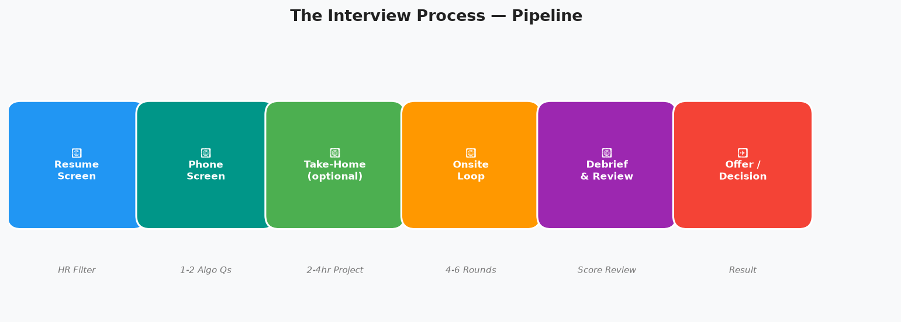 | Interview pipeline flow |
| 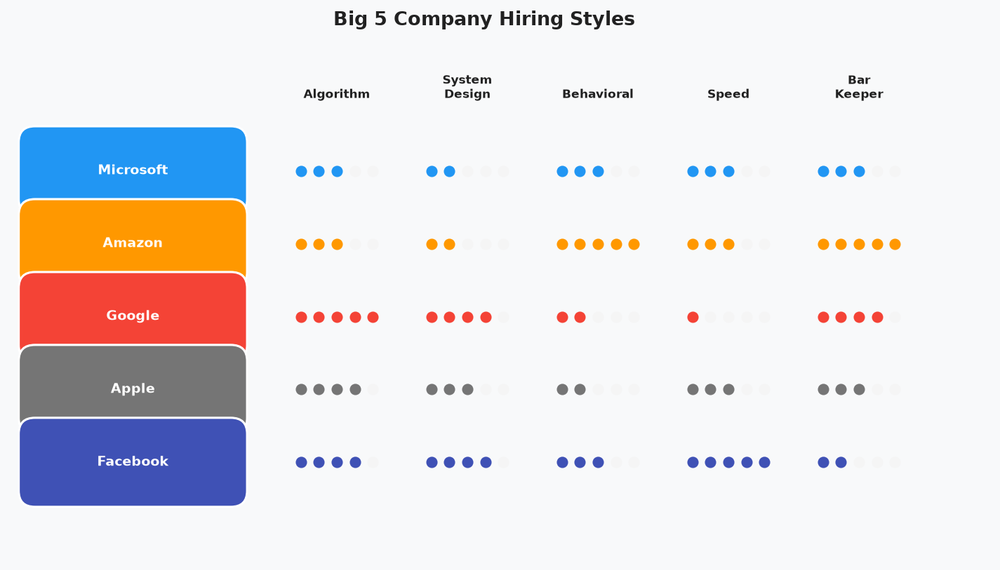 | Big 5 company hiring styles |
| 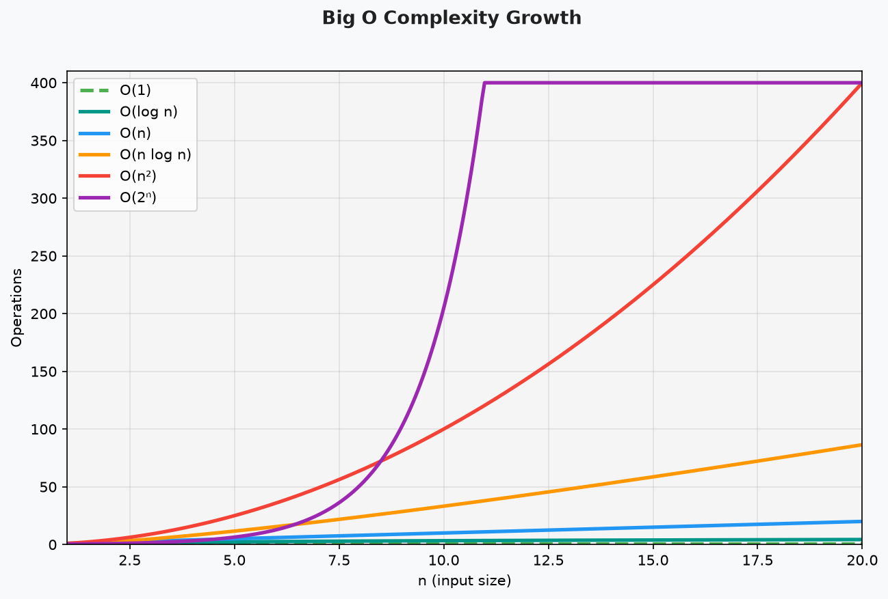 | Complexity growth curves |
| 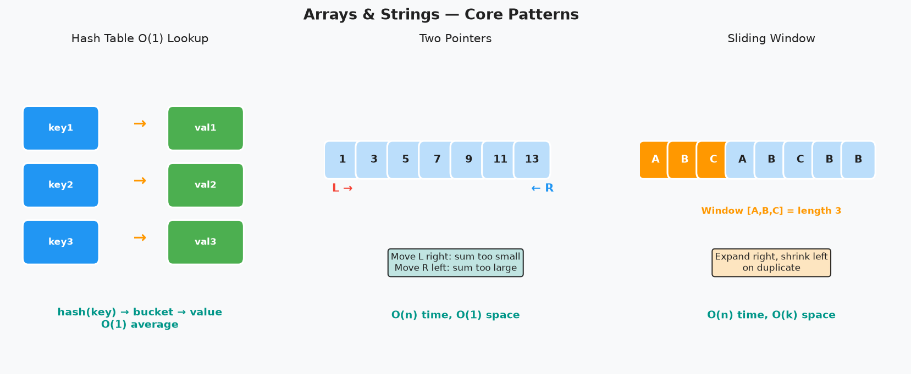 | Hash table + two-pointer + sliding window |
| 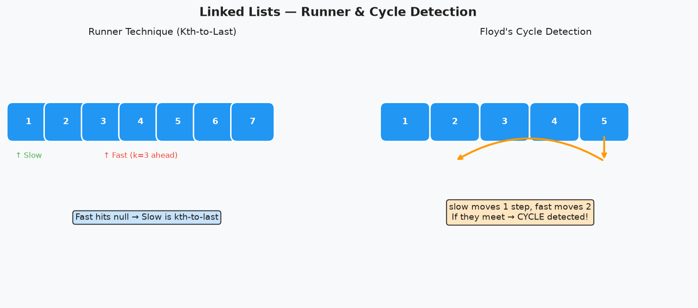 | Runner technique, cycle detection |
| 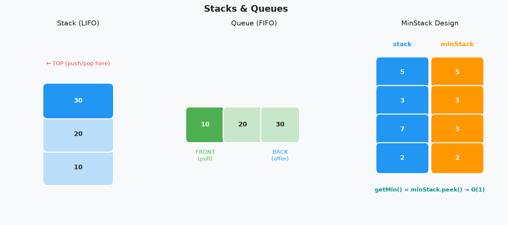 | LIFO/FIFO + MinStack |
| 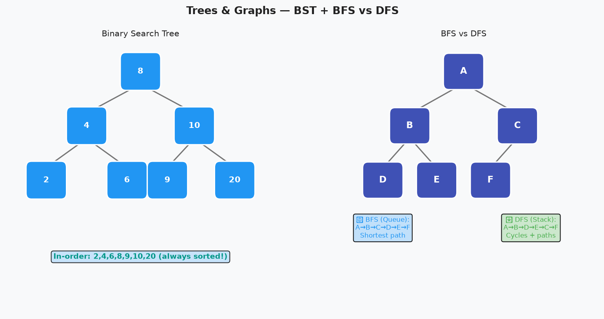 | BST + BFS vs. DFS |
| 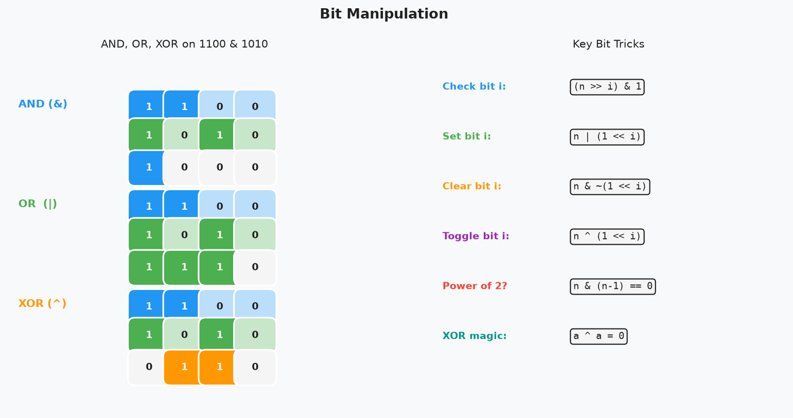 | Bitwise ops + two's complement |
| 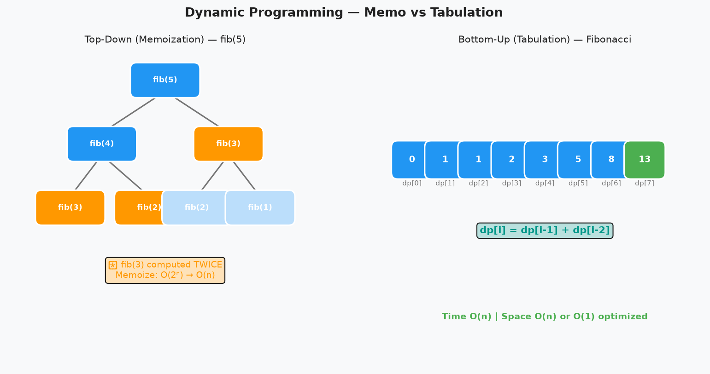 | Memo vs. tabulation |
| 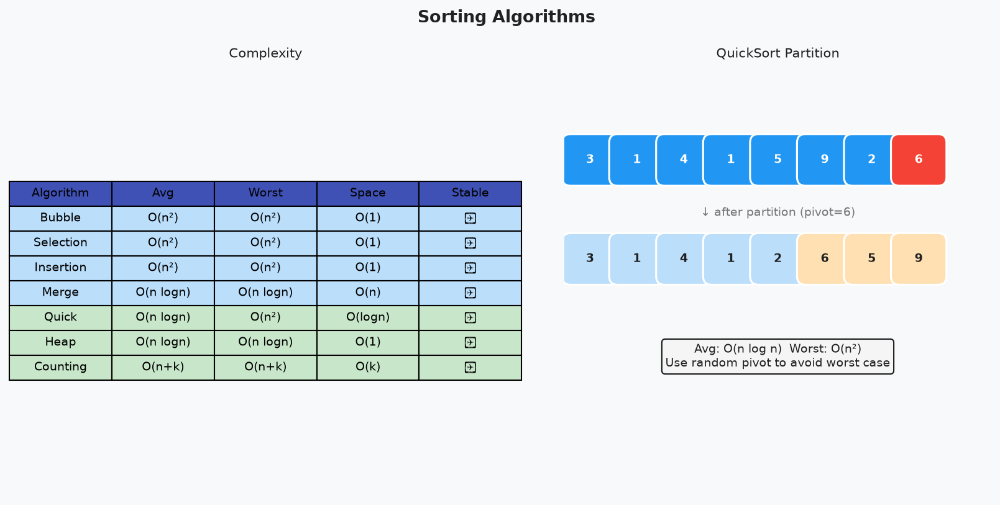 | Sorting algorithm comparison |
| 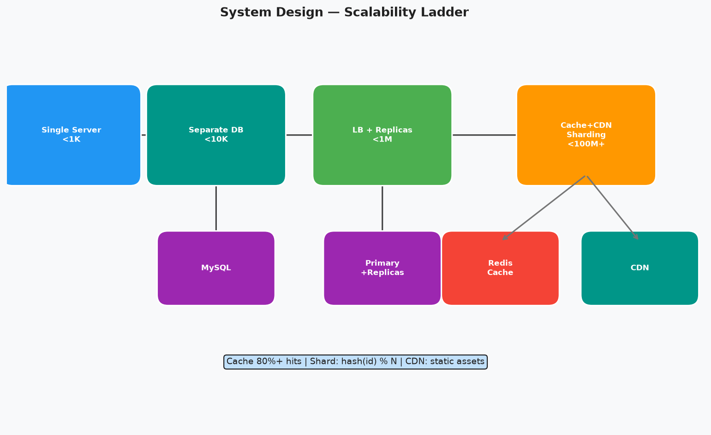 | Scalability ladder |
| 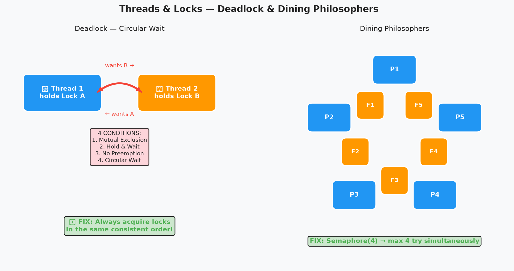 | Deadlock + dining philosophers |

> `pip install matplotlib numpy && python3 generate_images.py`

---

## 🎯 Key Takeaways → [key-takeaways.md](key-takeaways.md)

## 🔗 Related Books
- [System Design Interview](../system-design-interview/README.md)
- [System Design Interview Vol. 2](../system-design-interview-v2/README.md)
- [Clean Architecture](../clean-architecture/README.md)

---

*← [Back to Pragmatic](../README.md)*
