# System Design Interview: An Insider's Guide, Volume 2

**Authors**: Alex Xu & Sahn Lam
**Published**: 2022 · Byte Code LLC
**Category**: System Design / Distributed Systems / Interview Preparation

---

## 📖 About This Book

*System Design Interview: An Insider's Guide, Volume 2* is the definitive continuation of Alex Xu's acclaimed series. Where Volume 1 covered foundational systems (URL shortener, rate limiter, web crawler), Volume 2 tackles 13 **advanced, real-world system designs** used by the world's largest tech companies.

Each chapter follows a rigorous framework:
1. **Requirements clarification** — functional and non-functional
2. **Back-of-envelope estimation** — QPS, storage, bandwidth
3. **High-level design** — architecture diagram and data flows
4. **Deep dive** — critical components explored in detail
5. **Trade-off analysis** — honest evaluation of design decisions

The book teaches you to **think like a senior engineer** — not just recite solutions, but systematically derive them from first principles.

---

## 🗺️ The 13 Systems

```
┌────────────────────────────────────────────────────────────────────┐
│               System Design Interview Vol. 2                       │
│                                                                    │
│  📍 Geospatial          📊 Data Engineering                       │
│  01 Proximity Service   05 Metrics Monitoring                     │
│  02 Nearby Friends      06 Ad Click Aggregation                   │
│  03 Google Maps                                                    │
│                         🏢 Business Systems                       │
│  💬 Infrastructure      07 Hotel Reservation                      │
│  04 Message Queue       08 Distributed Email                      │
│                         09 S3 Object Storage                      │
│  🎮 Real-time           10 Gaming Leaderboard                     │
│                                                                    │
│  💰 Finance                                                        │
│  11 Payment System      13 Stock Exchange                         │
│  12 Digital Wallet                                                │
└────────────────────────────────────────────────────────────────────┘
```

---

## 📚 Chapters

| # | Chapter | Core Concepts | Key Pattern |
|---|---------|--------------|------------|
| [01](chapters/01-proximity-service.md) | Proximity Service | Geohash, QuadTree, spatial indexing | Geohash prefix search |
| [02](chapters/02-nearby-friends.md) | Nearby Friends | WebSocket, real-time location, fan-out | Redis Pub/Sub |
| [03](chapters/03-google-maps.md) | Google Maps | Map tiles, routing algorithms, ETA | Tile pyramid + CDN |
| [04](chapters/04-distributed-message-queue.md) | Distributed Message Queue | Partitions, offsets, replication | Kafka append-only log |
| [05](chapters/05-metrics-monitoring-alerting.md) | Metrics Monitoring | Time-series DB, pull vs. push, alerting | TSDB + downsampling |
| [06](chapters/06-ad-click-event-aggregation.md) | Ad Click Aggregation | Lambda architecture, watermarks, dedup | Stream + Batch dual pipeline |
| [07](chapters/07-hotel-reservation-system.md) | Hotel Reservation | Concurrency, idempotency, inventory | Atomic UPDATE pattern |
| [08](chapters/08-distributed-email-service.md) | Distributed Email | SMTP/IMAP, Cassandra mailbox, search | Metadata/blob separation |
| [09](chapters/09-s3-object-storage.md) | S3 Object Storage | Erasure coding, multipart upload | 6+3 erasure coding |
| [10](chapters/10-real-time-gaming-leaderboard.md) | Gaming Leaderboard | Redis ZSET, time windows, segments | Sorted set O(log N) ops |
| [11](chapters/11-payment-system.md) | Payment System | PSP integration, reconciliation | Idempotency + outbox |
| [12](chapters/12-digital-wallet.md) | Digital Wallet | Event sourcing, CQRS, bookkeeping | Event store + projection |
| [13](chapters/13-stock-exchange.md) | Stock Exchange | Order book, matching engine, FIFO | Single-threaded sequencer |

---

## 🖼️ Architecture Diagrams

Each chapter includes custom-generated architecture diagrams:

| Image | Description |
|-------|-------------|
| 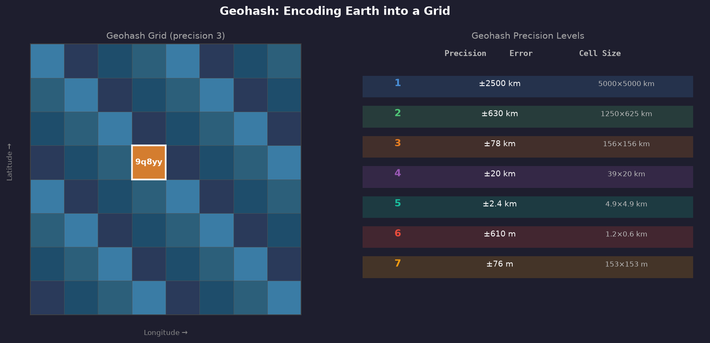 | Geohash precision levels and grid visualization |
| 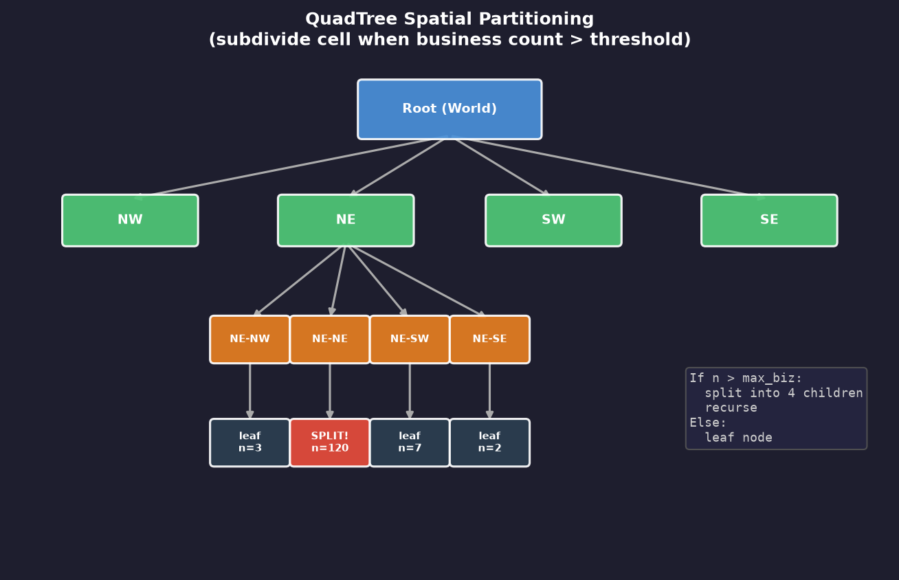 | QuadTree spatial partitioning |
| 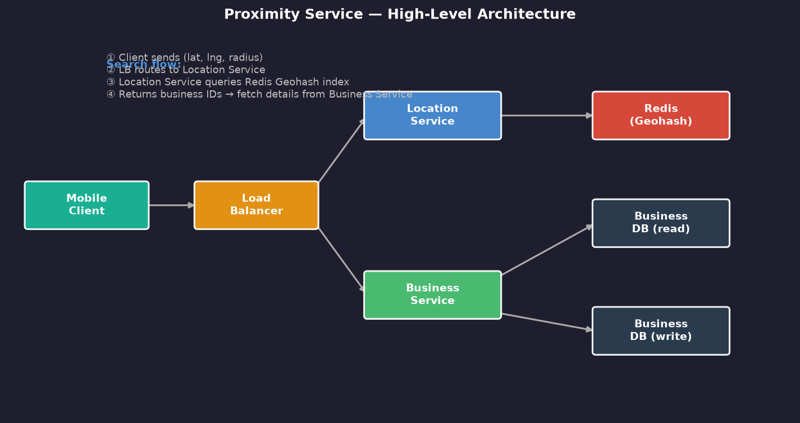 | Proximity service high-level architecture |
| 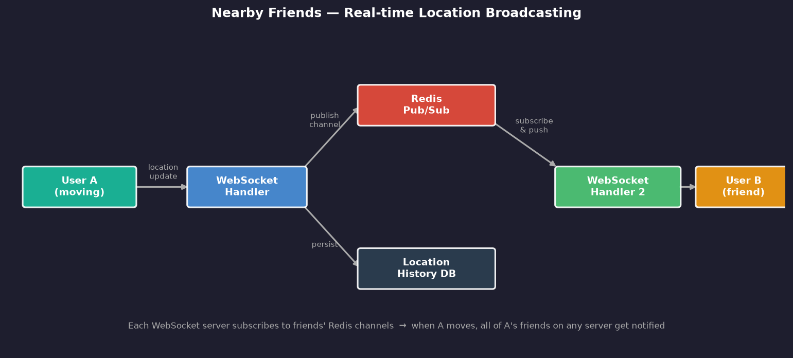 | Real-time location broadcasting |
| 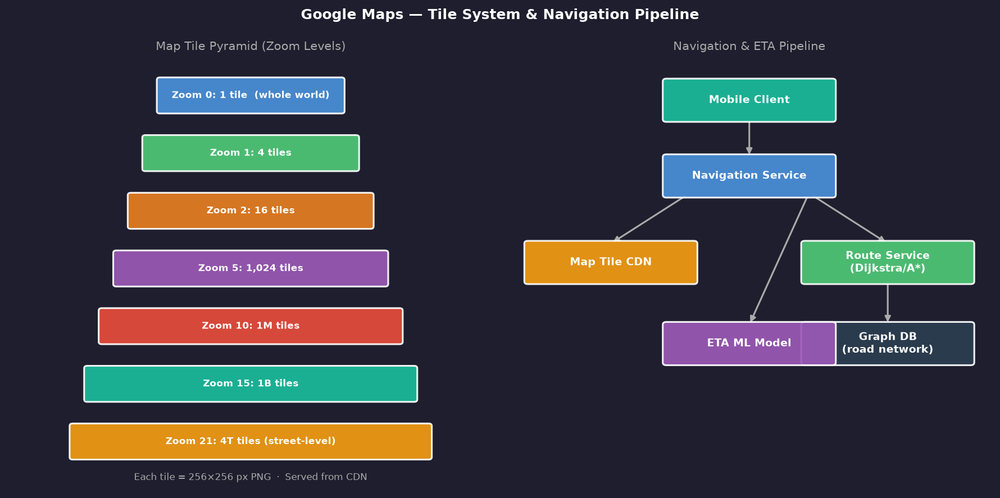 | Map tile pyramid and routing pipeline |
| 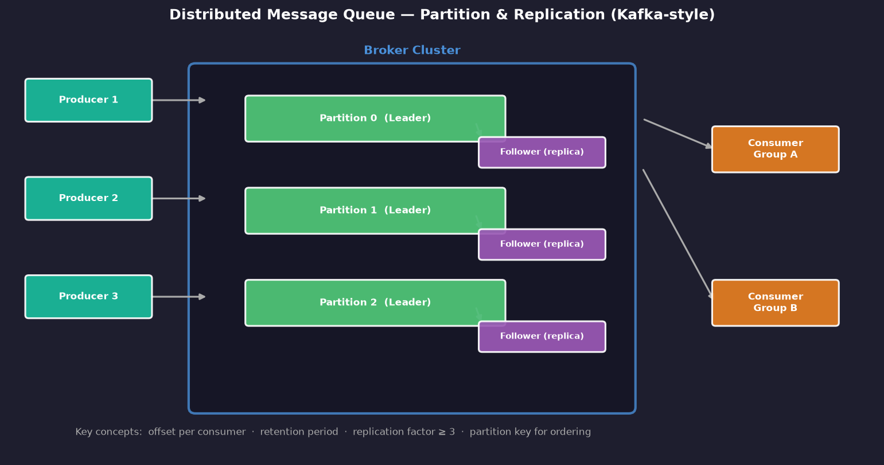 | Kafka-style partition and replication |
|  | Metrics monitoring data pipeline |
|  | Speed + batch layers for ad click aggregation |
|  | Concurrency patterns for reservations |
| 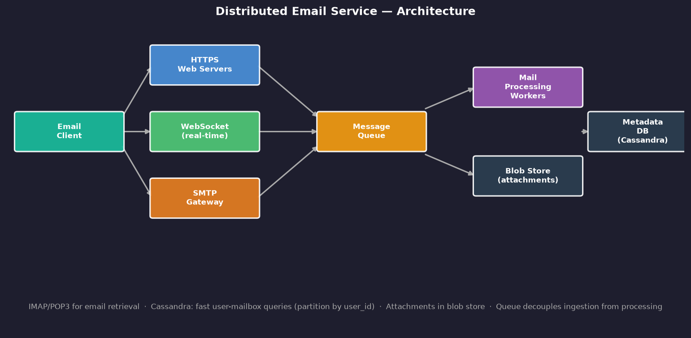 | Distributed email service architecture |
| 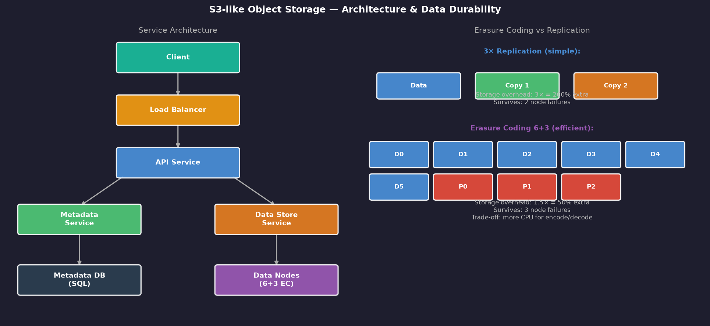 | S3-like object storage with erasure coding |
|  | Redis ZSET leaderboard |
| 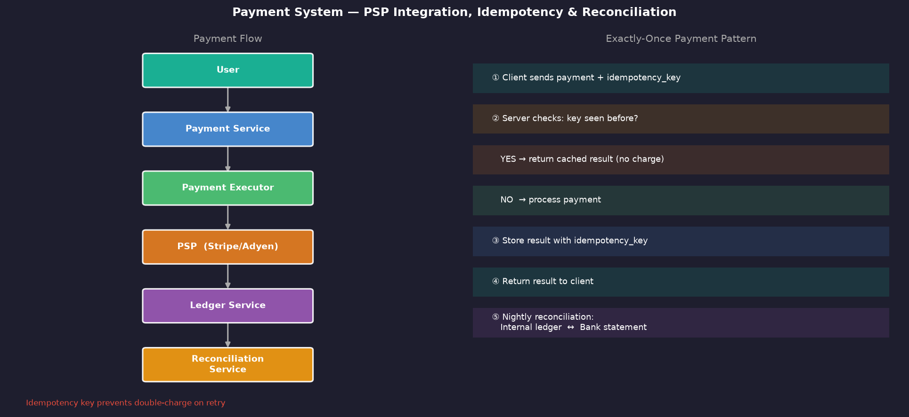 | Payment flow with idempotency |
| 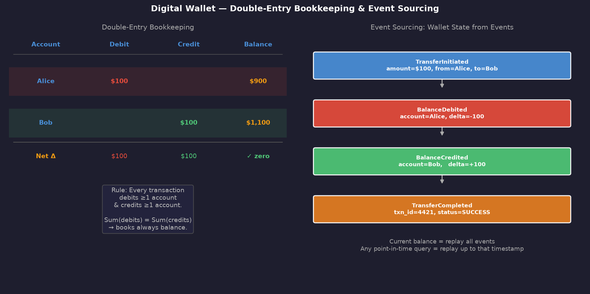 | Double-entry bookkeeping + event sourcing |
| 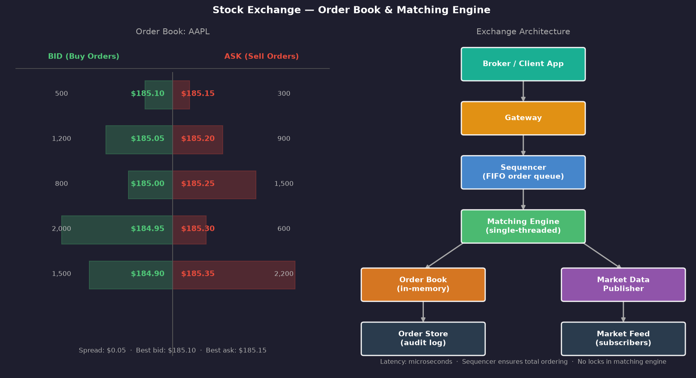 | Order book and matching engine |

---

## 💡 Key Takeaways

→ [View all 25 key takeaways](key-takeaways.md)

**The five most important ideas from this book:**

### 1. Requirements First, Always
```
Before drawing any diagram:
  - What does it do? (functional)
  - How big must it be? (non-functional)
  - How fast/available/consistent? (constraints)
  
Never solve the wrong problem brilliantly.
```

### 2. Idempotency is Non-Negotiable for Reliability
Any operation that can fail and be retried **must** be idempotent. Use client-generated UUIDs as idempotency keys. This applies to payments, reservations, API calls, and message processing.

### 3. The Right Data Structure Solves the Problem
```
Leaderboard → Redis Sorted Set (O log N rank queries)
Location → Geohash (prefix search)
Time-series → TSDB (sequential writes + time-range queries)
Messages → Append-only log (Kafka)
```

### 4. Single-Threaded > Multi-threaded for Ordered Processing
For systems requiring strict ordering (stock exchange, message queues), a single-threaded sequencer + single-threaded processor is often faster than multi-threaded with locks, and always more correct.

### 5. Reconciliation is the Safety Net
Regardless of how many safety mechanisms you build, always run a nightly reconciliation. Compare internal records to external sources. This catches what everything else missed.

---

## 🔗 Related Books in This Repo

- [Microservices Patterns](../microservices-patterns/README.md) — distributed system patterns that complement these designs
- [Software Architecture: The Hard Parts](../software-architecture-the-hard-parts/README.md) — trade-off analysis framework
- [Clean Architecture](../clean-architecture/README.md) — component design principles
- [Domain-Driven Design](../domain-driven-design/README.md) — domain modeling (used in wallets, exchanges)

---

## 📊 Cross-Chapter Patterns Reference

| Pattern | Used In |
|---------|---------|
| **Geohash** | Ch.1 (Proximity), Ch.2 (Nearby Friends) |
| **WebSocket + Redis Pub/Sub** | Ch.2 (Friends), Ch.8 (Email), Ch.10 (Leaderboard) |
| **Append-only log** | Ch.4 (Queue), Ch.9 (Object Store), Ch.13 (Exchange) |
| **Idempotency key** | Ch.7 (Hotel), Ch.11 (Payment), Ch.12 (Wallet) |
| **Double-entry bookkeeping** | Ch.11 (Payment), Ch.12 (Wallet) |
| **Event Sourcing** | Ch.12 (Wallet) |
| **Lambda Architecture** | Ch.6 (Ad Clicks) |
| **CQRS** | Ch.12 (Wallet) |
| **Erasure Coding** | Ch.9 (Object Store) |
| **Single-threaded + Sequencer** | Ch.13 (Exchange) |

---

*[← Back to Pragmatic](../README.md)*
