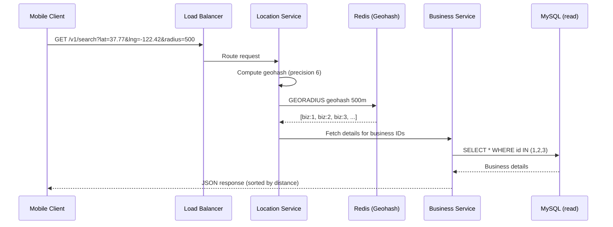

# Chapter 1 — Proximity Service

> *"Given a user's location, find all businesses within a given radius."*
> This deceptively simple requirement touches some of the deepest corners of distributed systems: geospatial indexing, read-heavy scaling, and low-latency querying.

---

## 🎯 Core Concept

A **Proximity Service** answers the question: *"What's nearby?"* — the backbone of Yelp, Google Places, Uber, and DoorDash. The engineering challenge is not just finding nearby points but doing it **fast, at massive scale**, with millions of queries per second from millions of users across the globe.

The key insight: **geography must be discretized**. You can't query a continuous coordinate space efficiently. You must convert 2D space into a structure a database can actually index.

---

## 📋 Requirements

### Functional
- Return all businesses within a given radius from a user's location
- Business owners can add/update/delete businesses (CRUD)
- Customers view business information (name, address, rating, etc.)

### Non-Functional
- Low latency: search results in < 200ms
- High availability: location search is critical path
- Reads >> Writes: business data changes infrequently

### Scale (Back-of-Envelope)
```
DAU:              100 million users
QPS (search):     5 QPS/user avg → 500M queries/day
                  Peak: ~3000 QPS
Businesses:       200 million registered
DB size:          200M × ~1KB = 200GB (fits in memory!)
```

---

## 🏗️ High-Level Architecture

```
┌────────────┐     ┌──────────────┐     ┌─────────────────┐
│   Mobile   │────▶│ Load Balancer│────▶│ Location Service│───▶ Redis (Geohash)
│   Client   │     └──────────────┘     └─────────────────┘
│            │                               │
│            │                          Business IDs
│            │                               │
│            │     ┌──────────────┐     ┌─────────────────┐
│            │────▶│ Load Balancer│────▶│ Business Service│───▶ MySQL (read replica)
└────────────┘     └──────────────┘     └─────────────────┘         │
                                                                      └─▶ MySQL (write)
```

**Two separate services** for a key reason:
- **Location Service**: read-heavy, geospatial index queries
- **Business Service**: CRUD operations, business details

They scale independently. Location service gets CDN/caching. Business service needs write consistency.


---

## 🌍 The Geospatial Index Problem

A naive SQL query won't work:

```sql
-- ❌ Full table scan — doesn't use any index
SELECT * FROM businesses
WHERE distance(lat, lng, user_lat, user_lng) < radius;
```

Why? `distance()` is a computed function — the database can't use a B-tree index on it. You'd scan all 200 million rows on every query.

### Solution 1: Two-Dimensional Search with Index

```sql
-- ✅ Better: apply bounding box first, then precise filter
SELECT * FROM businesses
WHERE lat BETWEEN (user_lat - delta) AND (user_lat + delta)
  AND lng BETWEEN (user_lng - delta) AND (user_lng + delta)
  AND distance(lat, lng, user_lat, user_lng) < radius;
```

Still not ideal because a composite index on `(lat, lng)` doesn't work well — you'd need to scan all rows matching the latitude range and then filter by longitude.

### Solution 2: Geohash ✅

**Geohash** maps 2D coordinates to a 1D string by interleaving bits of latitude and longitude. Nearby locations share a **common prefix**.

```
Alice: 9q8yy    → downtown SF
Bob:   9q8yz    → 50 meters from Alice
Carol: 9q8yx    → 100 meters from Alice
Dave:  dp3wjz   → New York City (completely different prefix)
```


#### How Geohash Works

```
Longitude range: [-180, 180]
Latitude  range: [-90,  90]

Step 1: Interleave bits
  lng bit → even positions
  lat bit → odd positions

Step 2: Encode to base-32
  Every 5 bits → one character (0-9, b-z excluding a, i, l, o)

Result: "9q8yy" = 37.7749°N, 122.4194°W (San Francisco)
```

#### Precision Table

| Precision | Cell Size | Use Case |
|-----------|-----------|---------|
| 1 | 5000 × 5000 km | Country level |
| 4 | 39 × 20 km | City level |
| 6 | 1.2 × 0.6 km | Neighborhood |
| **7** | **153 × 153 m** | **Nearby search (best)** |
| 9 | 2.4 × 2.4 m | Street address |

**For a 500m radius**: use precision 6 (610m cell) or 7 (76m cell).

#### The Boundary Problem ⚠️

A critical edge case: two businesses may be very close but in **different Geohash cells**.

```
Cell boundary example:
┌──────────┬──────────┐
│  9q8yy   │  9q8yz   │
│          │          │
│  User ●──┼──● Biz   │
│          │          │
└──────────┴──────────┘
  Different prefix, same radius!
```

**Solution**: Always query **the target cell + 8 surrounding cells**.

```python
def get_neighbors(geohash):
    return [geohash] + geohash_neighbors(geohash)
    # returns 9 cells total: center + N, NE, E, SE, S, SW, W, NW
```

### Solution 3: QuadTree ✅

A **QuadTree** recursively divides the 2D space into 4 quadrants. Each leaf node holds ≤ N businesses (e.g., N=100). Dense areas subdivide deeper.


```
World
├── NW (sparse → leaf, 23 businesses)
├── NE (dense → subdivide)
│   ├── NE-NW (leaf, 87 businesses)
│   ├── NE-NE (dense → subdivide further)
│   ├── NE-SW (leaf, 41 businesses)
│   └── NE-SE (leaf, 12 businesses)
├── SW (leaf, 56 businesses)
└── SE (leaf, 91 businesses)
```

**QuadTree vs Geohash**:

| | Geohash | QuadTree |
|--|---------|---------|
| **Implementation** | Simple (string prefix) | Complex (tree traversal) |
| **Storage** | In Redis (sorted set) | In-memory (all servers) |
| **Update** | O(1) key update | O(log n) tree update |
| **Query** | Prefix search | Tree traversal |
| **Best for** | Distributed systems | Single-machine |

> **The book recommends Geohash for interviews** — simpler to explain, Redis-native, and easily distributed.

---

## 🔬 Deep Dive: Data Layer

### Business Table (MySQL)
```sql
CREATE TABLE business (
    business_id  BIGINT PRIMARY KEY,
    name         VARCHAR(256),
    address      VARCHAR(1024),
    lat          DECIMAL(9, 6),    -- e.g., 37.774929
    lng          DECIMAL(9, 6),    -- e.g., -122.419416
    rating       DECIMAL(3, 1),
    created_at   TIMESTAMP DEFAULT NOW()
);
```

### Geohash Index (Redis)
```
Key:   "geo:geohash:{precision6_hash}"
Type:  Sorted Set
Score: (lat * 10^7 + lng)   ← for ordering
Members: ["biz:1234", "biz:5678", ...]
```

Or use Redis's built-in `GEOADD` / `GEORADIUS` commands:
```redis
GEOADD businesses 122.4194 37.7749 "starbucks:1234"
GEORADIUS businesses 122.4194 37.7749 500 m ASC COUNT 20
```

### Caching Strategy
- Business details: cache with TTL 24h (rarely change)
- Geohash → business_ids: cache the mapping (update on write)
- CDN for static business images/menus

---

## ⚖️ Design Decisions & Trade-offs

### 1. Read Replicas vs. Caching

| Approach | Pros | Cons |
|----------|------|------|
| **Read replicas** | Always fresh data | Replication lag, still DB |
| **Redis cache** | Sub-millisecond lookup | Stale data risk |
| **CDN** | Global edge distribution | Only for static content |

**Decision**: Redis for geospatial index + MySQL read replicas for business details.

### 2. Geohash Precision for Search Radius

```
Radius 100m  → precision 7 (cell: 153m)
Radius 500m  → precision 6 (cell: 1.2km)
Radius 1km   → precision 6
Radius 5km   → precision 5 (cell: 5km)
Radius 20km  → precision 4 (cell: 39km)
```

### 3. Business Update Consistency

When a business moves or closes:
```
1. Owner updates business via Business Service
2. MySQL write to master
3. Async: invalidate Redis Geohash entry
4. Async: add new Geohash entry (new location)
5. Read replica picks up change within ~1 second
```

Acceptable eventual consistency — a business doesn't teleport in real-time.

---

## 📊 Mermaid: Request Flow



---

## 💡 Key Takeaways

| Concept | The Lesson |
|---------|-----------|
| **Geohash** | 2D → 1D mapping enables prefix-based spatial queries |
| **9-cell search** | Always query center + 8 neighbors to handle boundary cases |
| **Precision selection** | Match geohash precision to your search radius |
| **Separate services** | Location search and business CRUD have different scaling needs |
| **Redis GEORADIUS** | In practice, Redis built-ins handle all the geohash math for you |
| **Read >> Write** | Business data is read 1000x more than written — cache aggressively |

---

*← [Back to System Design Interview Vol. 2](../README.md)*
