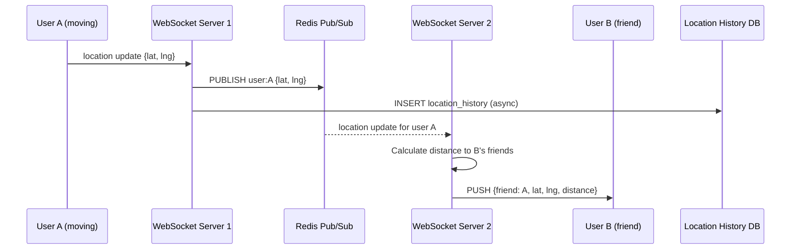

# Chapter 2 — Nearby Friends

> *"Show me which of my friends are currently within 5 miles of my location."*
> The challenge: locations change constantly, friendships create fan-out, and you need this in **real-time**.

---

## 🎯 Core Concept

Unlike a proximity service that finds static businesses, **Nearby Friends** must track **moving users** in real-time. A user's location changes every few seconds. With millions of users and friendship graphs, the naive "query everyone's location on every request" approach collapses immediately.

The key insights:
1. Use **WebSockets** — not HTTP polling — for real-time bidirectional location updates
2. Use **Redis Pub/Sub** — not point-to-point messaging — to fan-out location updates to all friends' servers
3. **Location history** is a bonus feature, not the core path

---

## 📋 Requirements

### Functional
- Users see friends who are nearby (within configurable radius, e.g. 5 miles)
- Location updates every 30 seconds when the app is open
- Nearby friends list updates automatically as friends move
- Location history stored and queryable

### Non-Functional
- Low latency: location update to friend's screen in < 1 second
- High availability
- Scale to 1 billion users, 10% active simultaneously

### Scale (Back-of-Envelope)
```
Concurrent users:   100 million (10% of 1B)
Location updates:   1 update / 30 sec / user
                    = 100M / 30 = 3.3M updates/sec = 3.3M messages/sec
Average friends:    500 per user
Peak fan-out:       3.3M × 500 = 1.65 billion message deliveries/sec
                    (not all friends are online — realistic ~10x smaller)
```

---

## 🏗️ High-Level Architecture

```
User A                  WebSocket           Redis          WebSocket            User B
(moving)               Handler 1           Pub/Sub        Handler 2            (friend)
   │                       │                  │                │                  │
   │──location update──────▶│                 │                │                  │
   │                       │──publish to ─────▶               │                  │
   │                       │   channel        │──push to ─────▶                  │
   │                       │   "user:A"       │  all subs      │──push update────▶│
   │                       │                  │                │                  │
   │                       │──persist to──────────────────────────────────────────│
   │                       │   History DB     │                │                  │
```


---

## 🔌 WebSocket: The Right Protocol

### Why NOT HTTP Polling?

```
HTTP Polling (bad):
  Client: "Any location updates?" every 5s
  Server: "No" (99% of the time)
  
  Problem: 100M users × 12 polls/min = 1.2 billion requests/min
           Mostly empty responses — wasteful
           5-second delay on updates

HTTP Long Polling (better but still bad):
  Client connects, server holds response until update or timeout
  
  Problem: Each connection holds a thread on server
           Still half-duplex — client sends, server responds

WebSocket (best):
  Persistent bidirectional TCP connection
  Server can PUSH to client instantly
  Low overhead after handshake
  Perfect for location streaming
```

### WebSocket Connection Lifecycle

```
1. Client sends HTTP Upgrade request:
   GET /ws HTTP/1.1
   Upgrade: websocket
   Connection: Upgrade
   Sec-WebSocket-Key: <base64 random>

2. Server responds:
   HTTP/1.1 101 Switching Protocols
   Upgrade: websocket

3. Connection now bidirectional, persistent

4. Client sends location update every 30s:
   {"type":"location","lat":37.77,"lng":-122.41,"ts":1700000000}

5. Server pushes friend locations:
   {"type":"friend_update","user_id":"bob","lat":37.78,"lng":-122.42,"distance":0.3}

6. Connection drops: reconnect with exponential backoff
```

---

## 📡 Redis Pub/Sub: The Fan-out Engine

### The Problem Redis Pub/Sub Solves

With millions of WebSocket connections, a user's friends might be connected to **any** WebSocket server. How does server 1 (where User A is connected) notify server 2 (where User B is connected)?

**Answer**: Redis Pub/Sub channel per user.

```
Architecture:
┌─────────────────────────────────────────────────────────────┐
│                    Redis Pub/Sub                             │
│                                                             │
│  channel: "user:alice"     channel: "user:bob"              │
│     │                           │                           │
│  WS Server 1 subscribes     WS Server 2 subscribes         │
└─────────────────────────────────────────────────────────────┘

When Alice moves:
1. WS Server 1 receives Alice's location
2. WS Server 1 publishes to "user:alice" channel
3. ALL subscribed WS servers receive the message
4. Each server filters: does this server have friends of Alice?
5. Push to those friends via their WebSocket connections
```

### Subscription Management

```
On Alice opens app:
  - WS Server 1 establishes connection with Alice
  - WS Server 1 fetches Alice's friend list from User Graph Service
  - WS Server 1 subscribes to Redis channels for each friend:
      SUBSCRIBE user:bob user:carol user:dave ...
  - Now WS Server 1 will receive updates when any friend moves

On Alice's friend Bob moves:
  - Bob's WS Server publishes to "user:bob"
  - WS Server 1 (subscribed to "user:bob") receives it
  - Calculates distance: is Bob within Alice's radius?
  - YES → push to Alice's WebSocket connection
  - NO  → discard

On Alice closes app:
  - WS Server 1 unsubscribes from all friend channels
  - Connection cleaned up
```

---

## 🔬 Deep Dive: Location Storage

### Real-time Location (Redis)

```redis
# Store current location per user
SETEX location:alice 300 "37.7749,-122.4194"  # TTL = 5 min

# Query all friends' locations in one call
MGET location:bob location:carol location:dave
```

### Location History (Cassandra / TimescaleDB)

Location history has a clear time-series pattern — perfect for Cassandra:

```sql
-- Cassandra table design
CREATE TABLE location_history (
    user_id   UUID,
    timestamp TIMESTAMP,
    lat       DOUBLE,
    lng       DOUBLE,
    PRIMARY KEY (user_id, timestamp)
) WITH CLUSTERING ORDER BY (timestamp DESC);

-- Query: where was Alice in the last hour?
SELECT * FROM location_history
WHERE user_id = 'alice-uuid'
  AND timestamp >= now() - 1h
LIMIT 120;
```

**Why Cassandra?**
- Write-heavy (3.3M writes/sec)
- Time-ordered access pattern (perfect for Cassandra clustering keys)
- No complex joins needed
- Scales horizontally

---

## ⚖️ Design Decisions & Trade-offs

### 1. Update Frequency vs. Battery Life

```
More frequent updates:
  + More accurate friend positions
  - More battery drain on mobile
  - More server load

Less frequent updates:
  + Better battery life
  - "My friend is 50m away" but data is 2 min old

Solution: Adaptive frequency
  - App in foreground, user moving: every 15s
  - App in foreground, user stationary: every 60s
  - App in background: every 5 min (or stop entirely)
```

### 2. User Privacy Controls

```
Privacy levels:
  OFF:        Don't share location at all
  FRIENDS:    Share with friends only (default)
  CUSTOM:     Share with specific friend groups
  GHOST MODE: Receive friend locations, but don't broadcast yours

Implementation: Filter at publish step
  If user has privacy=OFF: don't publish to Redis channel
```

### 3. WebSocket Server Scaling

```
Challenge: WebSocket connections are stateful (long-lived)
           Load balancer must use sticky sessions OR
           Connection state must be externalized

Solution: Sticky sessions per user_id hash
  - Hash(user_id) % num_ws_servers → route to correct server
  - If server dies: client reconnects (exponential backoff)
  - Connection restored within seconds
```

### 4. Handling Redis Pub/Sub at Scale

```
Problem: Redis Pub/Sub is single-threaded
         With 100M users × 500 friends = 50B subscriptions
         → Single Redis instance can't handle this

Solution: Redis Cluster — shard channels across nodes
  channel "user:alice" → node 1
  channel "user:bob"   → node 2
  
  Or: use dedicated Pub/Sub brokers (e.g., Apache Kafka with consumer groups)
      Better for very large scale (1B+ users)
```

---

## 📊 Mermaid: Location Update Flow



---

## 💡 Key Takeaways

| Concept | The Lesson |
|---------|-----------|
| **WebSocket over polling** | Real-time bidirectional updates at 1/100th the overhead |
| **Redis Pub/Sub for fan-out** | Decouples "who sent" from "who receives" across servers |
| **Per-user channel** | Each user has one channel; friends subscribe to it |
| **Cassandra for history** | Time-series writes at massive scale |
| **Privacy at publish** | Filter at the source, not at every consumer |
| **Stateful connections** | WebSocket servers need sticky sessions or stateless reconnection |

---

*← [Back to System Design Interview Vol. 2](../README.md)*
