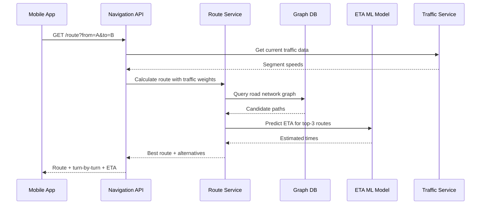

# Chapter 3 — Google Maps

> *"Turn-by-turn navigation for a billion users, updated in real time, working offline, rendering instantly."*
> Google Maps is one of the most complex systems ever built — this chapter distills its core architecture into teachable design decisions.

---

## 🎯 Core Concept

Google Maps solves three distinct problems simultaneously:
1. **Map rendering**: Show the right map tiles at the right zoom level instantly
2. **Route finding**: Calculate the shortest/fastest path between two points
3. **ETA estimation**: Predict travel time accounting for real-time traffic

Each of these is a separate engineering discipline. The magic is making them work together seamlessly on a phone.

---

## 📋 Requirements

### Functional
- Display maps at various zoom levels with pan/zoom interaction
- Find route from A to B (shortest, fastest, avoid tolls)
- Turn-by-turn navigation with real-time re-routing
- Show real-time traffic conditions
- Search for places by name or category

### Non-Functional
- Maps render in < 200ms on good connection
- Works offline (cached tiles)
- Supports 1 billion DAU
- Map data update latency < 1 day for road changes

### Scale (Back-of-Envelope)
```
DAU:                1 billion users
Map tile requests:  Each map view = ~20 tiles
                    1B × 20 = 20B tile requests/day
Tile storage:       Zoom 21 = 4.4 trillion tiles × ~50KB avg
                    ≈ 100 petabytes (most served from CDN cache)
Navigation events:  1B × 0.1% using nav = 1M concurrent navigations
```

---

## 🗺️ Map Tiles: How Maps Are Rendered

The world is divided into a **pyramid of tiles** where each zoom level is 4× the previous.

```
Zoom 0:  1 tile    (whole world in 256×256px)
Zoom 1:  4 tiles   (4 quadrants)
Zoom 5:  1,024 tiles
Zoom 10: 1,048,576 tiles   (city level)
Zoom 15: ~1B tiles         (street level)
Zoom 21: ~4T tiles         (building detail)
```


### Tile Coordinate System

Each tile is identified by `(zoom, x, y)`:
```
Zoom 1 tile coordinates:
┌─────────┬─────────┐
│ (1,0,0) │ (1,1,0) │  ← top row (y=0)
├─────────┼─────────┤
│ (1,0,1) │ (1,1,1) │  ← bottom row (y=1)
└─────────┴─────────┘

URL format: /tiles/{zoom}/{x}/{y}.png
```

### Tile Generation Pipeline

```
Raw Geographic Data (OpenStreetMap / proprietary)
          │
          ▼
   Data Processing
   (normalize, validate, update)
          │
          ▼
   Tile Rendering Engine
   (convert geo data → PNG tiles per zoom level)
          │
          ▼
   CDN Storage (S3 + CloudFront / similar)
          │
          ▼
   Client requests tile by (zoom, x, y) URL
```

**Key insight**: Tiles are **pre-rendered and cached**. Map rendering at query time would be impossibly slow. The CDN cache hit rate is ~99% — almost all tiles were requested before.

### Why CDN is Perfect for Tiles

```
Tiles are:
  ✓ Static (don't change per user)
  ✓ Cacheable (same tile URL = same image)
  ✓ Popular (NYC tiles requested millions of times/day)
  ✓ Geographically distributed (EU users need EU CDN)

CDN stores tiles at edge locations globally
Cache hit ratio: ~99%
Only ~1% of requests reach origin storage
```

---

## 🧭 Route Finding: Dijkstra & A*

### The Road Network as a Graph

```
Nodes:  Intersections, road endpoints
Edges:  Road segments with weights (time or distance)

Graph:  Directed (one-way streets matter!)
        Weighted (speed limit × distance = time)

Example:
A ──5min──▶ B ──3min──▶ D
│                        ▲
└───────8min──────────────┘

Shortest path A→D:
  Option 1: A→B→D = 8 min ✓
  Option 2: A→D directly = 8 min (tie)
```

### Dijkstra's Algorithm

```python
def dijkstra(graph, start, end):
    dist = {node: infinity for node in graph}
    dist[start] = 0
    pq = [(0, start)]  # (distance, node)
    
    while pq:
        d, node = heappop(pq)
        if node == end:
            return d
        for neighbor, weight in graph[node]:
            new_dist = d + weight
            if new_dist < dist[neighbor]:
                dist[neighbor] = new_dist
                heappush(pq, (new_dist, neighbor))
```

**Problem**: Real road networks have billions of nodes. Dijkstra is too slow for full-country routing.

### A* Algorithm (Dijkstra + Heuristic)

A* adds a **heuristic** — an estimate of remaining distance — to explore more promising paths first:

```
f(node) = g(node) + h(node)
          │           │
          │           └── heuristic: straight-line distance to destination
          └── actual cost from start to node

A* expands nodes in order of f(node)
→ More likely to reach destination faster
→ Explores far fewer nodes than Dijkstra
```

### Hierarchical Routing (Real-World Solution)

In practice, Google uses **hierarchical routing** (simplified):
```
Level 3: Highways (continental travel)
Level 2: Major roads (inter-city travel)
Level 1: Local roads (neighborhood)

Algorithm:
  1. Find route from start to nearest highway on-ramp
  2. Route across highway network (much smaller graph)
  3. Find route from highway exit to destination
```

This reduces graph size by 100-1000× for long routes.

---

## ⏱️ ETA: Machine Learning for Traffic Prediction

### Why Simple Distance/Speed Isn't Enough

```
Road: "Highway 101, speed limit 65mph, length 10 miles"
Naive ETA: 10/65 * 60 = 9.2 minutes

Reality on a Friday at 5pm: 45 minutes
```

### ETA Model Inputs

```
Historical data:
  - Average speed on this segment by hour/day/season
  - Incident history
  
Real-time signals:
  - GPS probes from millions of active navigation users
  - Speed reported by anonymous user phones
  - Traffic sensors (where available)
  - Reported incidents (accidents, road closures)
  
Model:
  - Input: route segments + time of day + day of week + weather + events
  - Output: predicted travel time per segment
  - Architecture: gradient boosting or deep neural network
```

### Live Traffic from GPS Probes

```
Every 15-30 seconds:
  Mobile app sends: {location, speed, heading, timestamp}
  (anonymized)

Aggregated on server:
  Segment "Highway 101 mile 34-35": 
    12 probes avg 45mph → congestion detected
    Expected: 65mph
    → Mark as slow traffic, update ETA model
```

---

## 🔬 Deep Dive: Navigation Service

### Re-routing in Real-Time

```
User is navigating A → B via route X
User deviates from route (takes wrong turn)

System detects:
  - User location diverges from planned route
  - Gap exceeds threshold (e.g., 50m off route)
  
Re-route triggered:
  - Calculate new route from current position to B
  - Account for current traffic
  - Announce new route via voice instruction
  
Latency target: < 2 seconds for re-route
```

### Offline Navigation

```
User downloads region tiles:
  - All tiles for the region at multiple zoom levels
  - Road network graph for offline routing
  - Stored on device storage

Works without internet:
  - Map rendering: from cached tiles
  - Routing: from cached road graph
  - No real-time traffic (outdated)
  - ETA: based on historical data only
```

---

## ⚖️ Design Decisions & Trade-offs

### 1. Tile Freshness

| Approach | Pros | Cons |
|----------|------|------|
| **Pre-render all tiles** | Fast serving, cacheable | Huge storage, slow to update |
| **Render on demand** | Always fresh | Too slow (100ms+ per tile) |
| **Pre-render + incremental** | Balance | Complex invalidation |

**Decision**: Pre-render with CDN, invalidate only changed tiles when map data updates.

### 2. Route Caching

```
Popular routes (JFK → Manhattan) calculated millions of times/day
Cache the route: hash(start_geohash, end_geohash, time_bucket) → route

Cache TTL: 5 minutes (traffic changes)
Cache hit rate for popular city-to-city routes: ~60%
```

### 3. Precision vs. Performance

```
Road network data:
  - More detail = better routing = slower computation
  - Less detail = worse routing = faster computation

Solution: Hierarchical graphs
  - Coarse graph for long distances
  - Detailed graph for local routing
  - Smooth transition between levels
```

---

## 📊 Mermaid: Navigation Request Flow



---

## 💡 Key Takeaways

| Concept | The Lesson |
|---------|-----------|
| **Tile pyramid** | Pre-render at all zoom levels; CDN caches 99% of requests |
| **Tile coordinates** | Every tile = (zoom, x, y) — deterministic, cacheable URL |
| **A* over Dijkstra** | Heuristic dramatically reduces nodes to explore |
| **Hierarchical routing** | Multi-level graph makes continental routing feasible |
| **GPS probes** | Crowd-sourced speed data from millions of phones = real-time traffic |
| **ETA is ML** | Pure physics-based ETA fails; ML model on historical + real-time data wins |
| **Offline-first** | Download region tiles + road graph for reliable navigation without internet |

---

*← [Back to System Design Interview Vol. 2](../README.md)*
