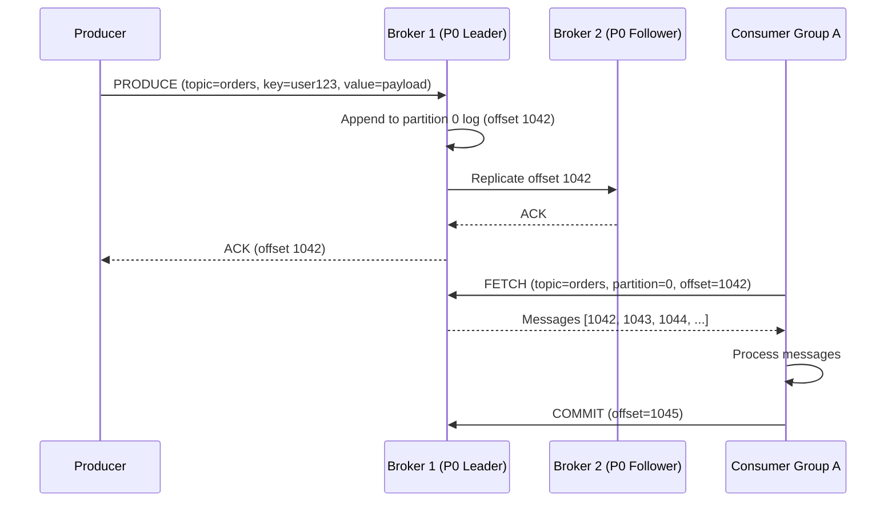

# Chapter 4 — Distributed Message Queue

> *"Producers and consumers should be able to operate independently, at different speeds, without knowing about each other."*
> A message queue is the backbone of every large distributed system. This chapter builds one from scratch.

---

## 🎯 Core Concept

A **Distributed Message Queue** decouples producers (who create messages) from consumers (who process them). Instead of direct service-to-service calls, producers drop messages into a queue and consumers pick them up at their own pace.

Think of it like a postal system: the sender doesn't wait for the recipient to be available — they hand off the letter and move on.

**Real-world examples**: Apache Kafka, Amazon SQS, RabbitMQ, Google Pub/Sub.

---

## 📋 Requirements

### Functional
- Producers publish messages to named topics
- Consumers subscribe to topics and receive messages
- Messages are retained for a configurable period (e.g., 2 weeks)
- Message ordering guaranteed within a partition
- At-least-once delivery semantics
- Support millions of messages/second throughput

### Non-Functional
- High throughput: millions of messages per second
- High availability: no single point of failure
- Persistent: messages survive broker restarts
- Scalable: add partitions/brokers to increase throughput

### Scale (Back-of-Envelope)
```
Throughput target:  1 million messages/second
Message size avg:   1KB
Storage/day:        1M msg/s × 1KB × 86400s = 86TB/day
  With 2-week retention: 86TB × 14 = ~1.2PB
  Need compression + replication: ~3.6PB raw
```

---

## 🏗️ High-Level Architecture

```
Producers                   Broker Cluster                    Consumers
┌─────────┐                ┌──────────────────────────────┐   ┌──────────────┐
│Producer1│──────────────▶ │ Topic "orders" (3 partitions)│──▶│Consumer Grp A│
│Producer2│                │  ┌─────────┐                 │   └──────────────┘
│Producer3│                │  │Partition│ P0 (Leader)      │   ┌──────────────┐
└─────────┘                │  │Partition│ P1 (Leader)      │──▶│Consumer Grp B│
                           │  │Partition│ P2 (Leader)      │   └──────────────┘
                           │  └─────────┘                 │
                           │  + Follower replicas on       │
                           │    other brokers              │
                           └──────────────────────────────┘
```


---

## 🔑 Core Concepts

### Topics and Partitions

A **topic** is a logical grouping of related messages (e.g., "user-events", "orders", "payments").

A topic is split into **partitions** for parallelism:

```
Topic "orders" with 3 partitions:

Partition 0: [msg1, msg2, msg5, msg8, ...]   → Consumer A reads this
Partition 1: [msg3, msg6, msg9, ...]          → Consumer B reads this
Partition 2: [msg4, msg7, msg10, ...]         → Consumer C reads this

Key insight: Ordering guaranteed WITHIN a partition
             No ordering guarantee ACROSS partitions
```

**Partition assignment**: producer uses message key:
```python
partition = hash(message_key) % num_partitions

# Example: all orders for user_id=123 go to same partition
partition = hash("user_123") % 3  # always same partition
# → events for user_123 are processed in order
```

### Offsets: Consumer Position Tracking

Each message in a partition has a sequential **offset** (like an array index):

```
Partition 0:
Offset:  0    1    2    3    4    5    6
         [m1] [m2] [m3] [m4] [m5] [m6] [m7]
                         ▲
                    Consumer A's committed offset = 4
                    (has processed m1-m4, will read m5 next)
```

Consumers **pull** messages and **commit offsets** themselves:
```
Consumer A reads batch: [m5, m6, m7]
Consumer A processes them
Consumer A commits offset 7 to broker
If Consumer A crashes and restarts: it resumes from offset 7
```

This is the key difference from traditional queues — consumers control their own position.

---

## 💾 Storage: Write-Ahead Log

Messages are stored in an **append-only log** on disk:

```
Segment file: /data/topic-orders/partition-0/00000000000000000000.log
              /data/topic-orders/partition-0/00000000000001000000.log

Each segment:
  [offset:4][timestamp:8][key_size:4][key:K][value_size:4][value:V]
  [offset:4][timestamp:8][key_size:4][key:K][value_size:4][value:V]
  ...

Append-only → sequential writes → very fast (no random I/O)
```

**Why sequential writes are fast**:
```
Random writes (HDD): ~100 IOPS → 0.1ms per write
Sequential writes (HDD): ~300MB/s → very fast for large batches

Modern SSDs: random writes ~100k IOPS, but sequential is still preferred
             for predictable performance at scale
```

### Index for Fast Offset Lookup

```
.index file: maps offset → byte position in .log file

offset 100 → byte 4892     ← jump directly here to read message at offset 100
offset 200 → byte 12341
offset 300 → byte 19847

Binary search in .index file → O(log n) lookup
```

---

## 🔄 Replication: Ensuring Durability

Each partition has a **leader** and N-1 **followers** (replicas):

```
Partition 0:
  Leader:   Broker 1  ← producers write here, consumers read here
  Follower: Broker 2  ← replicates from leader
  Follower: Broker 3  ← replicates from leader

Replication factor = 3 → survive 2 broker failures

ISR (In-Sync Replicas): set of replicas that are fully caught up
  If ISR = [Broker1, Broker2, Broker3] → all in sync
  If Broker3 lags → ISR = [Broker1, Broker2]
  
Write acknowledgment (acks=all): wait for all ISR to confirm → strong durability
```

### Leader Failover

```
Normal:  Producer → Broker1 (leader)
                    Broker2 (follower)
                    Broker3 (follower)

Broker1 crashes!
  ZooKeeper / KRaft detects failure
  Elects new leader from ISR: Broker2 becomes leader
  Producers/consumers redirect to Broker2
  Recovery time: typically < 30 seconds
```

---

## ⚖️ Design Decisions & Trade-offs

### 1. Push vs. Pull for Consumer Delivery

| | Push | Pull |
|--|------|------|
| **Model** | Broker pushes to consumer | Consumer polls broker |
| **Throughput** | Broker controls rate | Consumer controls rate |
| **Backpressure** | Hard — what if consumer is slow? | Easy — consumer just slows polling |
| **Example** | RabbitMQ | Kafka |

**Kafka uses pull**: consumers read at their own pace. Slow consumers don't affect other consumers or the broker.

### 2. Delivery Semantics

| Semantic | How | Risk |
|----------|-----|------|
| **At-most-once** | Commit offset before processing | Message loss if crash after commit |
| **At-least-once** | Commit after successful processing | Duplicate delivery on crash |
| **Exactly-once** | Idempotent producer + transactional consumer | Complex, higher latency |

**Kafka's approach**: At-least-once by default. Use idempotent producers + consumer deduplication for exactly-once.

### 3. Message Retention Policy

```
Option A: Delete after processing (traditional queue)
  + Small storage requirement
  - Can't replay; no audit trail

Option B: Retain for N days (Kafka's approach)
  + Replay for new consumers
  + Audit trail
  + Reprocess on bug fix
  - Requires more storage

Best practice: Retain 7-14 days with compression
```

### 4. Batching for Throughput

```
Producer batching:
  Instead of sending one message at a time:
  Buffer messages for 5ms, send batch of 1000 messages
  
  Throughput gain: 1000x fewer network round trips
  Latency trade-off: +5ms delay

Consumer batching:
  Fetch 500 messages per poll call
  Process batch, commit once
  
  Throughput gain: fewer offset commits
```

---

## 📊 Mermaid: Producer to Consumer Flow



---

## 💡 Key Takeaways

| Concept | The Lesson |
|---------|-----------|
| **Topics & Partitions** | Partitions are the unit of parallelism — more partitions = more throughput |
| **Offsets** | Consumer-controlled position enables independent consumption speeds |
| **Append-only log** | Sequential disk writes are much faster than random writes |
| **Replication** | ISR + acks=all guarantees no data loss even on broker failure |
| **Pull model** | Consumers pull at their pace — natural backpressure handling |
| **At-least-once** | Accept duplicates, build idempotent consumers — simpler than exactly-once |
| **Retention** | Keep messages for days/weeks — enables replay, debugging, new consumers |

---

*← [Back to System Design Interview Vol. 2](../README.md)*
