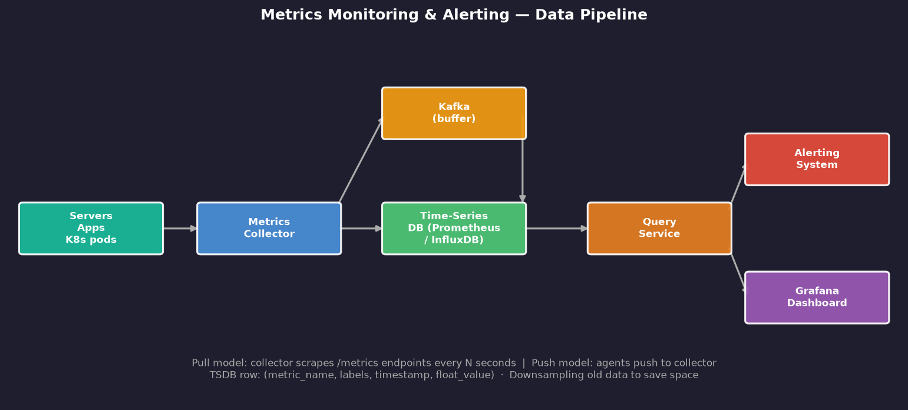
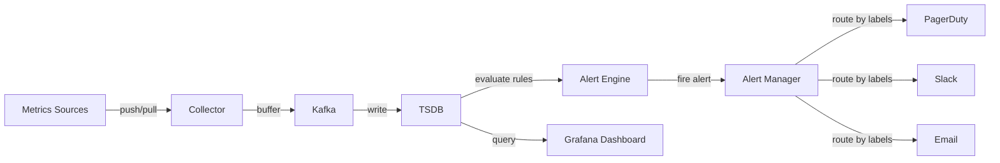

# Chapter 5 — Metrics Monitoring and Alerting System

> *"You can't improve what you can't measure. In distributed systems, observability is not optional — it's survival."*

---

## 🎯 Core Concept

A **Metrics Monitoring and Alerting System** collects, stores, queries, and visualizes numeric measurements from all parts of your infrastructure — servers, applications, databases, queues — and triggers alerts when things go wrong.

Think of it as the nervous system of your platform. Without it, you're flying blind.

**Real-world examples**: Prometheus + Grafana, Datadog, New Relic, AWS CloudWatch.

---

## 📋 Requirements

### Functional
- Collect metrics from diverse sources (servers, apps, containers)
- Store metrics with timestamps (time-series data)
- Query metrics with filters and aggregations
- Visualize metrics on dashboards (Grafana-style)
- Alert when metrics cross thresholds
- Support metric labels/tags for filtering (e.g., `env=prod, region=us-east`)

### Non-Functional
- Scale to 100+ million metrics/day across 1000s of servers
- Metrics stored for 1+ year (with downsampling)
- Query latency < 1 second for recent data
- Alert latency < 30 seconds from event to notification

### Scale (Back-of-Envelope)
```
Servers monitored:   10,000
Metrics per server:  ~500 (CPU, memory, disk, network, custom...)
Collection interval: every 15 seconds

Write QPS:   10,000 × 500 / 15 = 333,000 writes/sec
Storage:     333k × 1 year × 16 bytes/datapoint ≈ 168TB/year
             With compression (10:1): ~17TB/year
```

---

## 🏗️ High-Level Architecture

```
Data Sources           Collectors          Storage            Query/Alert
┌───────────┐         ┌─────────┐        ┌───────────┐      ┌──────────┐
│  Servers  │────────▶│Metrics  │──────▶ │  Kafka    │─────▶│Time-Series│
│  Apps     │         │Collector│        │  (buffer) │      │  DB       │
│  K8s pods │         │         │        └───────────┘      │(Prometheus│
└───────────┘         └─────────┘              │            │/InfluxDB) │
                                               ▼            └──────────┘
                                        ┌───────────┐            │
                                        │ Consumers │            ▼
                                        │(write to  │       ┌──────────┐
                                        │   TSDB)   │       │  Query   │────▶ Grafana
                                        └───────────┘       │ Service  │────▶ Alerting
                                                            └──────────┘
```



---

## 📊 The Data Model: Time-Series

Every metric is a **time-series**: a sequence of `(timestamp, value)` pairs with associated metadata:

```
Metric format:
  metric_name{label1=val1, label2=val2, ...} value timestamp

Example:
  cpu_usage{host="web-01", env="prod", region="us-east"} 73.5 1700000015
  cpu_usage{host="web-02", env="prod", region="us-east"} 45.2 1700000015
  http_requests_total{method="GET", status="200"}          1042 1700000015
  http_requests_total{method="GET", status="500"}          3    1700000015
```

**Why not a regular database?**

```
Regular DB for time-series:
  INSERT INTO metrics (name, host, value, timestamp)
  → 333,000 inserts/sec
  → Table grows to billions of rows
  → Indexes become huge
  → Range queries are slow

Time-Series DB (TSDB):
  Optimized for:
    - Sequential writes (append-only)
    - Time-range queries
    - Aggregations (avg, max, min, percentiles)
    - Automatic data expiry and downsampling
  
  10-100x more efficient than relational DB for this use case
```

---

## 🔄 Pull vs. Push Collection Models

### Pull Model (Prometheus-style)

```
Collector → scrapes → /metrics endpoint of each service

Flow:
  1. Each service exposes GET /metrics endpoint
  2. Collector calls all endpoints every 15 seconds
  3. Parses response, stores time-series

Pros:
  + Easy to discover service health (if /metrics is down, service is down)
  + Collector controls collection rate
  + No agent needed on each server

Cons:
  - Collector must know all service addresses
  - Doesn't work through firewalls
  - Services must expose HTTP endpoint
```

### Push Model (StatsD, CloudWatch Agents)

```
Service → pushes → Metrics Collector

Flow:
  1. Agent installed on each server
  2. Agent collects system metrics + custom app metrics
  3. Agent pushes to central collector endpoint

Pros:
  + Works behind firewalls
  + No need to expose HTTP endpoint per service
  + Better for short-lived jobs (batch jobs, lambdas)

Cons:
  - Need agent on every machine
  - Agent can be misconfigured/crash
  - Collector can be overwhelmed
```

**Best practice**: Use pull for long-lived services, push for ephemeral jobs.

---

## 💡 Alert System Design

### Alert Rules Engine

```yaml
# Prometheus alerting rule example
groups:
  - name: SLO Alerts
    rules:
      - alert: HighErrorRate
        expr: rate(http_requests_total{status="5xx"}[5m]) > 0.01
        for: 2m          # Must fire for 2 minutes (avoid flapping)
        labels:
          severity: critical
          team: backend
        annotations:
          summary: "High error rate on {{ $labels.service }}"
          description: "Error rate {{ $value | printf '%.2f' }}% > 1% threshold"
```

### Alert Routing: Who Gets Paged?

```
Alert fires → AlertManager
  ↓
Route by labels:
  severity=critical + team=backend → PagerDuty (on-call engineer)
  severity=warning  + team=backend → Slack #backend-alerts
  severity=info     + team=backend → Email digest
  
Deduplication: don't send 1000 alerts for the same issue
Grouping: aggregate related alerts into one notification
Silencing: suppress alerts during planned maintenance
```

### Alert Fatigue — The Real Enemy

```
Too many alerts → engineers ignore them → critical issues missed

Principles to avoid fatigue:
  1. Every alert must be actionable (if you can't DO something, don't alert)
  2. Every alert should be urgent enough to wake someone up (or don't page)
  3. Group related alerts (not 100 alerts for 100 hosts, but 1 alert for "cluster degraded")
  4. Use error budgets (SLO-based alerting): alert when you're burning budget too fast
```

---

## 🗄️ Storage: Downsampling & Retention

Storing full-resolution data forever is expensive. Use **downsampling**:

```
Raw data:      1 datapoint every 15 seconds → keep for 7 days
5-min averages: 1 datapoint every 5 minutes  → keep for 30 days
1-hour averages: 1 datapoint every hour      → keep for 1 year
1-day averages:  1 datapoint per day         → keep forever

Storage savings: 96% reduction from raw to daily averages
Trade-off: Can't see 15-second spikes in 6-month-old data
```

### Cassandra for Long-Term Storage

```
Table design for long-term metric storage:
CREATE TABLE metrics (
    metric_name TEXT,
    labels      FROZEN<MAP<TEXT, TEXT>>,
    time_bucket TIMESTAMP,  -- partition by day/hour
    ts          TIMESTAMP,
    value       DOUBLE,
    PRIMARY KEY ((metric_name, labels, time_bucket), ts)
) WITH CLUSTERING ORDER BY (ts ASC);
```

---

## 📊 Mermaid: Alert Pipeline



---

## ⚖️ Design Decisions & Trade-offs

### 1. Storage Engine Choices

| DB | Best For | Limitations |
|----|---------|------------|
| **Prometheus TSDB** | Ops monitoring, short retention | Single-node, limited to ~weeks |
| **InfluxDB** | General TSDB, flexible | Clustering is Enterprise only |
| **Cassandra** | Long-term storage, global scale | Not specialized for time-series |
| **TimescaleDB** | SQL familiarity + time-series | PostgreSQL overhead |

### 2. Cardinality Problem

```
High cardinality labels = explosion of time-series:

BAD:  http_requests{user_id="alice"}  ← unique per user → billions of series
GOOD: http_requests{endpoint="/api/orders"}  ← bounded

Rule: Labels should have LOW cardinality (< 1000 unique values)
      Never use user IDs, request IDs as labels
```

---

## 💡 Key Takeaways

| Concept | The Lesson |
|---------|-----------|
| **TSDB** | Time-series data needs specialized storage — 10-100x more efficient than SQL |
| **Pull vs. Push** | Pull for services, push for ephemeral jobs |
| **Downsampling** | Keep full resolution for 7 days, aggregate for long-term — saves 96% storage |
| **Alert fatigue** | Every alert must be actionable; group and deduplicate aggressively |
| **Cardinality** | High-cardinality labels (user_id) explode storage — use carefully |
| **SLO-based alerts** | Alert on error budget burn rate, not raw thresholds |

---

*← [Back to System Design Interview Vol. 2](../README.md)*
