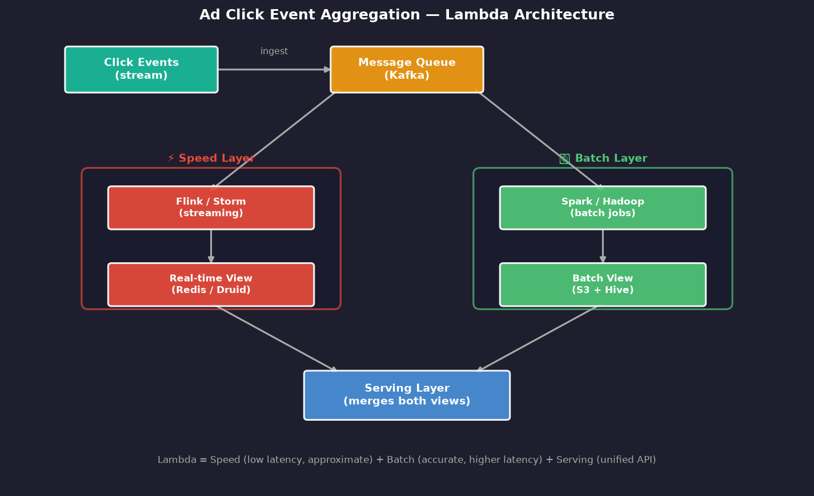
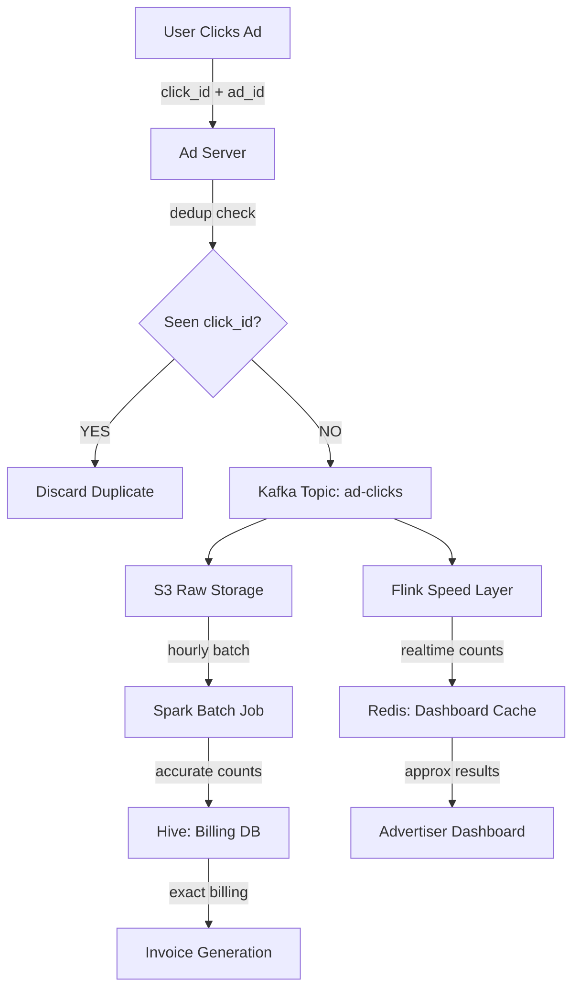

# Chapter 6 — Ad Click Event Aggregation

> *"Count every click. But count it correctly, count it once, and count it fast — even at 10,000 events per second."*

---

## 🎯 Core Concept

**Ad Click Event Aggregation** is the system that powers digital advertising revenue. Every time a user clicks an ad, it must be recorded, counted, and aggregated — accurately and in near-real-time — to charge advertisers, detect fraud, and optimize campaigns.

The unique challenge: you need **both** speed (real-time dashboards) and accuracy (billing). These two goals are in fundamental tension.

---

## 📋 Requirements

### Functional
- Track every ad click event: `{ad_id, user_id, timestamp, ip_address}`
- Aggregate total clicks per `ad_id` over configurable time windows (last minute, last hour, last day)
- Return top N most-clicked ads in a time range
- Support filtering by region, user demographics
- Real-time dashboard updates (< 1 minute lag)
- Exact billing counts (must be 100% accurate)

### Non-Functional
- Handle 10,000 click events/second at peak
- Fault tolerant: no click data loss
- Deduplication: each click counted exactly once
- Query latency < 1 second for aggregated results

### Scale (Back-of-Envelope)
```
Click events:     10,000/sec = 864M/day
Storage per click: ~50 bytes
Raw storage/day:   864M × 50B = 43GB/day
Aggregated storage: much smaller (counts, not raw clicks)
```

---

## 🏗️ Lambda Architecture: The Core Design

The fundamental tension in this system is:

```
Speed   ←→   Accuracy

Real-time stream processing:  Low latency, approximate results
Batch processing:             High latency, accurate results
```

**Lambda Architecture** solves this by running BOTH in parallel:



```
Click Events
     │
     ▼
Kafka (message queue)
     │
     ├──────────────────────────┐
     ▼                          ▼
Speed Layer               Batch Layer
(Flink/Storm)             (Spark/Hadoop)
(stream processing)       (batch jobs)
     │                          │
     ▼                          ▼
Real-time View            Batch View
(Redis/Druid)             (S3 + Hive)
     │                          │
     └──────────┬───────────────┘
                ▼
          Serving Layer
          (merges both views)
                │
                ▼
        Advertiser Dashboard
```

### Speed Layer (Low Latency)

```
Purpose: Show approximate results within seconds
Technology: Apache Flink / Apache Storm

Processing:
  Input:  click event stream from Kafka
  Every minute:
    SELECT ad_id, COUNT(*) as clicks
    FROM click_events
    WHERE timestamp >= now() - 1 minute
    GROUP BY ad_id
  Output: click counts to Redis

Characteristics:
  Latency:  1-30 seconds
  Accuracy: Approximate (may miss some events)
  Use case: Real-time dashboard, fraud detection
```

### Batch Layer (High Accuracy)

```
Purpose: Produce accurate counts for billing
Technology: Apache Spark / Hadoop MapReduce

Processing:
  Input:  all click events from S3 (hourly batch)
  Every hour:
    Read ALL events from S3 for past hour
    Count clicks per ad_id
    Deduplicate (remove duplicate clicks)
    Write to Hive table

Characteristics:
  Latency:  1-24 hours
  Accuracy: Exact (100% accurate for billing)
  Use case: Advertiser billing, financial reports
```

### Serving Layer

```
Purpose: Unify both views for the API
Algorithm:
  if query_time_range is recent (< 1 hour):
    return speed_layer_result  (fast but approximate)
  if query_time_range is old (> 1 hour):
    return batch_layer_result   (exact)
  if query spans both:
    batch_result + speed_layer for remaining time
```

---

## 🔑 Event Deduplication: The Critical Challenge

### Why Duplicates Happen

```
Normal flow:  Client → Server → Kafka → Processed ✓

Failure modes that cause duplicates:
  1. Client retries on timeout → 2 events with same content
  2. Kafka at-least-once delivery → consumer receives same message twice
  3. Flink job restart → re-processes already-counted events
  4. Network partition → event processed on both sides
```

### Deduplication Strategies

```
Strategy 1: Client-side idempotency key
  Client generates unique ID per click:
    click_id = UUID()
  Server checks: has click_id been seen?
  If yes → discard duplicate
  
  Storage: Set of seen click_ids in Redis
  TTL: 24 hours (clicks older than 24h can't be retried)

Strategy 2: Exactly-once processing in Kafka
  Kafka transactions + idempotent producer:
    producer.initTransactions()
    producer.beginTransaction()
    producer.send(event)
    producer.commitTransaction()
  
  If broker fails mid-commit → transaction rolled back
  No duplicate in Kafka

Strategy 3: Batch deduplication
  In Spark job:
    SELECT ad_id, COUNT(DISTINCT click_id) as unique_clicks
    FROM click_events
    GROUP BY ad_id
  
  DISTINCT by click_id eliminates duplicates at query time
```

---

## ⏱️ Time Windows for Aggregation

### Tumbling Windows (Fixed, Non-overlapping)

```
|─── 1 min ───|─── 1 min ───|─── 1 min ───|
  Window 1        Window 2       Window 3

Each event belongs to exactly ONE window
Simple to implement, easy to understand
Use case: "clicks in the last minute"
```

### Sliding Windows (Overlapping)

```
|─── 5 min ─────────|
    |─── 5 min ─────────|
        |─── 5 min ─────────|

Events can belong to multiple windows
More expensive to compute
Use case: "clicks in last 5 minutes" updated every minute
```

### Watermarks: Handling Late Events

```
Problem: Events arrive out-of-order due to network delays
  11:00:00 - event created
  11:00:15 - event arrives at Kafka (15s late)

Without watermarks:
  If window closes at 11:00:00, this event is missed!

With watermarks:
  Watermark = current_time - max_allowed_lateness (e.g., 2 minutes)
  Window doesn't close until watermark passes its end time
  → Events up to 2 minutes late are still counted
  → Events older than 2 minutes: dropped or sent to "late events" topic
```

---

## 🔬 Deep Dive: Top-N Ads Query

### Naive Approach (Doesn't Scale)

```sql
-- Every second, for each region:
SELECT ad_id, COUNT(*) as clicks
FROM click_events
WHERE timestamp >= now() - 1min
GROUP BY ad_id
ORDER BY clicks DESC
LIMIT 100;

-- Problem: Full table scan of billions of events per query
```

### Efficient Approach: Heap + Stream

```
Maintain a min-heap of size N per time window:
  Per partition in Flink:
    1. Aggregate counts locally → (ad_id, count) per partition
    2. Merge: for each (ad_id, count), update global heap:
       if count > heap.min: heap.pop_min(); heap.push((ad_id, count))
  
  Result: O(N log N) instead of O(M log M) where M >> N
```

---

## ⚖️ Design Decisions & Trade-offs

### Lambda vs. Kappa Architecture

| Architecture | Pros | Cons |
|-------------|------|------|
| **Lambda** (both batch + stream) | Flexibility, accuracy for billing | Complex: maintain two codebases |
| **Kappa** (stream only with replay) | Simple: one codebase | Expensive replay; stream must handle history |

**For ad click billing**: Lambda is preferred — billing accuracy requires a reliable batch layer.

### Data Freshness vs. Accuracy

```
Business rule:
  Dashboard (advertisers): can tolerate 1-5 minute lag, show approximate counts
  Billing (end of month): must be 100% accurate, batch-computed
  Fraud detection: must be < 5 seconds, approximate is fine

Design implication:
  Use speed layer for dashboard + fraud
  Use batch layer for billing
```

---

## 📊 Mermaid: Click Event Processing Flow



---

## 💡 Key Takeaways

| Concept | The Lesson |
|---------|-----------|
| **Lambda Architecture** | Speed + Accuracy at the cost of complexity — run stream AND batch |
| **Deduplication** | Use unique click_id + Redis TTL to prevent double-counting |
| **Watermarks** | Allow N minutes of lateness before closing a time window |
| **Kappa simplification** | If stream can replay history, skip the batch layer entirely |
| **Heap for Top-N** | Don't sort all clicks — maintain a min-heap of size N |
| **Accuracy vs. latency** | Billing needs 100% accuracy (batch); dashboards need speed (stream) |

---

*← [Back to System Design Interview Vol. 2](../README.md)*
