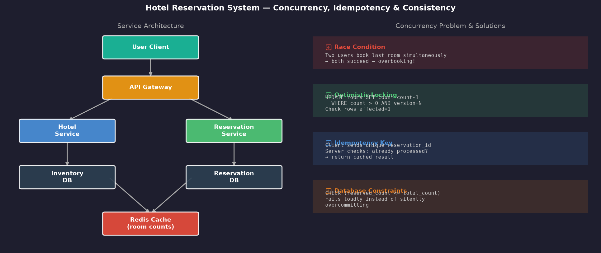
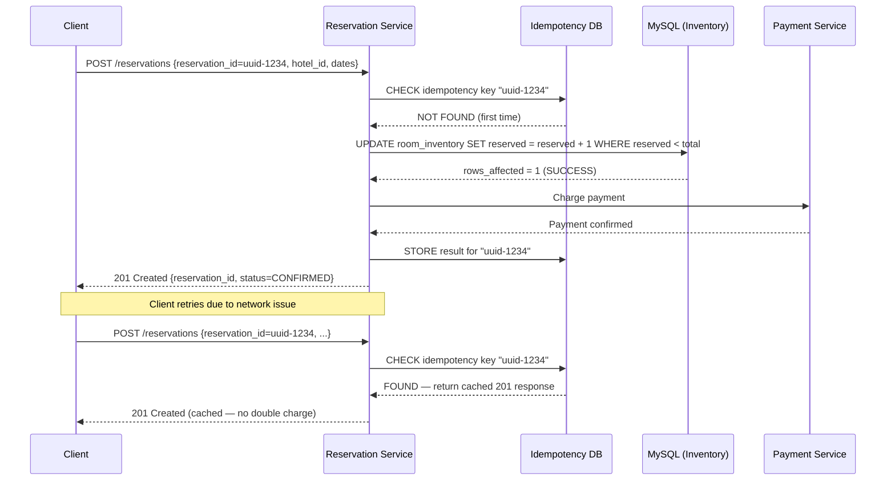

# Chapter 7 — Hotel Reservation System

> *"Two users simultaneously try to book the last room. Only one should succeed."*
> Hotel reservation is the canonical example of distributed concurrency, idempotency, and inventory management.

---

## 🎯 Core Concept

A **Hotel Reservation System** must handle a fundamentally hard problem: **concurrent inventory management**. Unlike shopping carts where you can always add more stock, hotel rooms are finite. The last room at the Marriott on New Year's Eve cannot be double-booked.

This chapter teaches three critical patterns:
1. **Idempotency** — making retries safe
2. **Optimistic locking** — handling concurrency without pessimistic locks
3. **Cache + DB consistency** — keeping the fast path accurate

---

## 📋 Requirements

### Functional
- Users search for available hotels/rooms by location and dates
- View hotel details, room types, pricing
- Reserve a room (select dates → pay → confirmation)
- Cancel reservation
- View booking history

### Non-Functional
- No overbooking (hard constraint — must be enforced)
- Idempotent booking: retry on network failure won't double-charge
- Read-heavy: searches vastly outnumber bookings
- Low latency: search results in < 200ms

### Scale (Back-of-Envelope)
```
Hotels:           500,000
Rooms/hotel avg:  20
Total rooms:      10 million
Reservations/day: 1 million (1 booking every 86ms)
Read/Write ratio: 10:1 (searches >> bookings)
```

---

## 🏗️ High-Level Architecture

```
┌──────────┐    ┌──────────────┐    ┌─────────────────┐
│  Client  │───▶│  API Gateway │───▶│  Hotel Service  │───▶ Hotel DB (read)
│  (Web/   │    └──────────────┘    │  (search, info) │───▶ Hotel DB (write)
│  Mobile) │           │            └─────────────────┘
└──────────┘           │
                       ▼
                ┌─────────────────┐   ┌─────────────────┐
                │ Reservation Svc │──▶│  Reservation DB │
                │ (booking, cancel│   │  (MySQL)        │
                └─────────────────┘   └─────────────────┘
                       │
                       ▼
                ┌─────────────────┐
                │  Redis Cache    │
                │(room inventory) │
                └─────────────────┘
```



---

## 🔑 The Concurrency Problem

### Race Condition Scenario

```
Available rooms for Room 101: 1

Time 0: User A queries → 1 room available ✓
Time 0: User B queries → 1 room available ✓

Time 1: User A books → success (room count: 1 → 0)
Time 1: User B books → success?? (room count: 0 → -1) ← OVERBOOKING!
```

This happens because both users checked availability BEFORE either committed their booking.

### Solution 1: Database Constraints (Last Line of Defense)

```sql
-- Constraint: reserved_count can never exceed total_rooms
ALTER TABLE room_inventory 
ADD CONSTRAINT chk_no_overbooking 
CHECK (reserved_count <= total_rooms);

-- Booking attempt:
UPDATE room_inventory
SET reserved_count = reserved_count + 1
WHERE hotel_id = 123 
  AND room_type = 'deluxe'
  AND check_in_date = '2024-12-31'
  AND reserved_count < total_rooms;  -- Critical: check INSIDE the UPDATE

-- Check rows affected:
-- rows_affected = 1 → booking succeeded
-- rows_affected = 0 → room no longer available → return error to user
```

This **atomic update** is the most important pattern here. The check and the update happen in a single SQL statement — the database guarantees atomicity.

### Solution 2: Optimistic Locking with Version

```sql
-- Add version column to inventory:
CREATE TABLE room_inventory (
    hotel_id       INT,
    room_type      VARCHAR(50),
    date           DATE,
    total_rooms    INT,
    reserved_count INT,
    version        INT DEFAULT 0,  -- ← optimistic lock
    PRIMARY KEY (hotel_id, room_type, date)
);

-- Read:
SELECT total_rooms, reserved_count, version FROM room_inventory
WHERE hotel_id = 123 AND room_type = 'deluxe' AND date = '2024-12-31';
-- Returns: total=5, reserved=4, version=42

-- Write (only if version hasn't changed):
UPDATE room_inventory
SET reserved_count = reserved_count + 1, version = version + 1
WHERE hotel_id = 123 AND room_type = 'deluxe' AND date = '2024-12-31'
  AND version = 42;  -- ← fails if another update happened
-- If rows_affected = 0: retry the whole operation
```

**Optimistic locking works best when:**
- Conflicts are rare (low contention)
- The operation can be safely retried

**For New Year's Eve at a popular hotel (high contention)**: pessimistic locking or simple atomic UPDATE is better.

---

## 🔑 Idempotency: Safe Retries

### The Problem

```
Scenario:
  1. User submits booking → server processes → payment charged
  2. Server returns 200 OK → network drops
  3. User never receives response → user clicks "Book Again"
  4. Server processes again → user charged TWICE → overbooking?
```

### Idempotency Key Solution

```
1. Client generates unique reservation_id (UUID) when starting checkout
2. Client sends reservation_id in every request for this booking:
   POST /reservations
   {
     "reservation_id": "res-uuid-1234",  ← idempotency key
     "hotel_id": 123,
     "room_type": "deluxe",
     "check_in": "2024-12-31",
     "user_id": "alice"
   }

3. Server checks idempotency table:
   IF EXISTS (SELECT 1 FROM idempotency WHERE key = 'res-uuid-1234'):
     → Return cached result (same response as first time)
   ELSE:
     → Process booking, store result with key
     → Return result

4. Result: User can retry safely. Server deduplicates by key.
```

```sql
CREATE TABLE idempotency_keys (
    key         VARCHAR(64) PRIMARY KEY,
    response    JSON,           -- cached response
    created_at  TIMESTAMP DEFAULT NOW()
);

-- TTL: clean up keys older than 24 hours (retries won't happen after that)
```

---

## 💾 Data Model

### Core Tables

```sql
-- Hotels
CREATE TABLE hotels (
    hotel_id    BIGINT PRIMARY KEY,
    name        VARCHAR(256),
    city        VARCHAR(100),
    country     VARCHAR(100),
    star_rating TINYINT,
    latitude    DECIMAL(9,6),
    longitude   DECIMAL(9,6)
);

-- Room types per hotel
CREATE TABLE rooms (
    room_id     BIGINT PRIMARY KEY,
    hotel_id    BIGINT,
    room_type   VARCHAR(50),   -- 'single', 'double', 'deluxe', 'suite'
    price       DECIMAL(10,2),
    total_count INT,
    FOREIGN KEY (hotel_id) REFERENCES hotels(hotel_id)
);

-- Inventory per date (pre-computed)
CREATE TABLE room_inventory (
    hotel_id       BIGINT,
    room_type      VARCHAR(50),
    date           DATE,
    total_rooms    INT,
    reserved_count INT,
    version        INT DEFAULT 0,
    PRIMARY KEY (hotel_id, room_type, date)
);

-- Reservations
CREATE TABLE reservations (
    reservation_id  VARCHAR(64) PRIMARY KEY,  -- user-generated UUID
    hotel_id        BIGINT,
    room_type       VARCHAR(50),
    user_id         BIGINT,
    check_in        DATE,
    check_out       DATE,
    status          ENUM('PENDING','CONFIRMED','CANCELLED'),
    total_price     DECIMAL(10,2),
    created_at      TIMESTAMP
);
```

### Pre-populating Inventory

```
For each hotel, pre-generate room_inventory rows for next 2 years:
  500K hotels × 5 room types × 730 days = 1.8B rows

This is large but manageable with proper partitioning:
  Partition by (hotel_id RANGE) or (date RANGE)
  Queries always filter by date range → partition pruning
```

---

## ⚡ Caching Strategy

### What to Cache

```
Room availability (most read, infrequently changed):
  Key: "inventory:{hotel_id}:{room_type}:{date}"
  Value: available_count (integer)
  TTL: 1 minute (stale is acceptable for search, not for booking)

Hotel details (static):
  Key: "hotel:{hotel_id}"
  Value: JSON blob
  TTL: 1 day

Search results by location/date:
  Key: "search:{city}:{check_in}:{check_out}:{star_rating}"
  Value: List of hotel_ids with availability
  TTL: 5 minutes
```

### Cache Consistency on Booking

```
On successful reservation:
  1. Write to DB: UPDATE room_inventory SET reserved_count = reserved_count + 1
  2. Invalidate cache: DEL "inventory:{hotel_id}:{room_type}:{date}"
  3. Next read: cache miss → re-read from DB → re-populate cache

Never update cache directly → stale data risk
Always invalidate → next reader gets fresh data from DB
```

---

## ⚖️ Design Decisions & Trade-offs

### Showing Availability in Search vs. At Booking Time

```
Search page: "Hotel ABC — 3 rooms available"
  → Cached data, possibly 5 minutes stale
  → Acceptable: user clicks through many hotels before booking

Booking page: "Room 101 — Last room!"
  → Real-time DB query (cache TTL = 10 seconds)
  → More accurate, slightly more expensive

Booking confirmation: "You are booking room 101 for Dec 31"
  → Atomic DB update with constraint check
  → 100% accurate
```

### Distributed Locking for High-Demand Rooms

For extremely popular rooms (flash sales, New Year's Eve):

```
Option A: DB atomic update (default)
  → Simple, works for most cases
  → May have high lock contention

Option B: Redis distributed lock
  SETNX "lock:{hotel_id}:{room_type}:{date}" 1 PX 5000
  → If SETNX returns 1: lock acquired, proceed
  → If SETNX returns 0: locked by another request, retry
  DEL "lock:{hotel_id}:{room_type}:{date}" after booking
  
  Works for very high contention scenarios
  Risk: Redis down = no bookings possible
```

---

## 📊 Mermaid: Booking Flow with Idempotency



---

## 💡 Key Takeaways

| Concept | The Lesson |
|---------|-----------|
| **Atomic UPDATE** | `UPDATE ... WHERE count < total` prevents overbooking without locks |
| **Idempotency key** | Client-generated UUID makes retries safe — server deduplicates |
| **Optimistic locking** | Version column + check before update — best for low-contention |
| **Pre-populate inventory** | Generate room_inventory for all dates upfront — fast date-range queries |
| **Cache invalidation** | On booking, delete cache key — never update directly |
| **Fail-open vs. fail-closed** | Booking must fail-closed (deny on uncertainty) vs. search can fail-open (show stale) |

---

*← [Back to System Design Interview Vol. 2](../README.md)*
