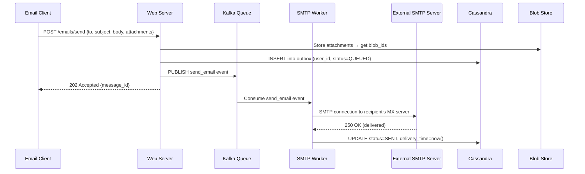

# Chapter 8 — Distributed Email Service

> *"Email is 50 years old and handles billions of messages daily. Building a scalable email service requires mastering protocols, storage, search, and real-time delivery."*

---

## 🎯 Core Concept

A **Distributed Email Service** must handle sending, receiving, storing, searching, and real-time delivery of email — all at massive scale. Think Gmail: 1.8 billion users, petabytes of stored messages, near-instant inbox updates.

The challenge is that email involves multiple complex protocols (SMTP, IMAP, POP3), diverse storage needs (message bodies, attachments, metadata), and real-time requirements (push notifications for new mail).

---

## 📋 Requirements

### Functional
- Send email (SMTP outbound)
- Receive email (SMTP inbound from external servers)
- View inbox, sent, drafts, spam folders
- Search emails by sender, subject, body content
- Real-time notification when new email arrives
- Attachments (up to 25MB per message)

### Non-Functional
- 1 billion users, each with ~50GB mailbox quota
- 99.99% availability
- Email delivery < 5 minutes end-to-end
- Search results < 1 second
- Inbox load < 500ms

### Scale (Back-of-Envelope)
```
Users:                1 billion
Emails sent/day:      10 billion (10 per user avg)
Avg email size:       75KB (with attachments factored in)
Metadata per email:   ~1KB (from, to, subject, timestamp)
Raw email storage:    10B × 75KB/day = 750TB/day
  With 5-year retention: 750TB × 365 × 5 ≈ 1.4 exabytes
  (Gmail stores ~10 exabytes in practice)
```

---

## 🏗️ High-Level Architecture

```
External Email         Internal Components           Storage
Servers (SMTP)         ┌─────────────────┐          ┌─────────────┐
       │               │  SMTP Servers   │──────────▶│ Message     │
       ▼               │  (inbound MX)   │           │ Queue       │
┌──────────────┐       └─────────────────┘           │ (Kafka)     │
│ DNS (MX      │               │                     └─────────────┘
│  records)    │               ▼                            │
└──────────────┘       ┌─────────────────┐                  ▼
                       │  Web Servers    │          ┌─────────────┐
User Client            │  (HTTPS API)    │          │  Processing │
       │               └─────────────────┘          │   Workers   │
       ▼                       │                    └─────────────┘
┌──────────────┐       ┌─────────────────┐          ┌─────────────┐
│  Email App   │──────▶│  WebSocket      │          │   Blob      │
│  (web/mobile)│       │  (real-time)    │          │   Store     │
└──────────────┘       └─────────────────┘          │(attachments)│
                                                     └─────────────┘
                                                     ┌─────────────┐
                                                     │  Metadata   │
                                                     │  DB (Cassandra) │
                                                     └─────────────┘
```


---

## 📧 Email Protocols

### SMTP (Simple Mail Transfer Protocol) — Sending

```
SMTP is used for:
  1. Client → your mail server (submission, port 587)
  2. Your mail server → recipient's mail server (relay, port 25)

Example SMTP conversation:
  CLIENT: EHLO mail.example.com
  SERVER: 250-OK
  CLIENT: MAIL FROM: <alice@example.com>
  SERVER: 250 OK
  CLIENT: RCPT TO: <bob@gmail.com>
  SERVER: 250 OK
  CLIENT: DATA
  SERVER: 354 Start mail input
  CLIENT: From: alice@example.com
          To: bob@gmail.com
          Subject: Hello!
          
          Hi Bob, ...
          .
  SERVER: 250 OK (Message queued as abc123)
```

### IMAP (Internet Message Access Protocol) — Receiving

```
IMAP: keeps emails on the server, syncs across devices
  - Modern standard (used by Gmail, Outlook)
  - Client downloads headers, fetches full message on demand
  - Server maintains "seen", "flagged" state per user

POP3: older, downloads emails to device and deletes from server
  - One device only
  - No server-side state
  - Rarely used for modern apps
```

---

## 💾 Storage Architecture

### Three Storage Types for Email

```
1. Metadata DB (Cassandra)
   - From, To, Subject, Date, Folder, Flags, Size
   - Quick mailbox queries
   - No message body

2. Message Store (Blob Storage / S3)  
   - Full email body (text/HTML parts)
   - Attachments
   - Immutable objects (emails don't change)
   - Content-addressed (hash = ID)

3. Search Index (Elasticsearch)
   - Full-text index of subject + body
   - Inverted index for fast keyword search
   - Updated async when new email arrives
```

### Why Cassandra for Email Metadata?

```sql
-- Cassandra table for mailbox
CREATE TABLE mailbox (
    user_id    UUID,
    folder     TEXT,           -- 'INBOX', 'SENT', 'TRASH', 'SPAM'
    timestamp  TIMEUUID,       -- sorts by time
    message_id TEXT,
    from_addr  TEXT,
    subject    TEXT,
    is_read    BOOLEAN,
    size_bytes INT,
    PRIMARY KEY ((user_id, folder), timestamp)
) WITH CLUSTERING ORDER BY (timestamp DESC);

-- Query inbox (most recent first):
SELECT * FROM mailbox
WHERE user_id = ? AND folder = 'INBOX'
LIMIT 50;
```

**Why Cassandra?**
- Partition key = `(user_id, folder)` → all inbox messages on same node
- Clustering by timestamp → sorted, efficient range queries
- Write-heavy (10 billion inserts/day) — Cassandra excels here
- Linear horizontal scaling

### Deduplication for Attachments

```
Many emails share the same attachment (forwarded emails, newsletters):
  
Content-addressed storage:
  hash = SHA256(attachment_content)
  path = /attachments/{hash[:2]}/{hash[2:4]}/{hash}
  
  If two emails have identical attachment:
  → Same hash → same blob → stored only ONCE
  → Reference count tracks how many emails use it
  
Storage savings: 20-40% deduplication rate typical
```

---

## 🔔 Real-time Inbox Notifications

### The Problem

```
User has email app open
New email arrives
User expects to see it immediately (< 2 seconds)

Without real-time:
  App polls every 30 seconds → 30s delay, unnecessary traffic
  
With real-time:
  Server pushes notification instantly → user sees immediately
```

### WebSocket Approach

```
1. User opens email app
2. App establishes WebSocket connection to WebSocket server
3. WebSocket server subscribes to user's Redis Pub/Sub channel
4. New email arrives via SMTP → Processing Worker:
   a. Store in Cassandra + Blob store
   b. Update search index (async)
   c. PUBLISH to Redis: "new_email:user:{user_id}" → {message_id, subject, from}
5. WebSocket server receives Redis message
6. Pushes notification to user's WebSocket connection
7. App shows "New email from Alice" badge/notification
```

---

## 🔍 Email Search

### Full-Text Search Architecture

```
Elasticsearch index for email:
{
  "user_id": "alice-uuid",
  "message_id": "msg-abc123",
  "from": "bob@example.com",
  "to": ["alice@example.com"],
  "subject": "Project proposal",
  "body": "Hi Alice, I wanted to share...",
  "timestamp": "2024-01-15T10:30:00Z",
  "folder": "INBOX",
  "attachments": ["proposal.pdf"]
}

Search query: "project proposal from:bob"
→ Elasticsearch inverted index lookup
→ Filter by user_id + query terms
→ Score by relevance (TF-IDF + recency)
→ Return matching message_ids
→ Fetch full metadata from Cassandra
```

### Search Indexing Pipeline

```
New email arrives
        │
        ▼
   Kafka message
        │
        ▼
Search Indexer Worker
  - Extracts text from HTML email
  - Strips tracking pixels, HTML tags
  - Handles email encoding (quoted-printable, base64)
  - Writes to Elasticsearch
        │
        ▼
Search index updated (< 30 second lag acceptable)
```

---

## 🛡️ Spam Filtering

### Multi-Layer Defense

```
Layer 1: DNS Reputation (fast, before accepting)
  - Check sender IP against RBL (Real-time Blackhole Lists)
  - Verify SPF record (authorized sender?)
  - Verify DKIM signature (not tampered?)
  - If any fail → reject at SMTP level

Layer 2: Content Analysis (after accepting)
  - Rule-based: known spam patterns, URLs, keywords
  - ML model: trained on billions of labeled emails
  - Score: 0.0 (not spam) to 1.0 (definitely spam)
  - If score > 0.9: move to SPAM folder
  - If score 0.5-0.9: mark as possible spam

Layer 3: User Feedback Loop
  - User marks email as spam → ML training signal
  - User marks email as "not spam" → counter signal
  - Personalized filtering per user over time
```

---

## ⚖️ Design Decisions & Trade-offs

### 1. Blob Storage vs. Database for Message Bodies

| Approach | Pros | Cons |
|----------|------|------|
| **Relational DB** (large blobs) | Simple, one system | DB not optimized for binary, expensive |
| **Cassandra** (large blobs) | Familiar, no extra system | Performance degrades with large values |
| **Blob Storage (S3-like)** | Cheap, infinitely scalable | Extra lookup step |

**Decision**: Metadata in Cassandra, bodies/attachments in blob storage. The extra lookup is worth it for cost and scalability.

### 2. Email Compression

```
Before storing:
  Compress email body with gzip/lz4
  
  Typical compression ratio:
    Text emails: 10:1 compression
    HTML emails: 5:1 compression
    Attachments: minimal (already compressed PDFs, images)
  
Storage savings: 60-70% on message bodies
```

---

## 📊 Mermaid: Email Sending Flow



---

## 💡 Key Takeaways

| Concept | The Lesson |
|---------|-----------|
| **SMTP/IMAP separation** | SMTP for sending, IMAP for retrieving — they serve different roles |
| **Cassandra for mailbox** | Partition by (user, folder), cluster by timestamp — perfect fit |
| **Blob store for bodies** | Separate large values from metadata — cost + performance |
| **Content addressing** | SHA256 deduplication eliminates 20-40% duplicate attachments |
| **WebSocket for real-time** | Push new email notifications instantly via Redis Pub/Sub fan-out |
| **Search is async** | Index after storage — eventual consistency acceptable for search |

---

*← [Back to System Design Interview Vol. 2](../README.md)*
