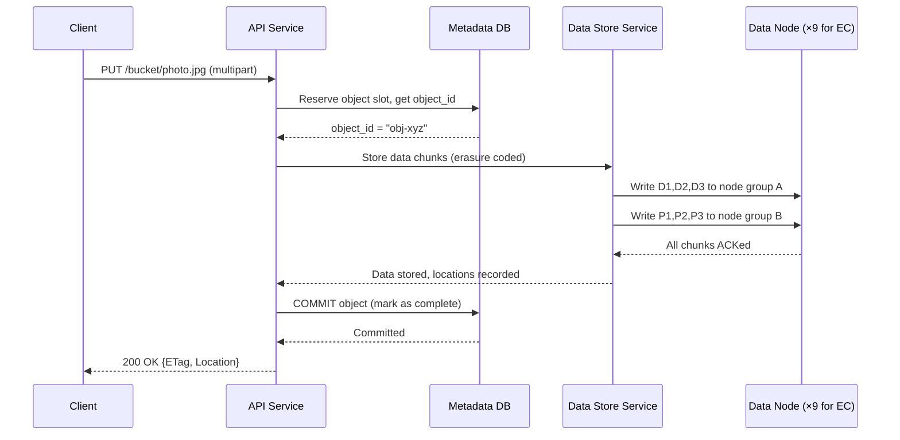

# Chapter 9 — S3-like Object Storage

> *"Store any file, any size, forever — with 11 nines of durability. That's the promise of object storage."*

---

## 🎯 Core Concept

**Object Storage** (like Amazon S3) is a flat, key-value store for binary data — photos, videos, backups, logs, model weights, anything. Unlike a file system (hierarchical) or a database (structured), object storage is designed for:

- **Massive scale**: exabytes of data
- **High durability**: 99.999999999% (11 nines)
- **High throughput**: millions of reads per second
- **Simplicity**: just PUT, GET, DELETE by key

The core challenge is storing enormous amounts of data reliably and cheaply across many failure-prone machines.

---

## 📋 Requirements

### Functional
- `PUT /bucket/key` — Upload an object (up to 5TB)
- `GET /bucket/key` — Download an object
- `DELETE /bucket/key` — Delete an object
- `LIST /bucket?prefix=x` — List objects with prefix
- Versioning: keep previous versions of objects
- Lifecycle policies: auto-delete/archive after N days

### Non-Functional
- 99.999999999% (11 nines) durability
- 99.99% availability
- Support objects from 1 byte to 5TB
- Low latency for small objects (< 10ms)
- High throughput for large objects (multi-GB/s)

### Scale (Back-of-Envelope)
```
Storage:        100 petabytes (100PB)
Object size:    ~1MB average
Objects:        100PB / 1MB = 100 billion objects
Metadata:       100B objects × 1KB metadata = 100TB metadata
Read QPS:       ~100,000 reads/sec
Write QPS:      ~10,000 writes/sec
```

---

## 🏗️ High-Level Architecture

```
Client
  │
  ├── PUT /bucket/key → Load Balancer → API Service
  │                                         │
  │                              ┌──────────┴──────────┐
  │                              ▼                     ▼
  │                      Metadata Service         Data Store
  │                      (SQL DB)                 Service
  │                      stores:                       │
  │                        bucket, key,            ┌───┴───┐
  │                        object_id,              │ Data  │
  │                        size, etc.              │ Nodes │
  │                                                │(9 nodes│
  └── GET /bucket/key → API → Metadata → find      │6+3 EC)│
                                 object_id →       └───────┘
                                 Data Store → return bytes
```


---

## 🔑 Key Design Decisions

### 1. Metadata vs. Data Separation

```
Two completely different access patterns:

Metadata (small, structured, frequent):
  - What: bucket, key, object_id, size, checksum, created_at, version
  - Access: every PUT and GET needs metadata lookup
  - Storage: SQL database (PostgreSQL or MySQL)
  - Size: ~1KB per object → 100TB for 100B objects (manageable)

Data (large, binary, sequential):
  - What: actual file bytes
  - Access: large sequential reads/writes
  - Storage: distributed data nodes (HDDs, not SSDs)
  - Size: actual file content (petabytes)
```

### 2. Object ID and Content-Addressing

```
Option A: Assign UUID to each object
  - Simple
  - No deduplication

Option B: Content-addressed (hash-based)
  - object_id = SHA256(content)
  - Identical content → same ID → stored once
  - Automatic deduplication
  - Immutable: content + ID are permanently linked

S3 uses UUID (no deduplication by default)
Content-addressing used by git, IPFS, and some internal systems
```

---

## 📦 Multipart Upload for Large Files

### Why Multipart?

```
Problem: Upload a 5GB video file
  Naive: single HTTP PUT → if it fails at 4.9GB, start over
  
  Issues:
    - Single TCP connection can't fill network bandwidth efficiently
    - Any interruption requires full restart
    - Maximum HTTP body size limits
```

### Multipart Upload Flow

```
Step 1: Initialize
  POST /bucket/video.mp4?uploads
  Response: {upload_id: "MPID-1234"}

Step 2: Upload parts in parallel
  PUT /bucket/video.mp4?partNumber=1&uploadId=MPID-1234 {bytes 0-99MB}
  PUT /bucket/video.mp4?partNumber=2&uploadId=MPID-1234 {bytes 100-199MB}
  PUT /bucket/video.mp4?partNumber=3&uploadId=MPID-1234 {bytes 200-299MB}
  ...
  Each part returns: {ETag: "etag-hash-1"}

Step 3: Complete
  POST /bucket/video.mp4?uploadId=MPID-1234
  Body: [{partNumber:1, ETag:"hash-1"}, {partNumber:2, ETag:"hash-2"}...]
  Response: {ETag: "combined-hash", Location: "/bucket/video.mp4"}

Benefits:
  ✓ Upload parts in parallel (better throughput)
  ✓ Retry individual failed parts (not whole file)
  ✓ Resume interrupted uploads
  ✓ Works for files up to 5TB
```

---

## 🛡️ Durability: Erasure Coding vs. Replication

### 3× Replication (Simple)

```
Object → stored on 3 different nodes:
  Node A (primary)
  Node B (replica 1)
  Node C (replica 2)

Storage overhead: 3× = 200% extra
Durability: survives 2 simultaneous failures
```

### Erasure Coding (Efficient)

```
Erasure coding (6+3 example):

Object → split into 6 data chunks + compute 3 parity chunks

  D1  D2  D3  D4  D5  D6   P1  P2  P3
  ──  ──  ──  ──  ──  ──   ──  ──  ──
  Node0 Node1 Node2 Node3 Node4 Node5 Node6 Node7 Node8

Store one chunk on each of 9 nodes

Recovery: any 6 of the 9 chunks can reconstruct the full object
  (tolerate ANY 3 node failures simultaneously)

Storage overhead: 9/6 = 1.5× = only 50% extra!
vs replication: 3× = 200% extra

Trade-off:
  + 50% storage overhead vs 200% for 3× replication
  + Same durability (survive 3 failures)
  - More CPU for encoding/decoding
  - Higher read latency (must read 6 chunks, not 1)
  - Used by Facebook, Google, AWS for cold storage
```

---

## 🗃️ Data Layout on Disk

### How Objects Are Stored Within a Data Node

```
Rather than one file per object (billions of small files = slow):

WAL Approach: Pack multiple objects into large files

  /data/shard-01/segment-0001.dat   (1GB file containing many objects)
  /data/shard-01/segment-0002.dat
  /data/shard-01/segment-0003.dat

segment-0001.dat internal layout:
  [obj_size:8][checksum:32][obj_data:N] [obj_size:8][checksum:32][obj_data:N] ...

Index file: maps object_id → (segment_file, byte_offset, length)
  {obj_id: "abc123", file: "segment-0001.dat", offset: 0, length: 1024}
  {obj_id: "def456", file: "segment-0001.dat", offset: 1024, length: 512}

Benefits:
  - Sequential I/O instead of random I/O
  - Filesystem handles fewer files (better performance)
  - Amortizes per-file overhead
```

---

## 🔒 Consistency Model

### Strong Consistency for Object Writes

```
After successful PUT:
  All subsequent GETs must return the new data
  
S3 (since 2020): strong read-after-write consistency
  PUT /key → success
  GET /key → guaranteed to return new version

Implementation:
  Metadata service is the source of truth
  Data stored before metadata committed
  GET reads metadata first → then data
  → Guaranteed fresh metadata = fresh data
```

### Versioning

```
Versioning enabled on bucket:

PUT /bucket/photo.jpg (v1)  → object_id = "obj-abc"
PUT /bucket/photo.jpg (v2)  → object_id = "obj-def" (new version)
PUT /bucket/photo.jpg (v3)  → object_id = "obj-ghi" (new version)

GET /bucket/photo.jpg        → returns v3 (current)
GET /bucket/photo.jpg?versionId=obj-abc → returns v1

DELETE /bucket/photo.jpg     → adds delete marker (doesn't actually delete)
GET /bucket/photo.jpg        → 404 (delete marker = latest)
GET /bucket/photo.jpg?versionId=obj-abc → still accessible

Lifecycle policy: delete versions older than 30 days to save storage
```

---

## ⚖️ Design Decisions & Trade-offs

### 1. Metadata DB Choice

| DB | Suitability | Notes |
|----|------------|-------|
| **PostgreSQL** | Good | Strong consistency, limited scale |
| **MySQL** | Good | Battle-tested, shardable |
| **Cassandra** | Limited | Eventual consistency is problematic for metadata |
| **TiKV/Spanner** | Excellent | Distributed, strongly consistent, complex |

**Decision**: MySQL with horizontal sharding by `bucket_id` — simple and proven.

### 2. Upload Security: Pre-signed URLs

```
Problem: Don't want client to upload through your API servers (bandwidth cost)
Solution: Pre-signed URLs

Flow:
  1. Client requests upload URL from your API:
     POST /presign?bucket=photos&key=vacation.jpg&size=10MB
  
  2. Server generates time-limited signed URL:
     Response: {
       url: "https://storage.example.com/photos/vacation.jpg",
       fields: {
         "X-Amz-Signature": "...",
         "X-Amz-Date": "...",
         "expiry": "300 seconds"
       }
     }
  
  3. Client uploads DIRECTLY to storage with signed URL
     → Bypasses your API servers entirely
     → Storage validates signature and accepts upload

Benefits: No bandwidth costs on your API tier
```

---

## 📊 Mermaid: Object Upload Flow



---

## 💡 Key Takeaways

| Concept | The Lesson |
|---------|-----------|
| **Metadata/Data separation** | Tiny metadata in SQL, huge data in data nodes — different access patterns |
| **Erasure coding** | 50% overhead vs 200% for replication — same durability, better economics |
| **Multipart upload** | Parallel parts + retry individual chunks → reliable large file uploads |
| **Pack small objects** | Store many objects in large segment files — better I/O performance |
| **Pre-signed URLs** | Client uploads directly to storage — bypasses your API, saves bandwidth |
| **Versioning** | Keep old versions with delete markers — never lose data unintentionally |

---

*← [Back to System Design Interview Vol. 2](../README.md)*
