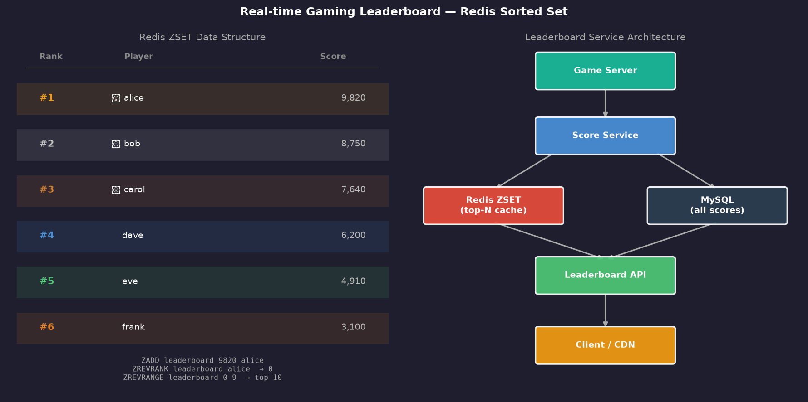
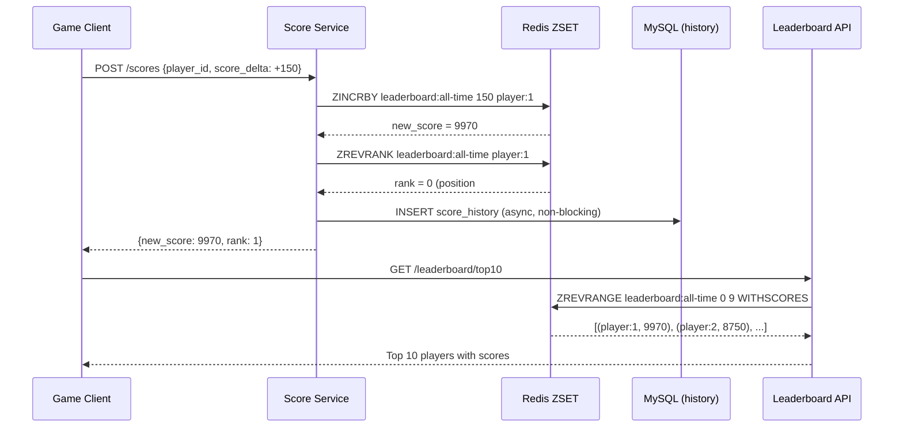

# Chapter 10 — Real-time Gaming Leaderboard

> *"Show the top 10 players globally, update it in real-time, and let any player see their own rank — instantly."*

---

## 🎯 Core Concept

A **Real-time Gaming Leaderboard** ranks players by score and must update instantly as scores change. The key engineering challenge is the **relative rank query**: given player X's score, what is their rank among all players?

This sounds simple but becomes complex at scale: how do you efficiently answer "what is player #5,000,000's rank?" when scores change thousands of times per second?

**The elegant solution**: Redis Sorted Sets — a data structure perfectly designed for this problem.

---

## 📋 Requirements

### Functional
- Player scores update after each game
- View global top-10 leaderboard in real-time
- Query your own rank (position among all players)
- View top-N players for a specific time window (today, this week, all-time)
- Leaderboard for specific segments (region, friend group)

### Non-Functional
- Leaderboard updates within 1 second of score change
- Support 500 million players
- Score update QPS: 50,000/sec
- Read QPS: 200,000/sec (leaderboard views)

### Scale (Back-of-Envelope)
```
Players:             500 million
Score updates/sec:   50,000
Leaderboard reads:   200,000/sec (4× writes — common for leaderboards)
Memory for ZSET:     500M × 16 bytes (score + player_id) = 8GB per ZSET
                     (fits in single Redis instance!)
```

---

## 🏗️ High-Level Architecture

```
Game Server                                     Storage
     │                                    ┌─────────────────┐
     │──score update──▶ Score Service     │ Redis ZSET      │
                              │           │ (top-N cache)   │
                              │──────────▶│                 │
                              │           └─────────────────┘
                              │           ┌─────────────────┐
                              │──────────▶│ MySQL           │
                              │           │ (all scores)    │
                              │           └─────────────────┘
                              │
                    Leaderboard API
                    (queries Redis for top-N)
                    (queries MySQL for rank)
```



---

## 🏆 Redis Sorted Set: The Core Data Structure

Redis **Sorted Set (ZSET)** stores members with associated float scores, automatically sorted by score. It supports O(log N) operations for all rank-related queries.

```
ZSET: "leaderboard:all-time"

  Member       Score     Rank (0-indexed)
  ───────────  ────────  ────────────────
  "player:1"   9,820     0 (rank #1)
  "player:2"   8,750     1 (rank #2)
  "player:3"   7,640     2 (rank #3)
  "player:4"   6,200     3 (rank #4)
  "player:5"   4,910     4 (rank #5)
```

### Key Redis Commands

```redis
# Add or update a player's score
ZADD leaderboard:all-time 9820 "player:1"

# Increment score (after a game)
ZINCRBY leaderboard:all-time 150 "player:1"
# → Alice's score: 9820 + 150 = 9970

# Get top 10 players (highest scores first)
ZREVRANGE leaderboard:all-time 0 9 WITHSCORES
# Returns: [(player:1, 9970), (player:2, 8750), ...]

# Get a player's rank (0 = #1 globally)
ZREVRANK leaderboard:all-time "player:1"
# Returns: 0 (player:1 is #1)

# Get players ranked 100-109 (page 11 of leaderboard)
ZREVRANGE leaderboard:all-time 100 109 WITHSCORES

# Count players with score ≥ X (how many beat this score?)
ZCOUNT leaderboard:all-time X +inf
```

### Why ZSET is Perfect for Leaderboards

```
Traditional approach:
  Store (player_id, score) in MySQL
  SELECT RANK() OVER (ORDER BY score DESC) WHERE player_id = X
  → O(N) for rank query (scan all players)
  → 500M players = very slow

Redis ZSET:
  Backed by skip list data structure
  All operations O(log N):
    - Update score: O(log N) ← fast!
    - Get rank: O(log N) ← fast!
    - Get top N: O(log N + N) ← fast!
  
  O(log 500M) = ~29 operations ← instant
```

---

## ⏰ Time-Bounded Leaderboards

### Today's Top Players

The challenge: scores from yesterday shouldn't count for today's leaderboard.

**Solution A**: Separate ZSET per time period (simple but memory-intensive)

```redis
# Today's leaderboard
ZADD leaderboard:2024-01-15 100 "player:1"

# This week's leaderboard
ZADD leaderboard:2024-W03 100 "player:1"

# Expire old ZSETs automatically
EXPIRE leaderboard:2024-01-14 86400  # delete after 24 hours
```

**Solution B**: Score = actual_score + timestamp encoding (clever but complex)

```
score_with_time = game_score * 10^10 + (MAX_TIMESTAMP - current_timestamp)

# Sort by game_score first, use timestamp as tiebreaker
# To get "today's" leaderboard: filter by timestamp range
ZRANGEBYSCORE leaderboard:all (MIN_TODAY_TS, MAX_TODAY_TS)
```

**Solution C**: Use MySQL for historical queries, Redis only for real-time top-N

```
Redis: "leaderboard:today" ZSET — only today's scores
  Reset at midnight: DEL "leaderboard:yesterday"; RENAME "today" → "yesterday"

MySQL: Full score history with timestamps
  For historical analysis, complex queries
```

---

## 📊 System Design: Score Update Flow

```
Game ends
  → Game Server: POST /scores {"player_id": "player:1", "delta": +150}
  → Score Service:
      1. ZINCRBY leaderboard:all-time 150 "player:1"  (Redis — instant)
      2. ZINCRBY leaderboard:today    150 "player:1"  (Redis — instant)
      3. INSERT INTO score_history (player_id, delta, ts)  (MySQL — async)
  → Response: {new_score: 9970, rank: 1}

Redis update: ~1ms
MySQL insert: ~5ms (async, doesn't block response)
```

### Handling Score Updates at Scale

```
50,000 score updates/sec to single Redis instance:
  Redis is single-threaded but very fast
  Single instance handles ~100,000 ops/sec
  → 50,000 updates/sec is achievable with one Redis

If scale increases:
  Shard by player_id:
    player_id hash % num_shards → ZSET shard
    
  Trade-off: 
    - Can't do global ZREVRANK directly across shards
    - Must query all shards and merge for global rank
    - Top-N: query top-N from each shard, merge, return top-N
```

---

## 🔢 Segment Leaderboards

### Friend Group Leaderboard

```
Alice wants to see rank among her 500 friends:

Approach 1: ZINTERSTORE (Redis intersection)
  ZINTERSTORE "leaderboard:alice-friends" 500 "leaderboard:all-time" 
    "user:alice:friends" "user:bob:friends" ...
  → Expensive for large friend lists

Approach 2: Fetch friend scores individually
  friend_ids = GET alice's friends from social graph
  scores = ZMGET leaderboard:all-time friend_ids
  Sort in application: O(F log F) where F = friend count
  → Works well for small friend lists (< 10,000)

Approach 3: Dedicated friend leaderboard ZSET
  Per user, maintain "leaderboard:user:{user_id}:friends" ZSET
  Update when: user scores change OR friendship changes
  → Most accurate but complex to maintain
```

---

## ⚖️ Design Decisions & Trade-offs

### 1. Redis vs. MySQL for Leaderboard

| Approach | Read QPS | Write QPS | Rank Query |
|----------|---------|---------|-----------|
| **MySQL `RANK()` window fn** | ~1,000 | ~5,000 | O(N) scan |
| **Redis ZSET** | ~100,000 | ~50,000 | O(log N) |
| **Redis ZSET + MySQL history** | ~100,000 | ~50,000 | O(log N) |

**Decision**: Redis ZSET for real-time serving + MySQL for persistence and analytics.

### 2. Consistency of Rank

```
User A reads rank: #152
500ms later, 10 players score higher
User A reads rank: #162

This is acceptable for leaderboards (not transactional data)
Eventual consistency is fine — users don't need millisecond-accurate ranks
```

### 3. Leaderboard Reset Strategy

```
Monthly reset flow (midnight Jan 1):
  1. RENAME leaderboard:current → leaderboard:december (atomic rename)
  2. EXPIRE leaderboard:december 30d (auto-cleanup)
  3. All score updates now go to fresh leaderboard:current
  
  Users see:
    - Real-time current month leaderboard
    - Archived December leaderboard (read-only)
```

---

## 📊 Mermaid: Leaderboard Query Flow



---

## 💡 Key Takeaways

| Concept | The Lesson |
|---------|-----------|
| **Redis ZSET** | Purpose-built for leaderboards — O(log N) for score, rank, top-N queries |
| **ZINCRBY** | Atomic score increment — no race conditions on score updates |
| **ZREVRANK** | Any player can check their rank in O(log N) — no full table scan |
| **Time-bounded** | Separate ZSET per time window + EXPIRE for automatic cleanup |
| **MySQL for history** | Redis for real-time serving; persist to MySQL for analytics, billing |
| **Sharding** | Shard by player_id for extreme scale — merge top-N across shards |

---

*← [Back to System Design Interview Vol. 2](../README.md)*
