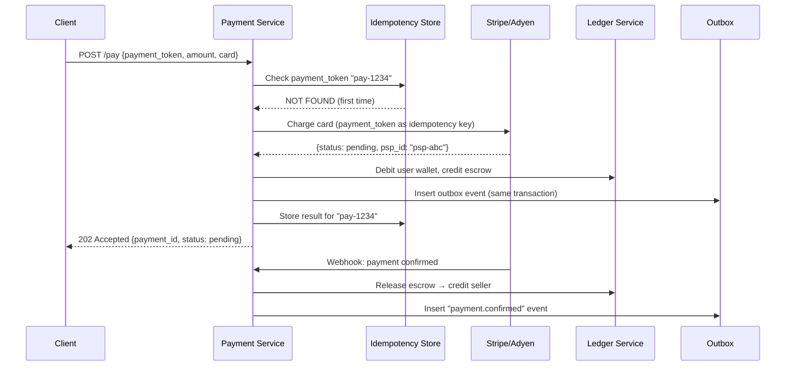

# Chapter 11 — Payment System

> *"Move money reliably. Never lose a transaction. Never charge twice. Reconcile everything."*
> Payment systems are where distributed systems meet financial compliance — the stakes couldn't be higher.

---

## 🎯 Core Concept

A **Payment System** orchestrates the movement of money between parties: buyers pay, sellers receive, the platform takes a fee. It must be:

- **Exactly-once**: one payment = one charge (never double-charge)
- **Consistent**: books must balance (no money appears or disappears)
- **Auditable**: every cent must be traceable
- **Resilient**: network failures and crashes cannot lose transactions

The fundamental challenge is achieving all of this in an inherently unreliable distributed environment.

---

## 📋 Requirements

### Functional
- Accept payment from buyer (credit card, digital wallet)
- Route payment through PSP (Payment Service Provider like Stripe)
- Credit seller's account
- Handle refunds
- Nightly reconciliation between internal ledger and bank records
- Support multiple currencies

### Non-Functional
- Exactly-once semantics: one charge per payment
- High availability: payment systems can't go down
- Fault tolerant: crash during payment must not lose money
- Auditability: every transaction logged permanently
- Low latency: < 3 seconds for payment confirmation

### Scale (Back-of-Envelope)
```
Orders/day:          1 million
Peak orders/sec:     100 (10× average)
Payment amount avg:  $50
Daily volume:        $50M/day → $18B/year
PSP calls/day:       1M (one per order)
Reconciliation:      nightly batch over 1M records
```

---

## 🏗️ High-Level Architecture

```
User                Payment             External
                    System              World
  │                    │                  │
  │──pay $50──────────▶│                  │
  │                    │──charge card────▶│ PSP (Stripe/Adyen)
  │                    │◀──confirmed──────│
  │                    │                  │
  │                    ├──update ledger   │
  │                    │   (credit seller)│
  │                    │──notify seller──▶│ Email/webhook
  │◀──receipt──────────│                  │
  │                    │                  │
  │                    │  [nightly]       │
  │                    │──reconcile──────▶│ Bank statement
  │                    │◀──statement──────│
```


---

## 🔑 Core Pattern: Idempotency for Exactly-Once

### The Double-Charge Problem

```
Scenario:
  1. User pays $50
  2. Payment Service charges card via PSP → success
  3. PSP sends back "confirmed"
  4. Network drops before Payment Service records confirmation
  5. Payment Service retries → charges card AGAIN → user charged $100!

This is catastrophic.
```

### Solution: Idempotency Key

```
Flow:
  1. Client generates payment_token = UUID() at checkout
  2. Every retry uses the SAME payment_token:
     POST /payments {
       "payment_token": "pay-uuid-1234",  ← idempotency key
       "amount": 5000,  ← cents
       "currency": "USD",
       "card_token": "card-xyz"
     }
  
  3. Server checks: has "pay-uuid-1234" been processed?
     SELECT * FROM idempotency WHERE key = 'pay-uuid-1234'
     
     If FOUND: return cached result (no charge)
     If NOT FOUND:
       Process payment
       Store result: INSERT INTO idempotency (key, result, expiry)
       Return result

  4. PSP also supports idempotency keys:
     Stripe: pass idempotency_key in header
     → Even if you call Stripe twice, they charge once
```

### Idempotency at Every Layer

```
Client → Payment Service:     payment_token (UUID)
Payment Service → PSP:        payment_token (forwarded)
PSP → Bank:                   handled by PSP internally

Multiple retries at any level → safely idempotent
```

---

## 💰 Double-Entry Bookkeeping: The Ledger

### Why Double-Entry?

Every financial transaction affects at least two accounts, and the sum of all changes must equal zero — this is the foundation of modern accounting.

```
Transaction: User pays $50 for an order

Single-entry (WRONG — don't do this):
  user.balance -= 50
  → Where did the $50 go? No audit trail.

Double-entry (CORRECT):
  Debit  "User Wallet"       $50  (money leaves user)
  Credit "Escrow Account"    $50  (money held in escrow)

  Sum of changes: -$50 + $50 = $0 ← always zero
```

```
Transaction: Order shipped, release payment to seller

  Debit  "Escrow Account"    $50  (money leaves escrow)
  Credit "Seller Wallet"     $50  (money goes to seller)

  Sum: -$50 + $50 = $0 ← always zero
```

**Invariant**: At any moment, total debits = total credits. If they don't match, there's a bug (money was created or destroyed).

### Ledger Table Schema

```sql
CREATE TABLE ledger_entries (
    entry_id       BIGINT PRIMARY KEY AUTO_INCREMENT,
    transaction_id VARCHAR(64) NOT NULL,  -- groups related entries
    account_id     BIGINT NOT NULL,
    entry_type     ENUM('DEBIT', 'CREDIT'),
    amount         DECIMAL(19, 4) NOT NULL,  -- 4 decimal places for forex
    currency       CHAR(3) NOT NULL,          -- ISO 4217: USD, EUR, GBP
    description    VARCHAR(256),
    created_at     TIMESTAMP NOT NULL DEFAULT NOW(),
    balance_after  DECIMAL(19, 4) NOT NULL   -- running balance snapshot
);

-- Constraint: sum of entries per transaction = 0
-- Enforced in application or via trigger
```

---

## 🔄 PSP Integration: The Payment Executor

### Synchronous vs. Asynchronous PSP Calls

```
Synchronous (simple):
  Payment Service → PSP → Bank → PSP → Payment Service
  User waits: 2-10 seconds for bank authorization
  
  Problem: What if PSP times out after 8 seconds?
           Did the charge go through? Unknown state.

Asynchronous (robust):
  1. Payment Service sends charge request to PSP
  2. PSP returns "pending" immediately
  3. PSP processes async with bank
  4. PSP calls Payment Service webhook when done:
     POST /webhook/payment-status {payment_id, status: "SUCCESS"}
  5. Payment Service updates ledger

  Advantage: Never lose a charge in limbo
             PSP guarantees webhook delivery
```

### Handling PSP Webhooks Reliably

```
PSP sends webhook → Payment Service /webhook endpoint
Payment Service processes → updates ledger
Payment Service returns 200 OK → PSP marks delivered

If Payment Service is down:
  PSP retries webhook with exponential backoff (1s, 2s, 4s, 8s...)
  Eventually delivered when service recovers
  
Idempotency: If webhook delivered twice, must handle gracefully:
  IF payment_id already CONFIRMED in DB: return 200 (no-op)
  ELSE: process normally
```

---

## 🔍 Reconciliation: The Safety Net

### Why Reconcile?

Even with all the above safeguards, discrepancies can occur:
- Bug causes internal ledger to miss a charge
- PSP fails to send webhook (rare but happens)
- Clock skew causes ordering issues

**Reconciliation** compares internal records with external bank/PSP statements to catch and fix any discrepancies.

### Nightly Reconciliation Process

```
Every night at 2 AM:
  1. Download PSP settlement file (all charges/refunds for the day)
  2. Download bank statement
  3. Compare with internal ledger

  For each PSP transaction:
    IF found in internal ledger AND amounts match → OK
    IF not found in internal ledger → MISSING (create alert + manual review)
    IF amounts differ → MISMATCH (create alert + manual review)

  Report:
    Total matched: 999,950 transactions ($49,997,500)
    Missing:       35 transactions ($1,750) → investigate
    Mismatched:    15 transactions ($750) → investigate
```

---

## 📦 The Outbox Pattern: Reliable Event Publishing

### The Problem

```
Transaction completes in DB:
  1. UPDATE payment SET status='CONFIRMED' ← DB write
  2. Publish "payment.confirmed" event to Kafka ← may fail!

If Kafka publish fails: DB says confirmed, no event published
→ Seller never notified, order never shipped
```

### Solution: Transactional Outbox

```sql
-- Same DB transaction:
BEGIN;
  UPDATE payment SET status='CONFIRMED', updated_at=NOW();
  INSERT INTO outbox (
    event_type, payload, status, created_at
  ) VALUES (
    'payment.confirmed', 
    '{"payment_id":"pay-1234","amount":5000}',
    'PENDING',
    NOW()
  );
COMMIT;
-- If DB commits, both payment AND outbox event are saved atomically

-- Separate Outbox Publisher process:
LOOP:
  SELECT * FROM outbox WHERE status='PENDING' ORDER BY created_at LIMIT 100
  FOR EACH event:
    Publish to Kafka
    IF success: UPDATE outbox SET status='PUBLISHED'
    IF fail: leave as PENDING, retry next loop
```

---

## ⚖️ Design Decisions & Trade-offs

### 1. Stripe vs. Build Your Own Payment Processor

```
Use PSP (Stripe, Adyen):
  + PCI compliance handled by them (massive cost saving)
  + Fraud detection included
  + Global payment methods supported
  + 99.99% uptime SLAs
  - 2.9% + $0.30 per transaction fee
  - Some customization limitations

Build your own:
  - Years of engineering investment
  - PCI DSS compliance audit (millions of dollars)
  - Global banking relationships needed
  - Only for large banks/fintechs processing billions/day
```

**Decision for most companies**: Use a PSP.

### 2. Synchronous vs. Asynchronous Ledger Update

```
Synchronous:
  Charge → Update Ledger → Notify Seller → Return receipt
  Simple, but: what if notify seller fails? Roll back charge?

Asynchronous (saga pattern):
  Charge → Update Ledger (immediate)
  → Publish event → Notify Seller (async, eventually)
  → Retry seller notification independently

Better fault isolation
```

---

## 📊 Mermaid: Payment Flow with Idempotency



---

## 💡 Key Takeaways

| Concept | The Lesson |
|---------|-----------|
| **Idempotency key** | Client UUID prevents double-charge on any retry at any layer |
| **Double-entry bookkeeping** | Every credit has a debit — books always balance, bugs are visible |
| **PSP for compliance** | Never build your own payment processor — PCI compliance alone costs millions |
| **Outbox pattern** | DB write + event publish in one transaction — no lost events |
| **Reconciliation** | Nightly comparison with bank statements catches anything that slips through |
| **Async webhooks** | PSP confirms async — don't poll, receive webhook with retry guarantee |

---

*← [Back to System Design Interview Vol. 2](../README.md)*
