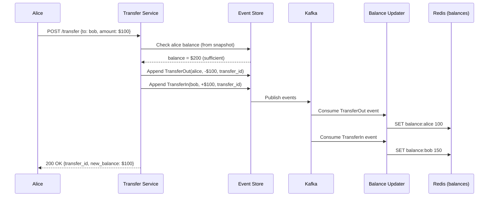

# Chapter 12 — Digital Wallet

> *"A digital wallet must handle millions of balance updates per second — correctly, consistently, and with a complete audit trail of every cent."*

---

## 🎯 Core Concept

A **Digital Wallet** (like PayPal, Apple Pay, or Venmo's backend) stores and manages users' money balances. Unlike a payment system that moves money between banks, a wallet manages balances within your own system.

The core challenges:
1. **Correctness**: Balance can never be wrong — this is real money
2. **Throughput**: Millions of transfers per second
3. **Auditability**: Every balance change must be traceable to its cause
4. **Consistency**: No money can appear or disappear

This chapter introduces the most sophisticated pattern: **Event Sourcing** applied to financial systems.

---

## 📋 Requirements

### Functional
- Add money to wallet (top-up)
- Transfer money between wallets
- Pay for goods/services from wallet balance
- View balance and transaction history
- Withdraw money to bank account

### Non-Functional
- High consistency: balance must be correct at all times
- High throughput: 1 million transfers/second
- Full auditability: reconstruct balance at any point in time
- No balance going negative (unless overdraft feature)

### Scale (Back-of-Envelope)
```
Users:              1 billion
Transfers/day:      100 million (1B × 10% active × 1 transfer)
Peak transfers/sec: ~10,000
Balance checks/sec: ~100,000 (10× more reads than writes)
Storage:            100M transactions/day × 200 bytes = 20GB/day
                    With 10-year history: ~73TB
```

---

## 💰 Double-Entry Bookkeeping (Revisited)

Every financial system at scale must use double-entry bookkeeping — covered in detail in Chapter 11, but central here too.

```
Alice transfers $100 to Bob:

Ledger entries (same transaction_id):
  DEBIT   Alice's Wallet     $100
  CREDIT  Bob's Wallet       $100

  Sum of credits - Sum of debits = 0 ← always balanced

Current balance = sum of all credits - sum of all debits for account
```

---

## 🔄 Event Sourcing: The Core Architecture Pattern

### Traditional State Storage (Has Problems)

```sql
-- Traditional approach: store current balance
CREATE TABLE wallets (
    user_id BIGINT PRIMARY KEY,
    balance DECIMAL(19,4)
);

-- Transfer $100 from Alice to Bob:
UPDATE wallets SET balance = balance - 100 WHERE user_id = alice_id;
UPDATE wallets SET balance = balance + 100 WHERE user_id = bob_id;
```

**Problems**:
1. **No history**: You only know current balance, not how you got there
2. **Concurrent updates**: Two transfers happening simultaneously may conflict
3. **Debugging**: Hard to trace "why is Alice's balance $43.21?"
4. **Regulatory audit**: Can't prove the balance to auditors

### Event Sourcing: Store Events, Not State

**Event Sourcing** stores every change as an immutable event. The current state is derived by replaying events.

```
Event Store (append-only):
  event_id  account   type     amount   timestamp
  ────────  ────────  ───────  ───────  ─────────────────
  1         alice     TOP_UP   +$200    2024-01-01 09:00
  2         alice     TRANSFER -$50     2024-01-01 10:00
  3         bob       TRANSFER +$50     2024-01-01 10:00
  4         alice     TRANSFER -$100    2024-01-01 11:00
  5         charlie   TRANSFER +$100    2024-01-01 11:00

Alice's current balance = sum of her events:
  +200 - 50 - 100 = $50

Alice's balance at 10:30 AM = replay up to timestamp 10:30:
  +200 - 50 = $150
```


### Benefits of Event Sourcing

```
1. Complete audit trail:
   "Why is Alice's balance $50?"
   → Show all events → auditor satisfied

2. Point-in-time queries:
   "What was the balance on Jan 1 at 9 AM for tax purposes?"
   → Replay events up to that timestamp

3. Debugging:
   "Something is wrong with Alice's balance"
   → Inspect raw event stream → find the bad event

4. Replay and reprocess:
   "We had a bug that calculated fees wrong"
   → Fix the code, replay all events → correct balances

5. CQRS natural fit:
   Write: append events
   Read: query projected view (pre-computed balance)
```

---

## 🏗️ CQRS: Separate Read and Write Models

**CQRS** (Command Query Responsibility Segregation) separates the write model (events) from the read model (balance views).

```
Write Side (Commands):
  User initiates transfer
  → Validate (enough balance?)
  → Append events to event store
  → Publish event to message queue

Read Side (Queries):
  Consumer reads events from queue
  → Updates balance projection in fast read DB
  → API queries balance from read DB (sub-millisecond)

Architecture:
  ┌───────────────┐      ┌─────────────────┐
  │  Write Side   │      │   Read Side     │
  │  Event Store  │─────▶│  Balance Cache  │
  │  (Append-only)│      │  (Redis / DB)   │
  └───────────────┘      └─────────────────┘
        ▲                        │
        │ write events           │ query balance
  Command API              Query API
```

### Eventual Consistency Trade-off

```
Write event → Event Store (immediately consistent)
Event → Queue → Consumer → Update balance view (eventually, ~100ms)

User experience:
  Alice transfers $100 to Bob
  Alice sees: balance $50 (immediate — from event store)
  Bob sees:   balance $150 (after 100ms — from read projection)
  
Is this acceptable?
  For most transfers: YES (100ms is imperceptible)
  For time-critical apps (trading): NO, need synchronous updates
```

---

## 🔐 Handling Race Conditions

### The Concurrent Transfer Problem

```
Alice has $100
Two concurrent transfers:
  Transfer A: Alice → Bob, $80
  Transfer B: Alice → Charlie, $80

If both read balance = $100 and both succeed:
  Alice's balance: 100 - 80 - 80 = -60 (overdraft!)
```

### Solution 1: Optimistic Locking with Version

```sql
-- Read with version
SELECT balance, version FROM wallets WHERE user_id = alice_id;
-- Returns: balance=100, version=42

-- Deduct with version check (atomic)
UPDATE wallets 
SET balance = balance - 80, version = version + 1
WHERE user_id = alice_id AND version = 42 AND balance >= 80;

-- If rows_affected = 0: concurrent update happened, retry
```

### Solution 2: Event Sourcing + Expected Version

```python
# When appending an event, specify expected version
def transfer(from_user, to_user, amount):
    # Load current state
    events = load_events(from_user)
    current_balance = sum(e.amount for e in events)
    expected_version = len(events)
    
    if current_balance < amount:
        raise InsufficientFundsError()
    
    # Append with optimistic concurrency check
    event_store.append(
        account_id=from_user,
        event=TransferOutEvent(amount=amount),
        expected_version=expected_version  # fails if another event was appended
    )
    # If fails: retry from the top
```

### Solution 3: Serialized Processing per Account

```
Instead of concurrent updates to same account:
  Route all events for user X to partition X in Kafka
  Single consumer processes account X events sequentially
  → No concurrent updates → no conflicts
  
Trade-off:
  + Simple, no locks needed
  - Limited parallelism per account
  - Hot accounts (celebrities) become bottlenecks
  Solution: Assign hot accounts to dedicated partitions
```

---

## 📊 The Balance Projection Service

```
Event Store → Kafka → Balance Updater → Redis / SQL

Balance Updater logic:
  WHEN event = TRANSFER_OUT:
    SET balance:user:{user_id} TO current_balance - event.amount
    LOG to sql: INSERT INTO balance_snapshots (user_id, balance, as_of_event_id)
    
  WHEN event = TRANSFER_IN:
    SET balance:user:{user_id} TO current_balance + event.amount

Redis: O(1) balance lookup for any user
SQL: persistent snapshots for recovery

Recovery:
  Redis crashes → reload from SQL snapshots → replay recent events from Kafka
```

---

## 🔬 Deep Dive: Transfer Flow End-to-End

```
1. Alice initiates: POST /transfer {from: alice, to: bob, amount: 100}

2. Transfer Service:
   a. Validate: is alice's balance >= 100? (query read DB)
   b. Generate transfer_id = UUID()
   c. Begin saga:
      - Append TransferInitiated event (alice, -100)
      - Append TransferInitiated event (bob, +100)
      Both atomically written OR neither (2PC with event store)

3. Event published to Kafka → Balance Updater consumes:
   - Alice balance: 200 → 100
   - Bob balance: 50 → 150

4. Confirmation:
   - Transfer Service marks saga COMPLETE
   - Push notification to both Alice and Bob

5. Audit entry:
   - Ledger records debit/credit pair with transfer_id
```

---

## ⚖️ Design Decisions & Trade-offs

### Approach Comparison

| Approach | Consistency | Throughput | Auditability | Complexity |
|----------|------------|-----------|-------------|-----------|
| **Simple balance UPDATE** | Strong (if careful) | Medium | None | Low |
| **Event Sourcing + CQRS** | Eventual | High | Complete | High |
| **Event Sourcing + sync** | Strong | Medium | Complete | Very High |

**Decision**: Event Sourcing + CQRS with eventual consistency for balance reads, strong consistency for transfer execution.

---

## 📊 Mermaid: Transfer Event Flow



---

## 💡 Key Takeaways

| Concept | The Lesson |
|---------|-----------|
| **Event Sourcing** | Store immutable events, derive state by replay — complete auditability |
| **CQRS** | Separate write model (events) from read model (balance cache) — each optimized |
| **Double-entry** | Every transfer debits one account and credits another — books always balance |
| **Optimistic concurrency** | Version-based conflict detection prevents overdrafts without blocking |
| **Point-in-time queries** | Replay events up to any timestamp — essential for tax/audit |
| **Eventual consistency** | Balance reads can lag by ~100ms — acceptable for most transfers |

---

*← [Back to System Design Interview Vol. 2](../README.md)*
