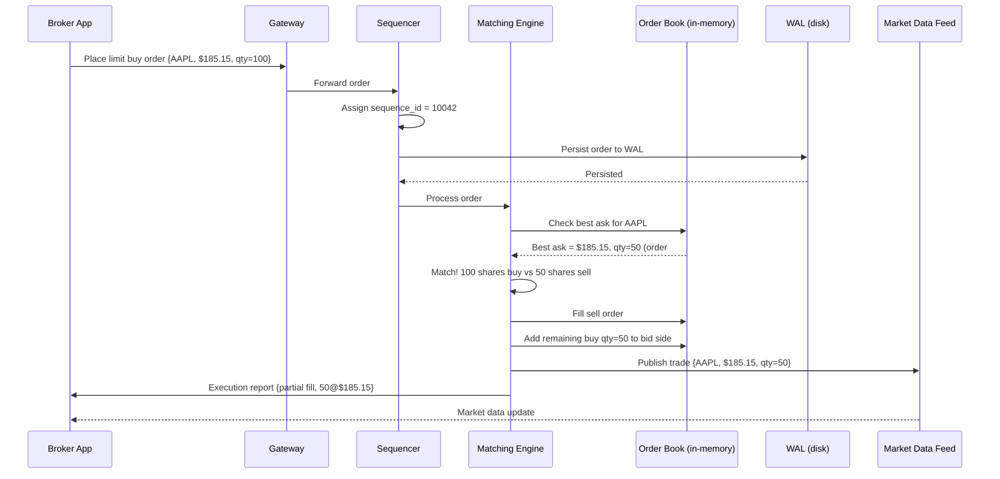

# Chapter 13 — Stock Exchange

> *"Match a buy order to a sell order in microseconds. Do it millions of times per day. Never lose an order. Never match incorrectly."*
> The stock exchange is the most demanding real-time system ever built.

---

## 🎯 Core Concept

A **Stock Exchange** is an electronic marketplace where buyers and sellers trade financial instruments (stocks, options, futures). It must:

- **Match orders**: connect buyers with sellers at agreed prices
- **Be fair**: same-time orders processed in arrival order (FIFO)
- **Be fast**: microsecond latency for institutional traders
- **Be reliable**: no order can be lost or duplicated
- **Provide market data**: broadcast prices to all participants in real-time

This is perhaps the hardest system design problem in the world — it's where distributed systems meets real-time computing meets financial regulation.

---

## 📋 Requirements

### Functional
- Place orders (market orders, limit orders, stop orders)
- Cancel/modify existing orders
- Match buy orders with sell orders
- Publish real-time market data (price feed)
- Provide historical trade data

### Non-Functional
- Latency: < 1 millisecond order-to-match (institutional target: microseconds)
- Throughput: 1 million orders/second
- Zero order loss: no order can disappear
- Deterministic: same inputs always produce same outputs
- Auditability: every order and match permanently recorded

### Scale (Back-of-Envelope)
```
Instruments traded:    10,000 (stocks, ETFs, options)
Orders/day:            100 million
Peak orders/sec:       100,000 (during market open/close)
Trades executed/day:   ~10 million (10% of orders match)
Market data messages:  10 million/second (prices broadcast)
```

---

## 🏗️ High-Level Architecture

```
Brokers/Clients                Exchange Core               Output
      │                              │                       │
      │──send order──────────────────▶                       │
      │                        ┌─────────────┐              │
      │                        │   Gateway   │              │
      │                        └─────────────┘              │
      │                               │                      │
      │                        ┌─────────────┐              │
      │                        │  Sequencer  │              │
      │                        │ (FIFO queue)│              │
      │                        └─────────────┘              │
      │                               │                      │
      │                        ┌─────────────┐     ┌────────────┐
      │                        │  Matching   │────▶│ Market     │
      │                        │   Engine   │     │ Data Feed  │──▶ traders
      │                        └─────────────┘     └────────────┘
      │                               │                      │
      │                        ┌─────────────┐              │
      │                        │   Order     │              │
      │                        │   Store     │              │
      │                        └─────────────┘              │
      │◀──execution report───────────────────────────────────│
```


---

## 📚 Order Book: The Heart of the Exchange

The **Order Book** is the central data structure that holds all outstanding buy and sell orders for a security.

```
Order Book for AAPL:

BID (Buy Orders)          |  ASK (Sell Orders)
Price    | Qty  | Orders  |  Price    | Qty  | Orders
─────────────────────────────────────────────────────
$185.10  | 500  | 3       |  $185.15  | 300  | 2    ← Best ask
$185.05  | 1200 | 5       |  $185.20  | 900  | 4
$185.00  | 800  | 2       |  $185.25  | 1500 | 6
$184.95  | 2000 | 8       |  $185.30  | 600  | 2
         ▲ Best bid

Spread = Best Ask - Best Bid = $185.15 - $185.10 = $0.05
```

### Order Book Data Structure

```python
from sortedcontainers import SortedDict

class OrderBook:
    def __init__(self):
        # Buy side: sorted highest-price first
        self.bids = SortedDict(lambda x: -x)  # SortedDict with negation for reverse
        # Sell side: sorted lowest-price first  
        self.asks = SortedDict()
        
    # Each price level contains a queue of orders (FIFO within price)
    # bids[185.10] = deque([order1, order2, order3])
    # asks[185.15] = deque([order4, order5])
```

---

## ⚙️ Matching Engine: The Core Algorithm

The **Matching Engine** processes orders against the order book using **price-time priority**:

1. **Best price first**: highest bid or lowest ask gets matched first
2. **Time priority within same price**: earlier orders get matched before later ones (FIFO)

```python
def process_limit_buy_order(order_book, buy_order):
    """Match a buy order against the order book"""
    
    while buy_order.remaining_qty > 0:
        # Get best ask (lowest sell price)
        if not order_book.asks:
            break  # No sellers — add to order book
        
        best_ask_price = order_book.asks.keys()[0]
        
        # Can we match? Buy price >= Sell price
        if buy_order.price < best_ask_price:
            break  # Buy price too low — add to order book
        
        # Match!
        sell_orders = order_book.asks[best_ask_price]
        sell_order = sell_orders[0]  # FIFO: take first order at this price
        
        matched_qty = min(buy_order.remaining_qty, sell_order.remaining_qty)
        
        # Execute the trade
        execute_trade(
            buy_order=buy_order,
            sell_order=sell_order,
            price=best_ask_price,  # Trade at seller's price
            quantity=matched_qty
        )
        
        buy_order.remaining_qty -= matched_qty
        sell_order.remaining_qty -= matched_qty
        
        # Remove fully filled sell orders
        if sell_order.remaining_qty == 0:
            sell_orders.popleft()
            if not sell_orders:
                del order_book.asks[best_ask_price]
    
    # Add remaining quantity to order book
    if buy_order.remaining_qty > 0:
        order_book.bids[buy_order.price].append(buy_order)
```

---

## 🔢 The Sequencer: Ensuring FIFO Order

The biggest challenge in distributed matching: **two brokers submit orders at the exact same time**. Which one gets processed first?

The **Sequencer** solves this by assigning a monotonically increasing sequence number to every order before it reaches the matching engine:

```
Broker A → Gateway → Sequencer → order_id=1042 → Matching Engine
Broker B → Gateway → Sequencer → order_id=1043 → Matching Engine

Lower sequence number = processed first = better time priority
```

### Why Single-Threaded Matching Engine?

```
Intuition: "More threads = more throughput, right?"
Reality for matching engines: WRONG

Multi-threaded approach:
  Thread 1: process AAPL orders
  Thread 2: process AAPL orders (race condition!)
  
  Problem: Two threads updating the same order book
           → Need locks → Locks add latency
           → Non-deterministic execution order
           → Impossible to replay exactly

Single-threaded approach:
  One thread processes all AAPL orders sequentially
  
  Advantages:
  ✓ No locks → maximum speed
  ✓ Deterministic → can replay
  ✓ Easier to reason about
  ✓ L1 cache efficiency (hot code path)

How fast is single-threaded?
  Modern CPUs: ~1 billion operations/second
  Order matching: ~1000 operations per order
  → 1,000,000 orders/second single-threaded
  
This is fast enough for most exchanges!
```

---

## 📡 Market Data Feed: Broadcasting Prices

After each trade or order book change, the exchange broadcasts market data to all participants:

```
Market data types:
  Level 1: Best bid/ask + last trade price
  Level 2: Full order book depth (top 10 levels each side)
  Level 3: Every individual order (only for market makers)

Broadcast mechanism:
  UDP multicast (not TCP):
    - No connection overhead
    - One packet → received by all subscribers simultaneously
    - Lossy but recoverable (recipients track sequence numbers)
    
  Why UDP instead of TCP?
    TCP: guaranteed delivery but adds RTT for ACK
    UDP multicast: best-effort delivery, ~10μs less latency
    
    Missing packets: subscriber requests retransmit from snapshot server
    Acceptable: rare packet loss for slightly stale prices
```

---

## 💾 Order Persistence: Write-Ahead Log

Every order must survive system crashes:

```
Order received → Persist to WAL → Process in memory → Respond

WAL (Write-Ahead Log):
  Sequential writes to disk (very fast)
  Contains all orders in sequence order
  
  Recovery:
    1. Load latest snapshot of order books
    2. Replay WAL from snapshot forward
    3. Order books restored to exact state before crash
    4. No orders lost!

WAL format:
  [seq:8][timestamp:8][type:1][order_id:8][symbol:8][side:1][price:8][qty:4]
  Each record: ~50 bytes
  At 1M orders/sec: 50MB/sec of WAL → manageable
```

---

## ⚖️ Design Decisions & Trade-offs

### 1. Latency vs. Throughput Trade-offs

```
Ultra-low latency (HFT exchanges):
  - FPGA-based matching (nanoseconds)
  - Kernel bypass networking (DPDK)
  - CPU core pinning (no context switches)
  - RDMA (Remote Direct Memory Access)
  Cost: Extremely expensive hardware

Standard exchange:
  - Software matching engine
  - Standard Linux networking
  - ~100 microseconds latency
  Cost: Regular servers

The book focuses on software-based design
```

### 2. Order Types

| Order Type | Description | Complexity |
|-----------|-------------|-----------|
| **Market** | Buy/sell at best available price | Simple |
| **Limit** | Buy/sell at specified price or better | Core matching |
| **Stop** | Trigger market order when price hits X | Complex (monitor prices) |
| **Iceberg** | Show only part of order (hide large orders) | Metadata-only |
| **IOC** | Immediate or Cancel (no partial fills to book) | Post-matching cleanup |

### 3. Tick Size and Price Discretization

```
Continuous prices (real numbers): impossible to match efficiently
  $185.14999... vs $185.15000... — are these equal?

Solution: Tick sizes
  AAPL tick size: $0.01
  Price stored as integer ticks: $185.15 → 18515
  
  All arithmetic in integer ticks → no floating point errors
  Critical: 0.1 in float is not exactly 0.1!
  
  Store: price_in_cents = round(price * 100)
  Never: price = 185.15 (float)
```

---

## 📊 Mermaid: Order Matching Flow



---

## 💡 Key Takeaways

| Concept | The Lesson |
|---------|-----------|
| **Order book** | Price-time priority: best price wins, FIFO within same price |
| **Single-threaded matching** | No locks, deterministic, cacheable — faster than multi-threaded |
| **Sequencer** | Assigns global order to all inputs before processing — ensures fairness |
| **WAL for persistence** | Sequential disk writes → survives crashes, enables exact replay |
| **UDP multicast** | Broadcast market data to all subscribers simultaneously at minimal latency |
| **Integer tick prices** | Never use floats for money — discretize to integer ticks |
| **FIFO matters** | Same-price orders must be matched in strict arrival order — regulatory requirement |

---

*← [Back to System Design Interview Vol. 2](../README.md)*
