# System Design Interview: An Insider's Guide (2nd Edition)

**Author**: Alex Xu
**Published**: 2020 · Byte Code LLC
**Category**: System Design / Distributed Systems / Interview Preparation

---

## 📖 About This Book

*System Design Interview: An Insider's Guide* (2nd Edition) is the gold standard for system design interview preparation. Alex Xu walks through **15 complete system designs** from first principles, each demonstrating how senior engineers think about scale, trade-offs, and distributed systems.

The book covers the full spectrum from foundational concepts (Chapter 1: scaling from scratch, Chapter 2: estimation math) through the interview framework (Chapter 3) to major real-world systems (YouTube, Google Drive, Chat Systems, etc.).

Unlike tutorials that just tell you the answer, this book teaches you the **reasoning process** — how to derive the right design for any system from requirements and constraints.

---

## 🗺️ The 16 Chapters

```
┌──────────────────────────────────────────────────────────────────────────────┐
│               System Design Interview — An Insider's Guide                   │
│                                                                              │
│  📐 Foundations              🔧 Building Blocks                              │
│  01 Scale from Zero          04 Rate Limiter                                 │
│  02 Estimation               05 Consistent Hashing                          │
│  03 Interview Framework      06 Key-Value Store                              │
│                              07 Unique ID Generator                          │
│  🌐 Web Systems              08 URL Shortener                                │
│  09 Web Crawler              09 Web Crawler                                  │
│                                                                              │
│  📱 Social & Communication   🎬 Media & Files                                │
│  10 Notification System      14 YouTube                                      │
│  11 News Feed System         15 Google Drive                                 │
│  12 Chat System                                                              │
│  13 Search Autocomplete      📚 Conclusion                                   │
│                              16 The Learning Continues                       │
└──────────────────────────────────────────────────────────────────────────────┘
```

---

## 📚 Chapters

| # | Chapter | Core Concepts | Key Pattern |
|---|---------|--------------|------------|
| [01](chapters/01-scale-from-zero.md) | Scale From Zero to Millions | CDN, load balancer, sharding, stateless | Scale ladder: 1K → 1B users |
| [02](chapters/02-back-of-envelope-estimation.md) | Back-of-Envelope Estimation | Powers of 2, latency numbers, QPS | Order-of-magnitude reasoning |
| [03](chapters/03-interview-framework.md) | Interview Framework | 4-step process, communication, trade-offs | Ask before designing |
| [04](chapters/04-rate-limiter.md) | Rate Limiter | Token bucket, sliding window, Redis | Distributed INCR counter |
| [05](chapters/05-consistent-hashing.md) | Consistent Hashing | Hash ring, virtual nodes, 1/N migration | Binary search on sorted ring |
| [06](chapters/06-key-value-store.md) | Key-Value Store | LSM tree, Bloom filter, gossip protocol | Write-ahead log + MemTable |
| [07](chapters/07-unique-id-generator.md) | Unique ID Generator | Snowflake, 64-bit, clock skew | 41-bit timestamp + machine ID |
| [08](chapters/08-url-shortener.md) | URL Shortener | Base62, hash collision, 301 vs 302 | Auto-increment ID → Base62 |
| [09](chapters/09-web-crawler.md) | Web Crawler | BFS, Bloom filter, robots.txt | Politeness per-domain queue |
| [10](chapters/10-notification-system.md) | Notification System | APNs, FCM, Kafka, retry | Third-party providers + Kafka |
| [11](chapters/11-news-feed-system.md) | News Feed System | Fan-out, push vs pull, ranking | Hybrid model for celebrities |
| [12](chapters/12-chat-system.md) | Chat System | WebSocket, Cassandra, presence | Redis Pub/Sub cross-server |
| [13](chapters/13-search-autocomplete.md) | Search Autocomplete | Trie, top-K cache, AJAX debounce | Top-K stored at each node |
| [14](chapters/14-youtube.md) | YouTube | Transcoding DAG, CDN, HLS/DASH | Pre-signed upload + streaming |
| [15](chapters/15-google-drive.md) | Google Drive | Block delta sync, conflict resolution | SHA-256 block deduplication |
| [16](chapters/16-the-learning-continues.md) | The Learning Continues | Reference architectures, resources | Cross-system pattern map |

---

## 🖼️ Architecture Diagrams

| Image | Description |
|-------|-------------|
| 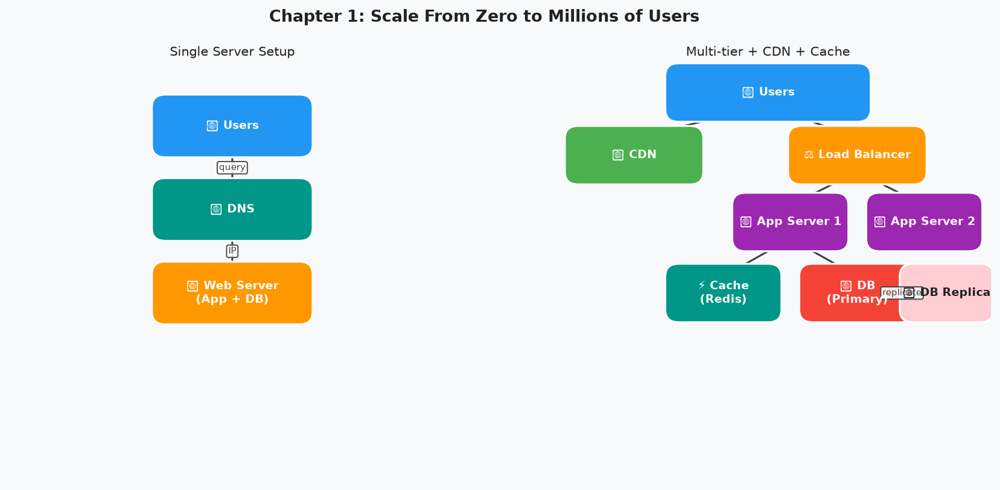 | Single server → CDN + Cache + LB + DB replicas |
| 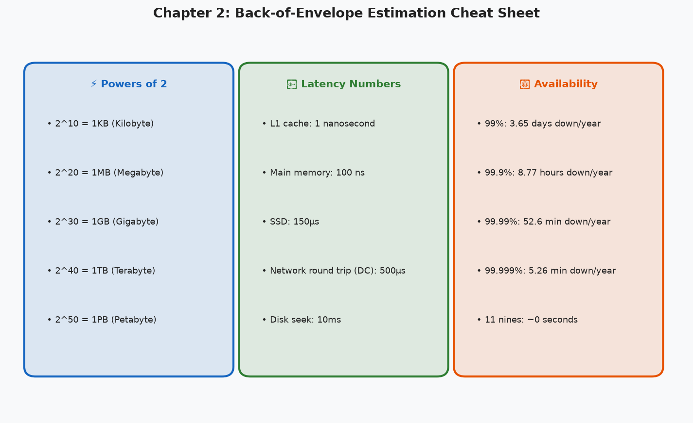 | Powers of 2, latency numbers, availability |
|  | 4-step interview framework |
| 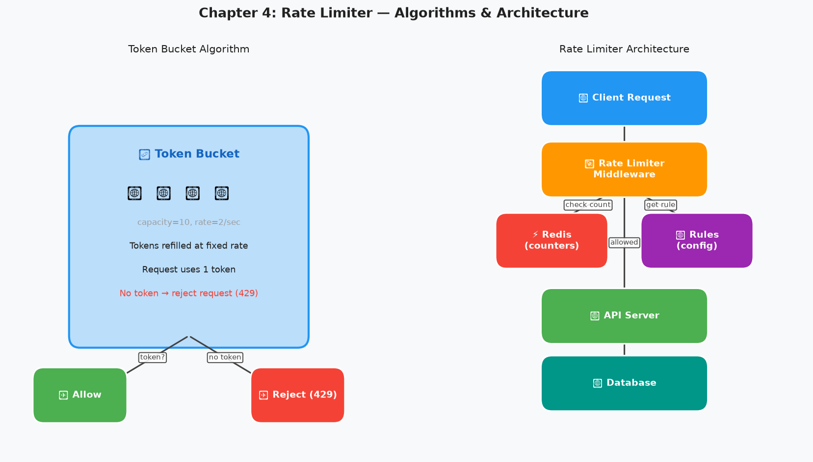 | Token bucket algorithm + Redis architecture |
|  | Hash ring with virtual nodes |
| 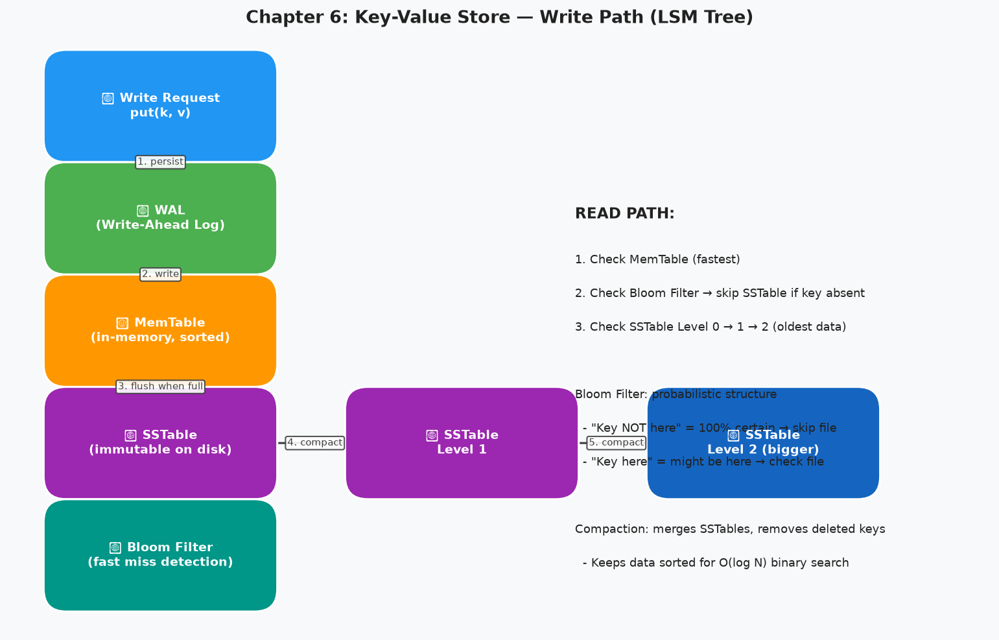 | LSM tree write path with WAL → MemTable → SSTable |
| 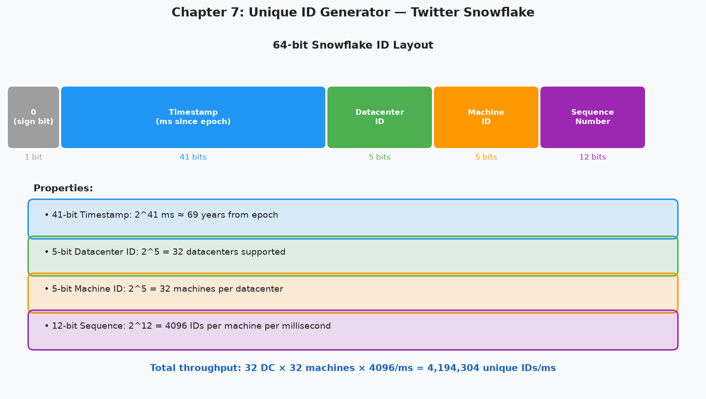 | 64-bit Snowflake ID layout |
| 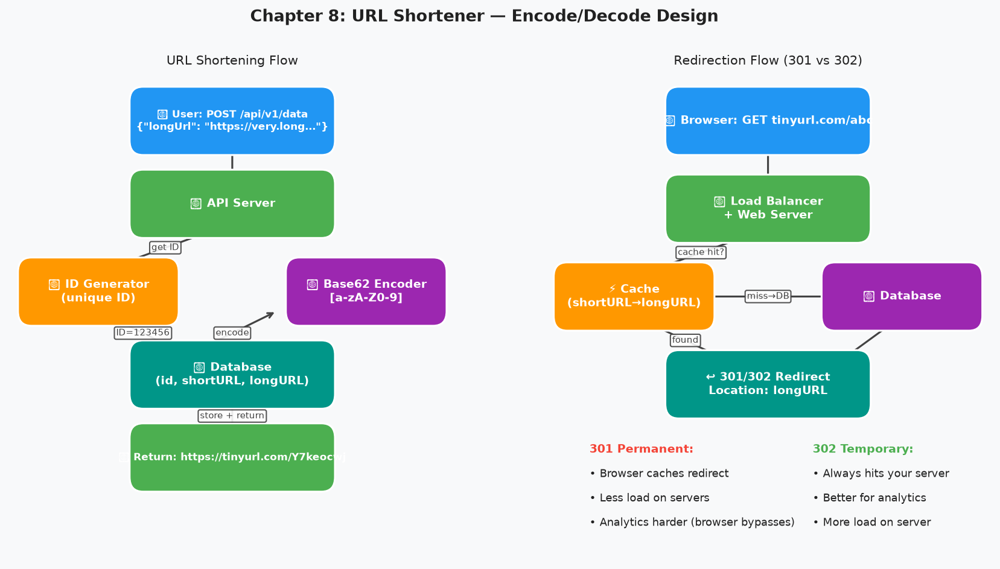 | Shorten + redirect flow with 301 vs 302 |
| 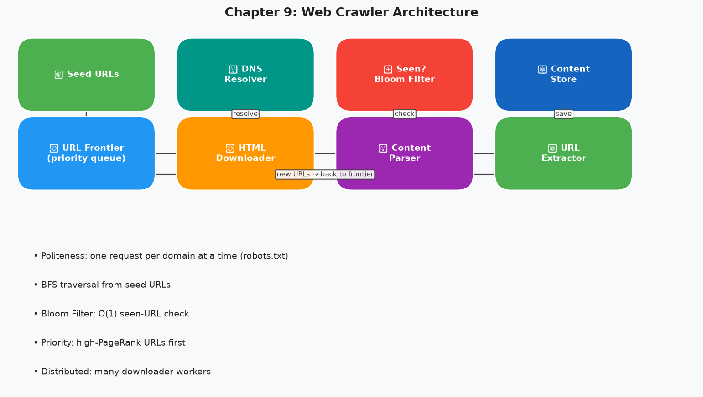 | BFS crawler with URL Frontier + Bloom filter |
| 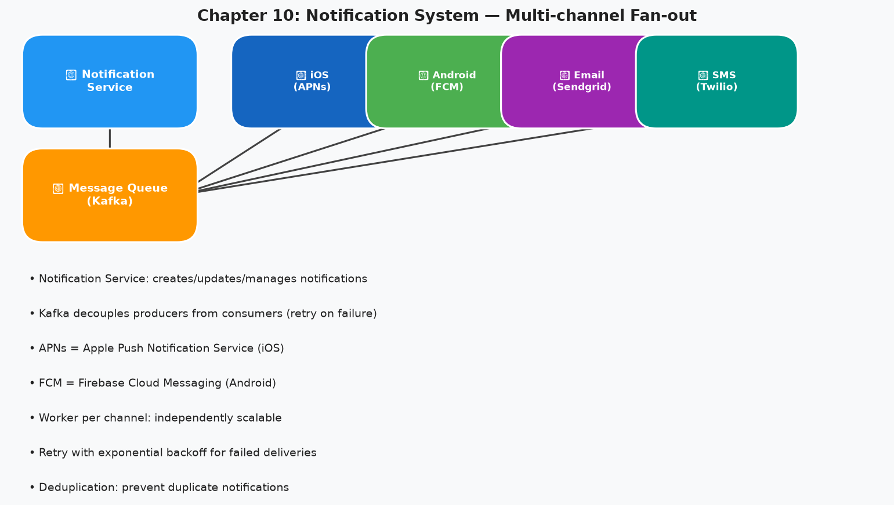 | APNs + FCM + Email + SMS fan-out via Kafka |
| 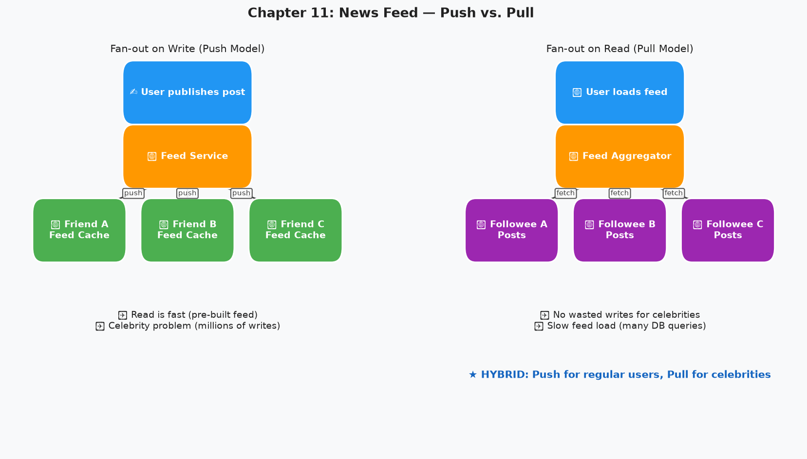 | Push vs pull fan-out for news feed |
| 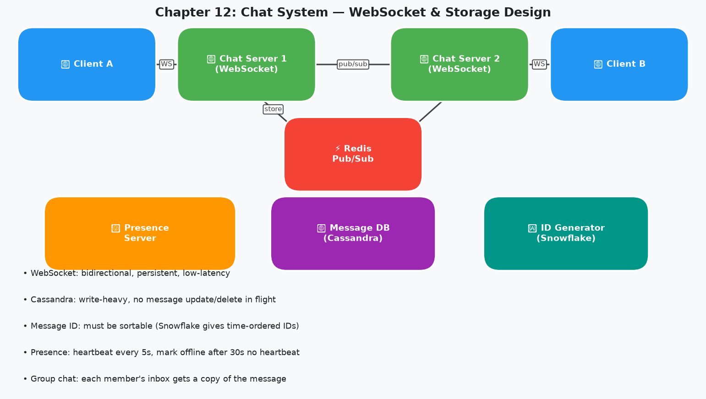 | WebSocket servers + Redis Pub/Sub routing |
| 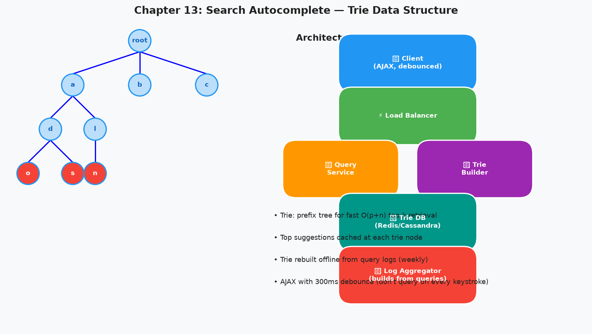 | Trie with top-K caching at each node |
| 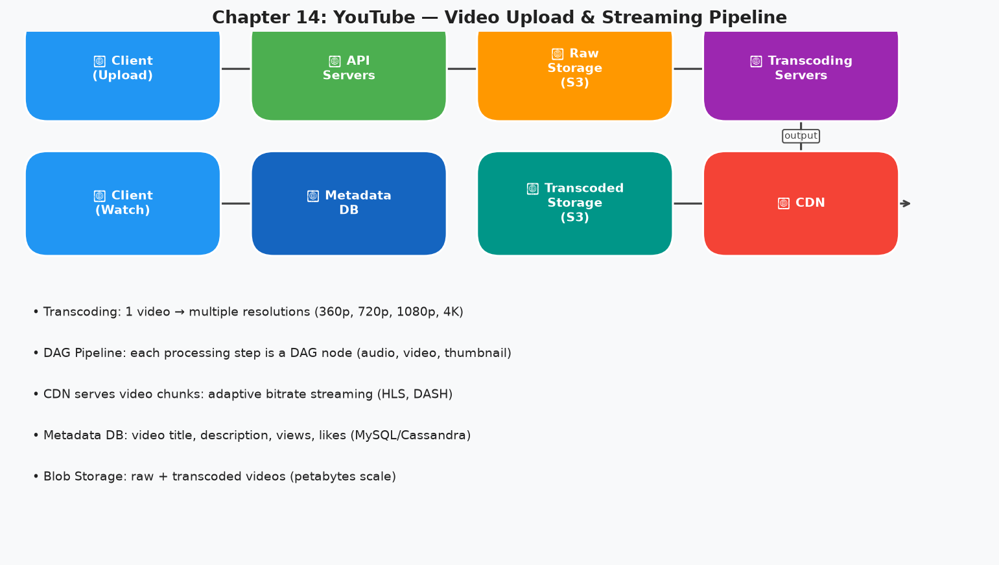 | Video transcoding DAG + CDN serving |
| 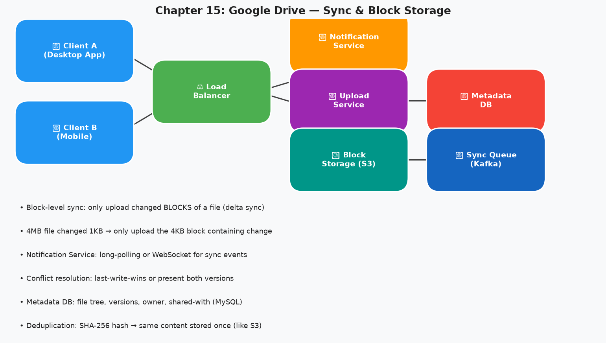 | Block-level delta sync + conflict resolution |

---

## 💡 Key Takeaways

→ [View all 20 key takeaways](key-takeaways.md)

**The 5 most critical lessons:**

### 1. The 4-Step Interview Framework
```
1. Clarify requirements (3-10 min)
2. Estimate scale (back-of-envelope)
3. High-level design (box diagram)
4. Deep dive into bottlenecks
```

### 2. Cache Is Your Best Friend
```
80% of all reads can be served from cache.
If your DB is overloaded, the answer is almost always "add caching first."
```

### 3. Consistent Hashing: 1/N Migration
```
With N servers, adding 1 server moves only 1/N keys.
Naive modulo hashing moves (N-1)/N = 80% of keys.
This difference makes consistent hashing essential for elastic distributed systems.
```

### 4. Snowflake: Time-Ordered IDs Without Coordination
```
41 bits timestamp + 10 bits machine ID + 12 bits sequence = 64-bit unique ID
Sort by ID = sort by creation time
No database coordination needed
4,096 unique IDs per machine per millisecond
```

### 5. The Right Data Structure Wins
```
Leaderboard   → Redis Sorted Set (O log N rank query)
Autocomplete  → Trie with top-K cache (O prefix_length lookup)
Seen URL check → Bloom Filter (1.25GB for 1B URLs)
Chat messages → Cassandra (partition by chat_id, cluster by Snowflake ID)
```

---

## 🔗 Related Books in This Repo

- [System Design Interview Vol. 2](../system-design-interview-v2/README.md) — 13 advanced systems
- [Microservices Patterns](../microservices-patterns/README.md) — distributed system patterns
- [Software Architecture: The Hard Parts](../software-architecture-the-hard-parts/README.md) — trade-off analysis
- [Clean Architecture](../clean-architecture/README.md) — component design principles

---

## 📊 Systems Cross-Reference by Pattern

| Pattern | Where It Appears |
|---------|----------------|
| **Token bucket rate limiting** | Ch.4, API Gateway design |
| **Consistent hashing ring** | Ch.5, Ch.6 (KV Store partition) |
| **Bloom filter** | Ch.6 (read optimization), Ch.9 (URL dedup) |
| **LSM Tree + WAL** | Ch.6, also drives Cassandra (Ch.12) |
| **Snowflake ID** | Ch.7, used in Ch.12 (chat), Ch.14 (YouTube) |
| **Base62 encoding** | Ch.8 (URL shortener) |
| **BFS + politeness** | Ch.9 (web crawler) |
| **Kafka as buffer** | Ch.10 (notifications), Ch.14 (YouTube transcoding) |
| **Fan-out hybrid** | Ch.11 (news feed) |
| **WebSocket** | Ch.12 (chat), Ch.15 (Drive notifications) |
| **Trie + Top-K cache** | Ch.13 (autocomplete) |
| **CDN + adaptive streaming** | Ch.14 (YouTube) |
| **Block delta sync** | Ch.15 (Google Drive) |

---

*[← Back to Pragmatic](../README.md)*
