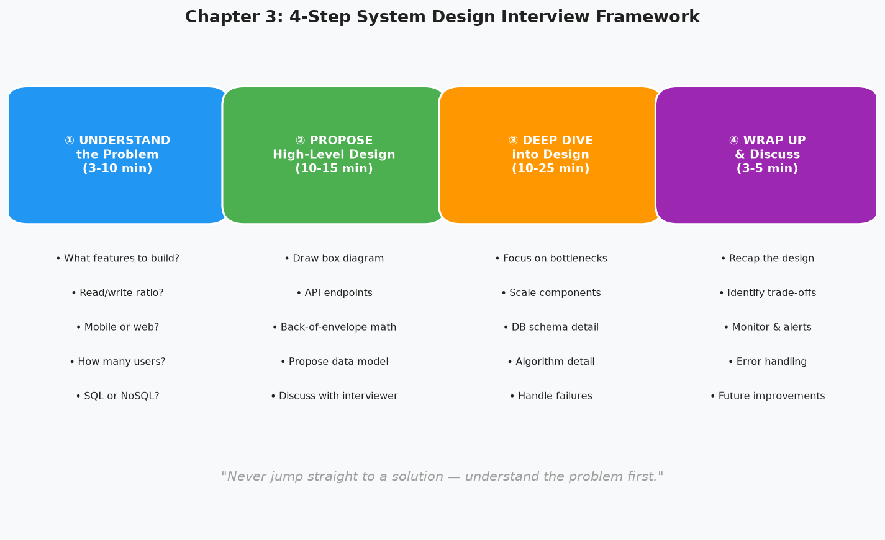

# Chapter 3 — A Framework for System Design Interviews

> *"The interviewer isn't just testing whether you know the answer. They're testing how you think under pressure, how you communicate trade-offs, and whether you ask the right questions."*

---

## 🎯 Core Concept

System design interviews are open-ended by design. There is no single correct answer. The interviewer wants to see your **problem-solving process**: how you break down ambiguity, reason through scale, propose solutions, and discuss trade-offs.

This chapter gives you the **4-step framework** used throughout the rest of the book. Master the process, and you can tackle any system design problem systematically.

---

## 🗺️ The 4-Step Framework



---

## Step 1: Understand the Problem (3–10 minutes)

**Never jump straight to a solution.** This is the most common mistake candidates make.

### What to Ask

```
1. What specific features do we need to build?
   "Is this like Twitter — do we need replies, retweets, likes?"
   "Or just posting and viewing?"

2. How many users are we designing for?
   "DAU? MAU? How fast is it growing?"

3. What is the scale?
   "How many requests per second? How many reads vs writes?"

4. What is the expected data size?
   "How much storage do we have? What's the retention policy?"

5. What's the tech stack?
   "Are we allowed to use cloud services like S3?"
   "Is there an existing tech stack we need to integrate with?"
```

### Example: Designing a Twitter-like Service

```
❌ Bad start: "Let me draw the architecture for a Twitter-like system..."

✅ Good start: "Before I start designing, let me ask a few questions:
  - Are we building the full Twitter, or specific features?
  - Should I focus on the timeline (feed) or tweet posting?
  - What's the expected DAU? 100M? 1B?
  - Do we need search? What about DMs?
  - Should I assume mobile and web both?
  - What's the read/write ratio? Is this read-heavy?"

Interviewer: "Focus on the feed and tweet posting. 100M DAU. Read-heavy."
→ NOW you can design with constraints.
```

### Red Flags to Avoid

```
❌ Jumping to solutions before understanding the problem
❌ Asking questions that don't matter for design ("Do users like cats?")
❌ Making assumptions silently without stating them
❌ Spending too long on this step (>10 minutes)
```

---

## Step 2: Propose a High-Level Design (10–15 minutes)

Come up with an initial blueprint. **Draw first, then explain.**

### What to Produce

```
1. A box diagram showing major components:
   Clients → Load Balancer → API Servers → Cache → DB

2. Core APIs:
   POST /tweets    → Create tweet
   GET  /timeline  → Get home feed
   GET  /tweets/{id} → Get specific tweet

3. Data model sketch:
   tweets: id, user_id, text, created_at
   users: id, name, email
   follows: follower_id, followee_id

4. Scale estimate:
   "100M DAU, 2 tweets/day = 200M writes/day = ~2,300 writes/sec"
   "50 timeline views/day = 5B reads/day = ~58,000 reads/sec"
   "Read:Write = 25:1 → needs read replicas and caching"
```

### Collaboration is Key

```
"Here's what I'm thinking... [draw diagram]"
"Does this look reasonable to you?"
"Should I focus more on the feed generation or the write path?"

The interviewer wants to see you can communicate your ideas clearly
and adjust based on feedback — just like in a real engineering discussion.
```

---

## Step 3: Deep Dive into the Design (10–25 minutes)

Based on interviewer feedback, **zoom into the most important components.**

### What to Focus On

```
Typical deep-dive areas:
  - The bottleneck component (usually the DB or hot spot)
  - The algorithm that makes the system work (consistent hashing, etc.)
  - How to handle failures (what if the cache goes down?)
  - How to handle scale (what if QPS doubles overnight?)
  - Trade-offs in your design choices
```

### Example: Twitter Feed Deep Dive

```
Interviewer: "Tell me more about how the timeline works."

You: "Great question. There are two approaches:

Approach A: Fan-out on Write (Push Model)
  When user A tweets:
  - Look up all of A's followers (could be millions)
  - Write a copy of the tweet to each follower's feed cache
  
  ✅ Reading the feed is fast (pre-built, O(1))
  ❌ A celebrity with 10M followers requires 10M writes per tweet

Approach B: Fan-out on Read (Pull Model)
  When user B opens their feed:
  - Look up who B follows
  - Fetch latest tweets from each followed user
  - Merge and sort by timestamp
  
  ✅ No wasted writes for celebrities
  ❌ Feed load is slow — N queries for N followees

Approach C: Hybrid (what Twitter actually does)
  - Regular users: push model (fast reads)
  - Celebrities: pull model (avoid write storms)
  
  I'd go with Approach C for production."
```

---

## Step 4: Wrap Up (3–5 minutes)

### What to Cover

```
1. Summarize your design briefly:
   "So to recap — clients hit the load balancer, which routes to stateless 
    API servers. Timeline reads from Redis cache (pre-built via fan-out on write
    for regular users, pulled on-demand for celebrity accounts)..."

2. Identify limitations and improvements:
   "The current design doesn't handle hot partitions well. 
    In production, I'd add consistent hashing for the cache layer."

3. Error handling:
   "If Redis goes down, we'd fall back to DB queries — 
    slower but the system stays up."

4. Operational concerns:
   "For monitoring, I'd track P99 latency on timeline reads, 
    cache hit rate, and DB replication lag."
```

### Things Not to Do

```
❌ Don't say "I'm done" if there's still time left
❌ Don't introduce entirely new major components at the end
❌ Don't be defensive if the interviewer challenges your choices
✅ DO say "That's a great point, the trade-off there is..."
```

---

## ⏱️ Time Management Template

```
Interview length: 45-60 minutes
  Step 1 — Requirements:    5-10 minutes
  Step 2 — High-level:      10-15 minutes
  Step 3 — Deep dive:       15-25 minutes
  Step 4 — Wrap up:         3-5 minutes

Don't let any one step consume the whole interview.
If stuck: "I'll make an assumption and move forward — feel free to redirect me."
```

---

## 💬 Communication Patterns That Work

### Thinking Out Loud

```
"I'm considering two approaches here. 
 Option A is simpler but doesn't scale past 1M users.
 Option B handles the scale but adds operational complexity.
 Given we're designing for 100M users, I'll go with Option B."
```

### Acknowledging Trade-offs

```
"This approach has a trade-off: by denormalizing the data,
 we get faster reads but need to handle data consistency ourselves.
 For this use case, that's acceptable because..."
```

### Asking for Direction

```
"There are two interesting directions I could take this — 
 the storage layer or the feed ranking algorithm.
 Which would you like me to focus on?"
```

---

## 💡 Key Takeaways

| Concept | The Lesson |
|---------|-----------|
| **Ask before designing** | Understand requirements before drawing a single box |
| **Draw first, talk second** | Diagrams communicate faster than words in system design |
| **State assumptions** | Never assume silently — say it, let interviewer correct you |
| **Embrace trade-offs** | Every design has trade-offs — the ability to articulate them is what matters |
| **Collaborate, don't monologue** | Treat the interview as a conversation with a colleague |
| **Time-box each step** | Don't spend 45 min on requirements — pace yourself |

---

*← [Back to System Design Interview](../README.md)*
