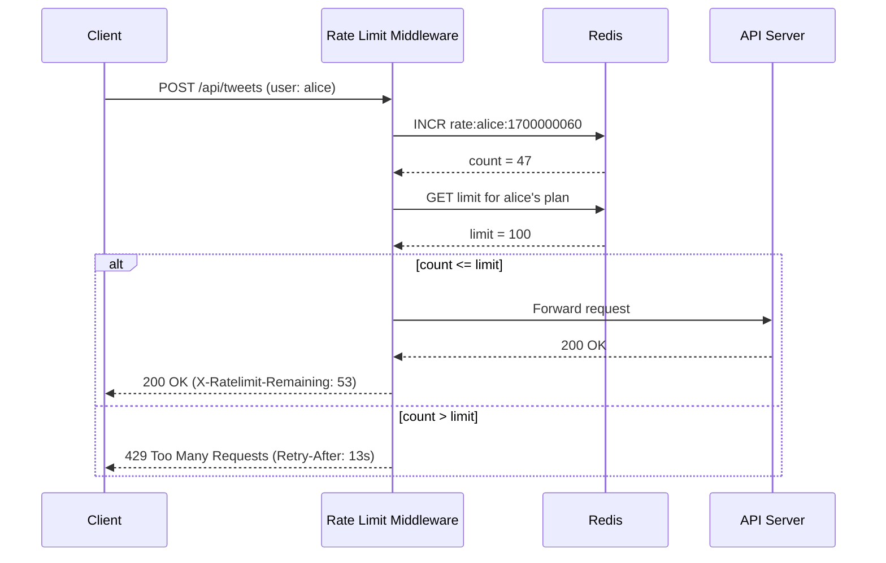

# Chapter 4 — Design a Rate Limiter

> *"A rate limiter is the gatekeeper of your API. It protects your system from abuse, ensures fair usage, and prevents a single bad actor from bringing down your service."*

---

## 🎯 Core Concept

A **Rate Limiter** controls how many requests a client can make to an API within a given time window. Without one, a single misconfigured client or malicious actor can overwhelm your servers with millions of requests per second.

**Real-world uses:**
- Twitter: 300 tweets per 3 hours per user
- GitHub API: 5,000 requests per hour per token  
- Stripe: 100 requests per second per API key
- YouTube: 10,000 quota units per day per project

---

## 📋 Requirements

### Functional
- Limit requests per user/IP/API key within time windows (per-second, per-minute, per-day)
- Return HTTP 429 (Too Many Requests) when limit exceeded
- Return headers showing remaining quota: `X-Ratelimit-Remaining: 45`
- Support multiple rule types: per-user, per-IP, per-endpoint

### Non-Functional
- Low latency: rate limiting must add < 1ms overhead
- High accuracy: must not let through significantly more than limit
- Distributed: work correctly across multiple API server instances
- Fault tolerant: if rate limiter fails, don't block all traffic (fail open vs. fail closed)

---

## 🔑 The Five Algorithms

### 1. Token Bucket (Most Common)

```
Concept: A bucket holds N tokens. Tokens refill at rate R per second.
         Each request consumes 1 token. If empty, reject request.

State: (tokens: int, last_refill: timestamp)

Algorithm:
  tokens_to_add = (now - last_refill) * refill_rate
  tokens = min(bucket_capacity, tokens + tokens_to_add)
  last_refill = now
  
  if tokens >= 1:
    tokens -= 1
    allow request
  else:
    reject with 429
```

**Properties:**
```
✅ Handles burst traffic (bucket can accumulate tokens)
✅ Simple to implement
✅ Memory efficient (2 values per user)
✅ Used by AWS API Gateway, Stripe

Parameters: bucket_size = max burst, refill_rate = steady-state throughput

Example: bucket_size=10, refill_rate=2/sec
  → User can burst 10 requests immediately
  → Then sustained at 2 requests/second
```

### 2. Leaking Bucket (Queue-based)

```
Concept: Requests enter a fixed-size queue. They're processed at a fixed rate.
         If queue is full, reject.

State: Queue of requests

Algorithm:
  if queue.size < capacity:
    queue.enqueue(request)
  else:
    reject with 429
  
  # Background processor: dequeue and process at fixed rate
  while queue:
    process(queue.dequeue())
    sleep(1/rate)
```

**Properties:**
```
✅ Smooth, uniform output rate (good for payment processing)
❌ Burst requests queued, causing high latency
❌ Queue memory grows
Used by: Shopify
```

### 3. Fixed Window Counter

```
Concept: Count requests in fixed time windows (e.g., each minute).
         If count > limit, reject.

State: {window_start: count}

Example:
  Window: 10:00:00 - 10:00:59  count=95  limit=100 → allow
  Window: 10:00:00 - 10:00:59  count=100 limit=100 → REJECT
  Window: 10:01:00 - 10:01:59  count=0   limit=100 → new window, allow
```

**Problem: Boundary Burst**
```
10:00:50 - 10:00:59: 100 requests (fills window at end)
10:01:00 - 10:01:10: 100 requests (new window, refills immediately)

= 200 requests in 20 seconds! (2× the intended limit)
→ Window boundary is exploitable
```

### 4. Sliding Window Log

```
Concept: Store timestamp of each request. 
         Count requests in [now - window, now]. If > limit, reject.

State: sorted list of timestamps (e.g., Redis ZSET)

Algorithm:
  Remove timestamps older than (now - window_size)
  if len(timestamps) < limit:
    add current timestamp
    allow
  else:
    reject with 429
```

**Properties:**
```
✅ Accurate: no boundary burst problem
❌ Memory intensive: stores timestamp per request
   (1000 users × 100 requests × 8 bytes = ~800KB — manageable)
```

### 5. Sliding Window Counter (Best of Both)

```
Concept: Approximate sliding window by weighting two fixed windows.

State: count in previous window + count in current window

Formula:
  requests = count_prev × ((window_size - time_since_window_start) / window_size)
           + count_curr

Example:
  window_size = 60 seconds
  count_prev = 80
  count_curr = 30
  time_since_window_start = 15 seconds
  
  requests = 80 × (45/60) + 30 = 80 × 0.75 + 30 = 60 + 30 = 90
  if 90 < 100: allow
```

**Properties:**
```
✅ Memory efficient (2 values per user, not a list)
✅ Approximation is very accurate (within ~0.003% error)
✅ Used by Cloudflare, Redis rate limiting
```

---

## 🏗️ Architecture: Distributed Rate Limiter


### Why Centralized Storage (Redis)?

```
Problem: Three web servers, each with their own in-memory counter

Server 1: user A count = 3
Server 2: user A count = 2  
Server 3: user A count = 3

Total real count = 8, but each server thinks user A is fine!
→ User can exceed the limit by factor of N (where N = server count)

Solution: Centralized Redis counter

Server 1 → Redis INCR "rate:user_A:1700000060" → 4
Server 2 → Redis INCR "rate:user_A:1700000060" → 5
Server 3 → Redis INCR "rate:user_A:1700000060" → 6

All servers see the same global count!
```

### Redis Implementation

```python
def is_rate_limited(user_id: str, limit: int, window_sec: int) -> bool:
    key = f"rate:{user_id}:{int(time.time() // window_sec)}"
    
    pipeline = redis.pipeline()
    pipeline.incr(key)
    pipeline.expire(key, window_sec * 2)  # TTL cleanup
    current_count, _ = pipeline.execute()
    
    return current_count > limit

# Usage:
if is_rate_limited(user_id="alice", limit=100, window_sec=60):
    return HTTP_429_TOO_MANY_REQUESTS
```

### Response Headers

Always tell clients their remaining quota:

```
HTTP/1.1 200 OK
X-Ratelimit-Limit:     100    ← max allowed per window
X-Ratelimit-Remaining: 47    ← remaining in current window
X-Ratelimit-Reset:     1700000120  ← Unix timestamp when window resets

HTTP/1.1 429 Too Many Requests
Retry-After: 30    ← seconds until they can try again
```

---

## ⚖️ Design Decisions & Trade-offs

### 1. Where to Implement the Rate Limiter?

| Location | Pros | Cons |
|---------|------|------|
| **Client-side** | No network latency | Untrusted, easily bypassed |
| **API Gateway** | One place, works for all APIs | Gateway becomes bottleneck |
| **Middleware in each service** | Fine-grained control | Code duplication |
| **Standalone rate limit service** | Reusable, separate concerns | Extra network hop |

**Best practice**: API Gateway for simple per-endpoint limits + Redis-backed middleware for complex per-user limits.

### 2. Fail Open vs. Fail Closed

```
Rate limiter goes down → what happens?

Fail Open (allow all traffic):
  ✅ Service stays available
  ❌ No rate limiting during outage → potential abuse

Fail Closed (block all traffic):
  ✅ System protected
  ❌ Service is unavailable for all users

Decision depends on business risk:
  Financial APIs: fail closed (protect from fraud)
  Social media: fail open (availability is more important)
```

### 3. Hard vs. Soft Limiting

```
Hard limit: Strictly enforce N requests per window
  → User at request N+1 gets 429 immediately

Soft limit: Allow slight overflow then throttle
  → User at N+1 gets slightly slower response
  → User at N+100 gets 429

Soft limiting reduces user frustration for brief bursts.
```

---

## 📊 Mermaid: Rate Limiter Request Flow



---

## 💡 Key Takeaways

| Concept | The Lesson |
|---------|-----------|
| **Token bucket** | Best general-purpose algorithm: allows bursts, configurable steady-state |
| **Sliding window counter** | Best for accuracy with minimal memory (approximation works in practice) |
| **Redis for distributed counters** | Single atomic INCR operation across all servers — critical for correctness |
| **Response headers** | Always tell clients their quota — reduces unnecessary retries |
| **Fail open for availability** | Rate limiter failure should not take down your service |
| **HTTP 429** | Standard status code for rate limiting — include `Retry-After` header |

---

*← [Back to System Design Interview](../README.md)*
