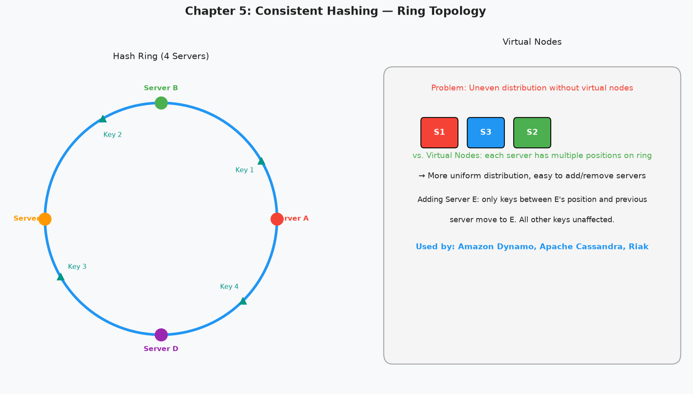

# Chapter 5 — Design Consistent Hashing

> *"When you add a server, ideally only the keys that belong to the new server should move. Everything else should stay put. Consistent hashing achieves exactly this."*

---

## 🎯 Core Concept

**Consistent Hashing** is the algorithm that makes distributed caches and databases work at scale. It solves the key distribution problem: when you add or remove servers, how do you redistribute data with minimal disruption?

Without consistent hashing, adding a server to a cluster might require moving almost all keys — expensive and disruptive. With consistent hashing, only `1/N` of keys move when you add a server (where N is the number of servers).

**Used by:** Amazon DynamoDB, Apache Cassandra, Riak, Nginx, Discord, Akamai CDN.

---

## 🔑 The Problem: Naive Hashing Fails at Scale

### Simple Modulo Hashing

```python
server = hash(key) % num_servers

# With 4 servers:
hash("user:alice") % 4 = 2  → Server 2
hash("user:bob")   % 4 = 1  → Server 1
hash("user:carol") % 4 = 0  → Server 0
hash("user:dave")  % 4 = 3  → Server 3
```

**What happens when you add Server 4?**

```python
# Old mapping (4 servers):
hash("user:alice") % 4 = 2  → Server 2 ✓

# New mapping (5 servers):
hash("user:alice") % 5 = 2  → still Server 2 ✓ (lucky)
hash("user:bob")   % 5 = 4  → Server 4! (was Server 1) ✗

# Roughly (N-1)/N keys need to be moved!
# 4/5 = 80% of all keys must be remapped
```

With a cache cluster, this means **80% cache miss rate** during rebalancing — catastrophic.

---

## 🔄 The Consistent Hashing Solution

### The Hash Ring

```
Visualize a ring from 0 to 2^32 - 1

Both servers AND keys are hashed to positions on this ring.

Each key is assigned to the first server clockwise from its position.

          0
          ┌──────────────────────────────────┐
    2^32  │  ....                            │  (wraps around)
          │        Server A (hash=0)         │
          │    hash=30    hash=60            │
          │  Key2 ●         ● Server B       │
          │                  (hash=90)       │
          │                                  │
          │  hash=200                        │
          │  Key3 ●    ● Server C (hash=180) │
          │                                  │
          │  hash=300    hash=320            │
          │  Key1 ●      ● Server D (hash=350)│
          └──────────────────────────────────┘

Key1 → clockwise from 300 → Server D (at 350) ✓
Key2 → clockwise from 30  → Server B (at 90)  ✓
Key3 → clockwise from 200 → Server C (at 180)? NO — clockwise goes to Server D (350)? 
       Actually: from 200, clockwise: 350 (Server D) is next
```

**Adding Server E (hash=250):**
- Only keys between 180 and 250 need to move to Server E
- All other keys are unaffected
- With N servers, only 1/N keys move on average!

---

## ⚖️ Virtual Nodes: Solving Uneven Distribution

### The Problem with Basic Consistent Hashing

```
Random hash positions → unequal partition sizes

Server A gets: 30% of the ring
Server B gets: 5% of the ring   ← barely any traffic
Server C gets: 45% of the ring  ← overloaded
Server D gets: 20% of the ring

This is not balanced!
```

### Virtual Nodes (Vnodes)

Instead of each server getting 1 position on the ring, each server gets K positions (virtual nodes):

```
Server A → positions: [100, 650, 1100, 1800, ...]  ← K=100 virtual nodes
Server B → positions: [50, 250, 900, 1600, ...]
Server C → positions: [200, 500, 800, 1500, ...]

All positions are sorted: 50, 100, 200, 250, 500, 650, 800, 900, 1100, 1500, 1600, 1800...

A key at position 300 → next clockwise → 500 → Server C
A key at position 750 → next clockwise → 800 → Server C
A key at position 950 → next clockwise → 1100 → Server A
```

**Effect:** With K=100 virtual nodes per server, load becomes very evenly distributed (within a few percent of ideal).

```python
class ConsistentHashRing:
    def __init__(self, servers, num_vnodes=100):
        self.ring = {}  # position → server
        self.sorted_positions = []
        
        for server in servers:
            for i in range(num_vnodes):
                position = hash(f"{server}:{i}") % (2**32)
                self.ring[position] = server
                self.sorted_positions.append(position)
        
        self.sorted_positions.sort()
    
    def get_server(self, key):
        if not self.ring:
            return None
        
        key_position = hash(key) % (2**32)
        
        # Binary search: find first position >= key_position
        idx = bisect.bisect_right(self.sorted_positions, key_position)
        
        # Wrap around the ring
        if idx == len(self.sorted_positions):
            idx = 0
        
        return self.ring[self.sorted_positions[idx]]
```

---

## 📊 Architecture Diagram



---

## 🔬 Adding and Removing Servers

### Adding Server E

```
Before:
  Ring: A(0) → B(90) → C(180) → D(350)
  Key at position 250 → Server D

Add Server E at position 250:
  Ring: A(0) → B(90) → C(180) → E(250) → D(350)
  Key at position 220 → Server E (was D)
  
Only keys in range (180, 250] need to move from D to E.
All other keys: unaffected.
```

### Removing Server C (failure)

```
Before:
  Ring: A(0) → B(90) → C(180) → D(350)
  Key at position 120 → Server C

Remove Server C:
  Ring: A(0) → B(90) → D(350)
  Key at position 120 → now routes to Server D

Only keys that were assigned to C need to reassign to D.
All other keys: unaffected.
```

---

## 🏗️ Real-world Use Cases

### Distributed Cache (Memcached/Redis Cluster)

```
Problem: 
  You have 1TB of session data that doesn't fit on one Redis node.
  Split it across 4 Redis nodes.
  
With consistent hashing:
  session:user:123 → hash → Ring → Redis Node 2
  session:user:456 → hash → Ring → Redis Node 0
  session:user:789 → hash → Ring → Redis Node 3
  
When Redis Node 4 is added:
  ~25% of sessions migrate to Node 4
  75% of sessions stay on their current nodes
  No cache stampede!
```

### Database Sharding

```
MongoDB / Cassandra use consistent hashing (or range partitioning):

User IDs:
  0-25%   → Shard 1
  25-50%  → Shard 2
  50-75%  → Shard 3
  75-100% → Shard 4

Add Shard 5:
  Shard 3 moves keys in (50-62.5%) range to Shard 5
  Everything else unchanged
```

---

## ⚖️ Design Decisions & Trade-offs

### How Many Virtual Nodes?

```
Too few (K=1): Uneven distribution
Too many (K=1000): More memory, slower lookup

Sweet spot: K=100-200 virtual nodes per server
  - Distribution within ~2-3% of ideal
  - Lookup stays O(log N) via binary search
  - Memory: 1000 servers × 100 vnodes × 8 bytes = ~800KB (fine)
```

### Heterogeneous Servers

```
Not all servers are equal:
  Server A: 32GB RAM (powerful)
  Server B: 8GB RAM (basic)

Give Server A more virtual nodes:
  Server A: 300 virtual nodes (gets ~75% of keys)
  Server B: 100 virtual nodes (gets ~25% of keys)
  
Weight servers by capacity!
```

---

## 💡 Key Takeaways

| Concept | The Lesson |
|---------|-----------|
| **Hash ring** | Map both servers and keys to a circle — assign key to next clockwise server |
| **1/N key migration** | Adding 1 server to N-server cluster moves only 1/N keys (not all!) |
| **Virtual nodes** | K positions per server ensures even load distribution |
| **O(log N) lookup** | Binary search on sorted positions — fast even with 1000× servers |
| **Capacity weighting** | More powerful servers get more virtual nodes = proportional load |
| **Graceful failures** | Server removal only affects its own keys — clean failover |

---

*← [Back to System Design Interview](../README.md)*
