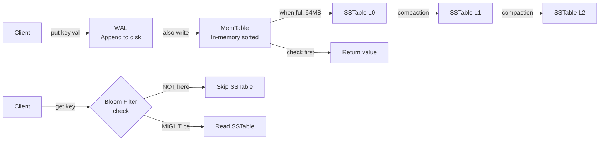

# Chapter 6 — Design a Key-Value Store

> *"A key-value store is the Swiss Army knife of distributed systems — simple interface, infinite depth. Understanding how it works internally prepares you for building any storage system."*

---

## 🎯 Core Concept

A **Key-Value Store** is the simplest distributed database: you store data as (key, value) pairs. The API is trivially simple: `get(key)`, `put(key, value)`, `delete(key)`. But building one that handles petabytes of data, millions of requests per second, and arbitrary node failures is deeply complex.

**Real-world examples**: Amazon DynamoDB, Apache Cassandra, Redis, RocksDB, LevelDB.

---

## 📋 Requirements

### Functional
- `get(key)` → returns value
- `put(key, value)` → stores/overwrites
- `delete(key)` → removes key
- Keys and values are byte arrays (up to 10KB each)

### Non-Functional
- High availability (can read/write even during failures)
- High scalability (petabytes of data, millions of QPS)
- Automatic scaling (add nodes without manual resharding)
- Tunable consistency (strong or eventual, configurable)
- Low latency: P99 < 10ms for reads and writes

---

## 🏗️ Storage Engine: The LSM Tree

Modern key-value stores use **Log-Structured Merge Trees (LSM Trees)** for writes, and **SSTables** for on-disk storage.


### Write Path

```
1. Write-Ahead Log (WAL):
   Every write is first appended to a WAL on disk.
   If the process crashes, WAL allows recovery.

2. MemTable (In-Memory):
   Write is also stored in an in-memory sorted structure (Red-Black Tree).
   Reads from MemTable are O(log N) — very fast.
   
3. SSTable Flush:
   When MemTable exceeds ~64MB, it's flushed to disk as an SSTable.
   SSTables are immutable, sorted by key.
   
4. Compaction:
   Background process merges SSTables.
   Removes deleted/overwritten keys.
   Keeps data sorted for efficient reads.
```

**Why is this fast for writes?**
```
Traditional DB (B-tree): random writes to disk → 100 IOPS
LSM Tree: sequential appends to WAL + batched SSTable writes → 300MB/s

Sequential disk I/O is 100-1000× faster than random I/O
```

### Read Path

```
To read key K:
1. Check MemTable (in-memory, O(log N)) → found? return it
2. Check Bloom Filter for each SSTable:
   - "Key NOT in SSTable X" = guaranteed → skip it  
   - "Key MIGHT be in SSTable X" → check SSTable X
3. Read SSTables from newest to oldest (Level 0, Level 1, Level 2...)
4. First occurrence of K is the latest value

Bloom Filter = probabilistic data structure:
  - No false negatives (never says "not here" when it is)
  - Some false positives (occasionally says "might be here" when it isn't)
  - Reduces unnecessary disk I/O by 90%+
```

---

## 🔑 Data Partitioning: Consistent Hashing

Distribute keys across nodes using consistent hashing (Chapter 5):

```
Hash ring with 4 nodes:
  Node A: stores keys with hash in range (D, A]
  Node B: stores keys with hash in range (A, B]
  Node C: stores keys with hash in range (B, C]
  Node D: stores keys with hash in range (C, D]

get("user:alice"):
  hash("user:alice") = 150
  150 falls in range (A, B] → route to Node B

Adding Node E between B and C:
  Keys in (B, E] move from C to E
  All other keys unaffected
```

---

## 🔄 Replication: Consistency and Availability

Each key is replicated to N nodes (e.g., N=3):

```
For key "user:alice" → primary Node B
  Replica on Node C (next clockwise)
  Replica on Node D (next next clockwise)

N=3: data exists on 3 nodes
W=2: write acknowledged after 2 nodes confirm
R=2: read from 2 nodes, return value

Quorum: W + R > N ensures at least 1 overlap
  2 + 2 > 3 ✓ → strong consistency

Fast reads: R=1 (read from 1 node)
  → Faster but may return stale data (eventual consistency)

Durability: W=3 (all 3 must confirm)
  → Slower but all replicas guaranteed up-to-date
```

### The CAP Theorem in Practice

```
Consistent Key-Value Store (CP):
  DynamoDB with strong consistency mode
  Write to W=3, read from R=2
  If 2 nodes fail: system unavailable (consistency over availability)

Available Key-Value Store (AP):
  Cassandra with ONE consistency level
  Write to any node, read from any node
  System stays up even during partitions (availability over consistency)
  
DynamoDB, Cassandra: tunable (you choose per-operation)
```

---

## ⚡ Handling Failures

### Gossip Protocol (Failure Detection)

```
Each node maintains a list of (node_id, heartbeat_counter, last_updated)

Every second:
  Each node increments its own heartbeat counter
  Each node gossips its membership list to K random nodes
  Recipients merge lists (take higher heartbeat value)
  If heartbeat not updated for T seconds → node is offline

Gossip vs. heartbeat to central coordinator:
  Central: single point of failure
  Gossip: fully distributed, O(log N) convergence time
```

### Hinted Handoff (Temporary Failures)

```
Node B is down. write("user:alice", value) arrives.

Hinted handoff:
  Write to Node C with hint: "this actually belongs to Node B"
  When Node B recovers, Node C delivers the hint
  Node B processes the pending write

Effect: Writes succeed even during temporary node failures
        Data is eventually consistent when nodes recover
```

### Merkle Trees (Detecting Inconsistencies)

```
Problem: After recovery, how do we know which keys are out of sync?
Comparing all keys between replicas = too slow

Merkle Tree:
  Each node computes a hash tree of its data
  Top-level hash = hash(all data on node)
  
  Compare top-level hashes:
    Same → nodes are in sync, done! O(1) check
    Different → compare subtree hashes to find divergent range
    
  Only transfer keys that differ!
  O(log N) communication to identify inconsistencies
```

---

## 🗄️ Data Model

```sql
-- Logical model (actual storage is byte arrays):
CREATE TABLE kv_store (
    key         BYTES,
    value       BYTES,
    version     BIGINT,      -- vector clock / timestamp
    created_at  TIMESTAMP,
    ttl         INT          -- optional expiry
);
```

### Vector Clocks for Conflict Resolution

```
Problem: Two clients update same key concurrently on different nodes

Node B receives: put("cart:alice", ["apple"]) → version [B:1]
Node C receives: put("cart:alice", ["banana"]) → version [C:1]

When nodes sync: both versions exist!
  [B:1] "apple"
  [C:1] "banana"

Neither is "newer" — they're concurrent updates

Resolution options:
  1. Last-write-wins: use timestamp (simple, loses data)
  2. Vector clocks: detect conflict, present both to client (application decides)
  3. CRDT: data structure that auto-merges (e.g., Sets merge via union)

Amazon DynamoDB used vector clocks historically.
Modern approach: LWW (last write wins) with client-chosen conflict resolution.
```

---

## ⚖️ Design Decisions & Trade-offs

### Write-Optimized (LSM) vs. Read-Optimized (B-Tree)

| | LSM Tree | B-Tree |
|--|---------|--------|
| **Write** | Fast (sequential append) | Slower (random I/O) |
| **Read** | Slower (check multiple SSTables) | Fast (one tree traversal) |
| **Space** | Higher (until compaction) | Lower |
| **Best for** | Write-heavy workloads | Read-heavy workloads |
| **Examples** | Cassandra, RocksDB | MySQL InnoDB, PostgreSQL |

### Compression for Cost Reduction

```
SSTable data is highly compressible:
  - JSON keys repeat (field names)
  - Sequential keys have common prefixes
  
Snappy/LZ4 compression:
  Typical compression ratio: 3:1 to 5:1
  CPU cost: minimal (< 5% overhead)
  Storage savings: 60-80%
```

---

## 📊 Mermaid: Write and Read Paths



---

## 💡 Key Takeaways

| Concept | The Lesson |
|---------|-----------|
| **LSM Tree** | Sequential appends to WAL → fast writes; compaction happens in background |
| **Bloom Filter** | Probabilistic structure that eliminates 90%+ of unnecessary disk reads |
| **Consistent hashing** | Distribute keys across nodes with minimal remapping on cluster changes |
| **N/W/R quorum** | W+R > N guarantees at least 1 consistent replica is always read |
| **Gossip protocol** | Distributed failure detection without single point of failure |
| **Hinted handoff** | Temporarily store writes for failed nodes; deliver on recovery |

---

*← [Back to System Design Interview](../README.md)*
