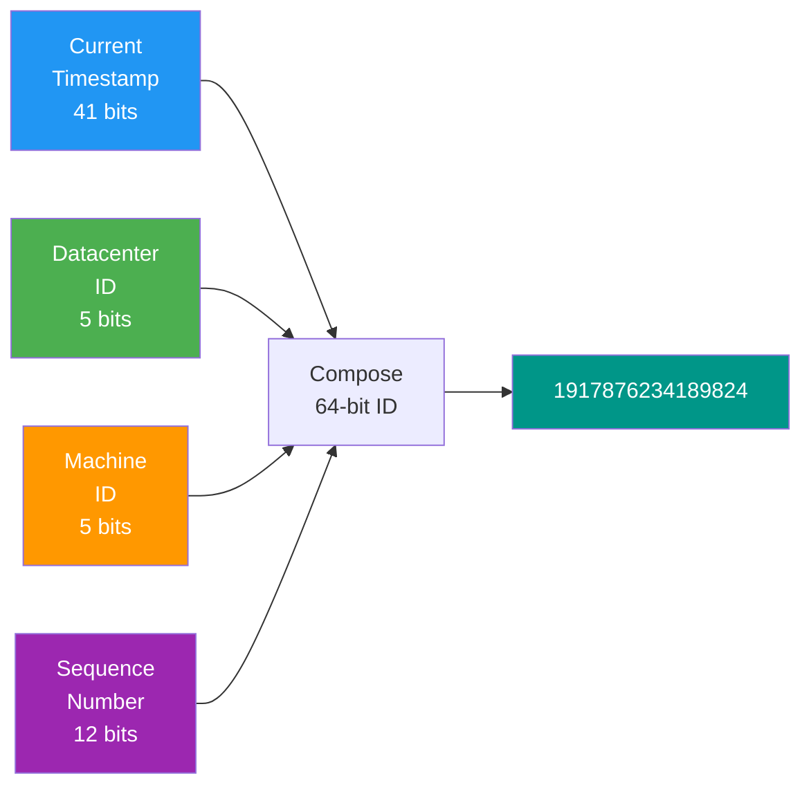

# Chapter 7 — Design a Unique ID Generator in Distributed Systems

> *"In a distributed system, generating an ID sounds trivial — until you have 100 servers all trying to generate IDs simultaneously. Coordinating uniqueness across machines is an art."*

---

## 🎯 Core Concept

A **Unique ID Generator** must produce identifiers that are:
- **Unique** across all servers, forever
- **Sortable by time** (so you can tell which event happened first)
- **Fast** — millions of IDs per second
- **Highly available** — no single point of failure

This chapter introduces the most elegant solution: **Twitter's Snowflake ID format** — a 64-bit integer that encodes time, machine ID, and sequence number.

---

## 📋 Requirements

### Functional
- IDs must be unique across all distributed servers
- IDs must be 64-bit numbers (fits in a `long` / `int64`)
- IDs should be sortable by generation time (time-ordered)
- Generation rate: > 10,000 IDs per machine per millisecond

### Non-Functional
- High availability (no central coordinator)
- Low latency: < 1ms per ID generation
- Scalable: works across any number of machines

---

## 🔑 Approaches to Distributed ID Generation

### Approach 1: UUID (Too Simple, Has Problems)

```
UUID: 128-bit random identifier
Example: 550e8400-e29b-41d4-a716-446655440000

Generation:
  uuid4 = os.urandom(16) with some bits set

Problems:
  ❌ Not sortable by time (random, not sequential)
  ❌ 128 bits (won't fit in 64-bit database index efficiently)
  ❌ Contains dashes — takes more storage as string
  
Use UUID when: you don't care about time ordering and need cross-language simplicity
```

### Approach 2: Auto-increment in Database (Single Point of Failure)

```
MySQL: id BIGINT AUTO_INCREMENT PRIMARY KEY

Problems:
  ❌ Single server → single point of failure
  ❌ Can't scale write throughput (one server)
  ❌ Distributed becomes complex: multi-master auto_increment

Multi-master trick:
  Server 1 generates: 1, 3, 5, 7, ... (odd numbers)
  Server 2 generates: 2, 4, 6, 8, ... (even numbers)
  
  ✅ Two servers, unique IDs
  ❌ Fixed to exactly 2 servers — not flexible
  ❌ Hard to add a 3rd server
```

### Approach 3: Ticket Server (Flickr's Approach)

```
Centralized "ticket server":
  All ID requests go to one dedicated MySQL server
  Ticket server: auto_increment counter
  
  GET /next-id → returns 1234567
  GET /next-id → returns 1234568

Problems:
  ❌ Single point of failure
  ❌ Network round trip for every ID
  ❌ Throughput limited to ~50,000 IDs/sec
```

### Approach 4: Snowflake (Best: No Coordination Required)

**Twitter's Snowflake** generates time-ordered, globally unique 64-bit IDs **without any coordination** between machines.

---

## ❄️ Twitter Snowflake — Deep Dive


### Bit Layout

```
┌────────┬─────────────────────────────────────────┬──────────┬──────────┬────────────────┐
│ 1 bit  │              41 bits                    │  5 bits  │  5 bits  │    12 bits     │
│ Sign   │           Timestamp (ms)                │ DC ID    │ Mach ID  │   Sequence     │
└────────┴─────────────────────────────────────────┴──────────┴──────────┴────────────────┘
  Always 0   Milliseconds since custom epoch       Datacenter  Machine    Per-machine/ms
             (Jan 1, 2020 for example)             ID (0-31)   ID (0-31)  counter (0-4095)
```

### What Each Field Means

```
Sign bit (1 bit):
  Always 0 → ensures ID is always positive
  
Timestamp (41 bits):
  Milliseconds since custom epoch (e.g., 2024-01-01 00:00:00 UTC)
  2^41 = 2,199,023,255,552 ms = ~69 years
  After 69 years, timestamps overflow (plan accordingly!)

Datacenter ID (5 bits):
  2^5 = 32 datacenters supported
  
Machine ID (5 bits):
  2^5 = 32 machines per datacenter
  Total: 32 × 32 = 1,024 unique machines
  
Sequence Number (12 bits):
  2^12 = 4,096 unique IDs per machine per millisecond
  Resets to 0 each millisecond
  If 4,096 IDs/ms exhausted → wait for next millisecond
```

### Generation Algorithm

```python
class SnowflakeGenerator:
    EPOCH = 1704067200000  # Jan 1, 2024 00:00:00 UTC in ms
    
    def __init__(self, datacenter_id: int, machine_id: int):
        assert 0 <= datacenter_id < 32
        assert 0 <= machine_id < 32
        self.datacenter_id = datacenter_id
        self.machine_id = machine_id
        self.sequence = 0
        self.last_timestamp = -1
    
    def next_id(self) -> int:
        timestamp = self._current_ms()
        
        if timestamp < self.last_timestamp:
            raise Exception("Clock moved backwards!")
        
        if timestamp == self.last_timestamp:
            self.sequence = (self.sequence + 1) & 0xFFF  # 12 bits
            if self.sequence == 0:
                timestamp = self._wait_for_next_ms(self.last_timestamp)
        else:
            self.sequence = 0
        
        self.last_timestamp = timestamp
        
        # Compose the 64-bit ID
        return (
            ((timestamp - self.EPOCH) << 22) |
            (self.datacenter_id << 17) |
            (self.machine_id << 12) |
            self.sequence
        )
    
    def _current_ms(self) -> int:
        return int(time.time() * 1000)
    
    def _wait_for_next_ms(self, last_ts: int) -> int:
        ts = self._current_ms()
        while ts <= last_ts:
            ts = self._current_ms()
        return ts
```

### Maximum Throughput

```
Per machine, per millisecond: 4,096 IDs
Cluster capacity: 32 datacenters × 32 machines × 4,096/ms
                = 4,194,304 IDs/millisecond globally
                = 4.2 billion IDs/second

In practice: each machine generates 4M IDs/second independently
```

---

## 🔍 Why Snowflake IDs Are Time-Sorted

```
Snowflake IDs generated at different times:

At 10:00:00.000: ID = 0001 0000 0000 0000 0001 ... (timestamp=1, seq=0)
At 10:00:00.001: ID = 0001 0000 0000 0000 0010 ... (timestamp=2, seq=0)
At 10:00:00.001: ID = 0001 0000 0000 0000 0011 ... (timestamp=2, seq=1)

Since timestamp is in the most significant bits:
  Sort IDs numerically ↔ Sort by creation time

This means:
  - Database queries on ID range ≈ queries on time range
  - "Give me all events after ID X" = "Give me all events after timestamp X"
  - B-tree indexes on ID become time-range indexes
```

---

## ⚠️ The Clock Skew Problem

```
Problem: Server clock jumps backward (e.g., NTP sync)

At 10:00:01.000: generate IDs with timestamp = 1,000
NTP correction:  clock jumps back to 10:00:00.500
At 10:00:00.500: would generate IDs with timestamp = 500

ID at 500 < ID at 1,000 → DUPLICATE or OUT-OF-ORDER IDs!

Solutions:
  1. Refuse to generate IDs if clock goes backward:
     throw ClockMovedBackwardsException
     Alert ops team, wait for clock to catch up
  
  2. Use last known time:
     Keep track of last_timestamp
     If current_time < last_timestamp: use last_timestamp (may duplicate sequences!)
  
  3. Milli-second extension:
     Add extra sequence bits, don't advance until sequence is exhausted
     Effectively "pretend time hasn't moved backward"
```

---

## ⚖️ Design Decisions & Trade-offs

### Coordination vs. No Coordination

| Approach | Coordination | Failure Mode |
|----------|-------------|-------------|
| **Auto-increment DB** | Central server | DB failure = no IDs |
| **UUID** | None | No failure, but not ordered |
| **Snowflake** | None (machine IDs configured) | Clock skew |
| **Flake (Erlang)** | None | More bits for randomness |

**Snowflake wins for most cases**: no coordination, time-ordered, compact 64-bit.

### Epoch Choice Matters

```
Twitter chose: 2010-01-01 as epoch
  At that point: 2010 + 69 years = IDs valid until ~2079

If you choose: 2024-01-01 as epoch
  Valid until: 2024 + 69 years = ~2093

Lesson: Choose an epoch close to when you'll deploy.
        Starting from Unix epoch (1970) wastes bits — your IDs are already 54 years in.
```

---

## 📊 Mermaid: Snowflake ID Composition



---

## 💡 Key Takeaways

| Concept | The Lesson |
|---------|-----------|
| **Snowflake format** | 1 sign + 41 timestamp + 5 datacenter + 5 machine + 12 sequence = 64 bits |
| **Time-ordered IDs** | Timestamp in MSB means numeric order = chronological order |
| **No coordination** | Each machine generates IDs independently — no network calls |
| **4,096 IDs/ms/machine** | Sequence resets each ms; waits for next ms when exhausted |
| **Clock skew** | Monitor NTP sync; reject or queue IDs if clock moves backward |
| **Custom epoch** | Use recent epoch to maximize the 41-bit timestamp lifespan |

---

*← [Back to System Design Interview](../README.md)*
