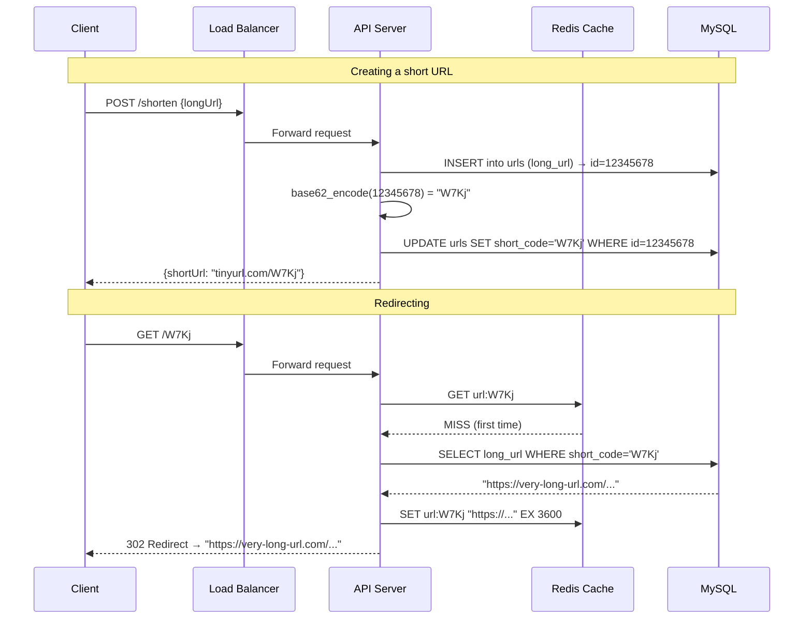

# Chapter 8 — Design a URL Shortener

> *"The URL shortener looks simple on the surface — take a long URL, return a short one. But implement it at Twitter's scale and every design decision matters."*

---

## 🎯 Core Concept

A **URL Shortener** (like bit.ly, TinyURL) converts a long URL into a short one, and redirects users when they visit the short URL. It's one of the most common system design interview questions because it touches storage, hashing, caching, and HTTP semantics.

The core challenge: with billions of short URLs in existence, how do you make every redirect sub-millisecond?

---

## 📋 Requirements

### Functional
- `POST /api/v1/data/shorten` → given long URL, return short URL
- `GET /{shortCode}` → redirect to original long URL
- Short URLs are 7 characters `[a-zA-Z0-9]` (62^7 = 3.5 trillion possibilities)
- Custom aliases allowed (e.g., `tinyurl.com/my-blog`)
- URLs expire after 1 year (configurable)

### Non-Functional
- 100:1 read/write ratio (redirects >> new URLs)
- Write QPS: 1,000/sec; Read QPS: 100,000/sec
- Low latency: redirect completes in < 100ms globally
- High availability: 99.99% uptime

### Scale (Back-of-Envelope)
```
Writes:     1,000 URLs/sec = 86.4M URLs/day
10-year storage: 86.4M × 365 × 10 = 315B URLs
URL record size: 500 bytes avg (short URL + long URL + metadata)
Total storage:   315B × 500B = 157.5TB (manageable with sharding)

Read QPS: 100,000/sec → 99% cache hit → 1,000 DB reads/sec
Cache size: 20% of daily URLs × 365 days × 500 bytes = 3.1TB → multiple Redis nodes
```

---

## 🏗️ High-Level Architecture


---

## 🔑 The Core Algorithm: Hash Function

### Approach 1: Hash + Take First 7 Characters

```python
import hashlib

def shorten_url(long_url: str) -> str:
    # SHA-256 hash of long URL → take first 7 base62 chars
    hash_hex = hashlib.sha256(long_url.encode()).hexdigest()
    
    # Convert hex to base62
    hash_int = int(hash_hex[:8], 16)  # first 8 hex chars = 32 bits
    short_code = base62_encode(hash_int)[:7]
    return f"https://tinyurl.com/{short_code}"

BASE62_CHARS = "0123456789ABCDEFGHIJKLMNOPQRSTUVWXYZabcdefghijklmnopqrstuvwxyz"

def base62_encode(n: int) -> str:
    if n == 0:
        return BASE62_CHARS[0]
    result = []
    while n:
        result.append(BASE62_CHARS[n % 62])
        n //= 62
    return ''.join(reversed(result))
```

**Problem: Hash Collisions**

```
"https://example.com" → hash → first 7 chars → "X9aB3kL"

A different URL might also produce "X9aB3kL" → COLLISION!

Resolution strategies:
  1. Append a counter to the URL before hashing:
     "https://example.com:0" → "X9aB3kL" (collision!)
     "https://example.com:1" → "P7dK2mN" (try again)
  
  2. Use a Bloom filter to detect collisions before DB check
  
  3. Use approach 2: ID + Base62 encoding (no collisions)
```

### Approach 2: Auto-increment ID + Base62 Encoding (Better)

```
1. New URL arrives: "https://very-long-url.com/article/12345"
2. Insert into DB → auto_increment ID = 123456789
3. Encode ID in base62:
   123456789 in base62 = "W7Kj" (7 chars or fewer)
4. Store: {short_code: "W7Kj", long_url: "https://very-long-url.com/..."}
5. Return: "https://tinyurl.com/W7Kj"

Why no collisions?
  Each URL gets a unique ID from the DB.
  Each unique ID maps to a unique base62 string.
  Mathematical bijection: ID ↔ short_code

Base62 capacity:
  7 characters: 62^7 = 3.5 trillion URLs
  This is sufficient for billions of URLs!
```

**Base62 encoding in detail:**

```
Charset: [0-9][A-Z][a-z]
  0-9:   digits (10)
  A-Z:   uppercase (26)  
  a-z:   lowercase (26)
Total:   62 characters

ID = 11157 (decimal)
  11157 ÷ 62 = 179 remainder 59 → char 'x'
  179   ÷ 62 = 2   remainder 55 → char 't'
  2     ÷ 62 = 0   remainder 2  → char '2'
  
  Result: "2tx" (reverse order)
  
  11157 → "2tx" ✓
```

---

## 🗄️ Data Model

```sql
CREATE TABLE urls (
    id          BIGINT PRIMARY KEY AUTO_INCREMENT,
    short_code  VARCHAR(7) UNIQUE NOT NULL,    -- base62 encoded ID
    long_url    TEXT NOT NULL,
    user_id     BIGINT,                         -- who created it
    created_at  TIMESTAMP DEFAULT NOW(),
    expires_at  TIMESTAMP,                      -- TTL
    click_count BIGINT DEFAULT 0               -- analytics
);

-- Index for redirect lookup (most frequent operation):
CREATE INDEX idx_short_code ON urls(short_code);
-- With Redis cache, this index rarely hit
```

---

## ⚡ The Redirect: 301 vs. 302

```
HTTP/1.1 301 Moved Permanently
Location: https://very-long-url.com/article/12345

HTTP/1.1 302 Found (Temporary Redirect)
Location: https://very-long-url.com/article/12345
```

### Which to Use?

```
301 Permanent:
  Browser behavior: browser caches the mapping permanently
  Next visit to same short URL: browser goes DIRECTLY to long URL
    → Your server never sees the request again
  
  ✅ Lower server load (browser-cached, no repeat requests)
  ❌ Can't update or expire URLs (browser ignores server)
  ❌ Can't count clicks accurately (browser bypasses your analytics)

302 Temporary:
  Browser behavior: ALWAYS asks your server before redirecting
  
  ✅ Click counting works (every click hits your server)
  ✅ Can change destination URL anytime
  ✅ Can expire URLs
  ❌ More server load (can't leverage browser caching)

Decision: If analytics matter → 302
          If maximum performance matters → 301
          Most commercial URL shorteners use 302 for analytics
```

---

## ⚡ Caching for High-Volume Redirects

```
Read QPS: 100,000/sec
Without cache: 100,000 DB queries/sec → expensive!

With cache (Redis):
  GET /{shortCode}
    1. Check Redis: "shortCode:W7Kj" → "https://..."
       Cache hit: return redirect immediately (< 1ms)
    2. Cache miss:
       Query DB
       Store in Redis with TTL = 1 hour
       Return redirect

Cache hit rate: 99% (most clicks are on recent/popular URLs)
DB queries: 100,000 × 0.01 = 1,000/sec → manageable!

Cache key: f"url:{short_code}"
Cache value: long URL string
TTL: 1 hour (balance freshness vs. DB load)
```

---

## 🔬 Deep Dive: Handling Custom Aliases

```
User wants: tinyurl.com/my-company-blog

Implementation:
  1. User provides: short_code="my-company-blog", long_url="https://blog.mycompany.com"
  2. Check: is "my-company-blog" already taken?
     SELECT id FROM urls WHERE short_code = 'my-company-blog'
     → If exists: return error "Alias already taken"
     → If not: proceed
  3. Insert with custom short_code (no base62 needed)
  4. URL length limit on custom aliases: 50 chars

Conflict resolution:
  "my-company-blog" might collide with auto-generated code
  Solution: Namespace them:
    - Auto-generated: always ≤7 chars (62^7 = 3.5T)
    - Custom: can be longer, but not ≤7 alphanumeric chars
    - Or: reserve a prefix for custom aliases (e.g., "c/my-company-blog")
```

---

## 📊 Mermaid: URL Shortening Flow



---

## ⚖️ Design Decisions & Trade-offs

### Single DB vs. Sharding

```
At 315B URLs × 500 bytes = 157.5TB:
  Single MySQL server: ~20TB max (practical limit) → NOT enough

Sharding by short_code hash:
  short_code → hash → shard 0, 1, 2, ... N

  Problem: Different shards have different auto_increment ranges
  Solution: Snowflake IDs (Chapter 7) — globally unique IDs without coordination
```

### Analytics: Simple vs. Full Pipeline

```
Simple: increment click_count in DB on each redirect
  ❌ 100,000 DB updates/sec → too expensive

Better: async analytics
  On redirect: write click event to Kafka
  Background consumers: aggregate and update DB every minute
  
Or: Use a time-series DB (InfluxDB) for analytics
    Keep URL DB clean (redirects only)
```

---

## 💡 Key Takeaways

| Concept | The Lesson |
|---------|-----------|
| **Base62 encoding** | Convert auto-increment DB ID to 7-char short code — no collisions |
| **302 over 301** | Use temporary redirect for analytics; permanent for performance |
| **Redis cache** | 99% cache hit rate turns 100K QPS into 1K DB queries/sec |
| **Hash collision risk** | Hash-based approach needs collision handling; ID+Base62 avoids it |
| **Custom aliases** | Namespace custom URLs to prevent collision with generated codes |
| **Sharding for scale** | 157TB of data needs sharding — use Snowflake IDs, shard by ID |

---

*← [Back to System Design Interview](../README.md)*
