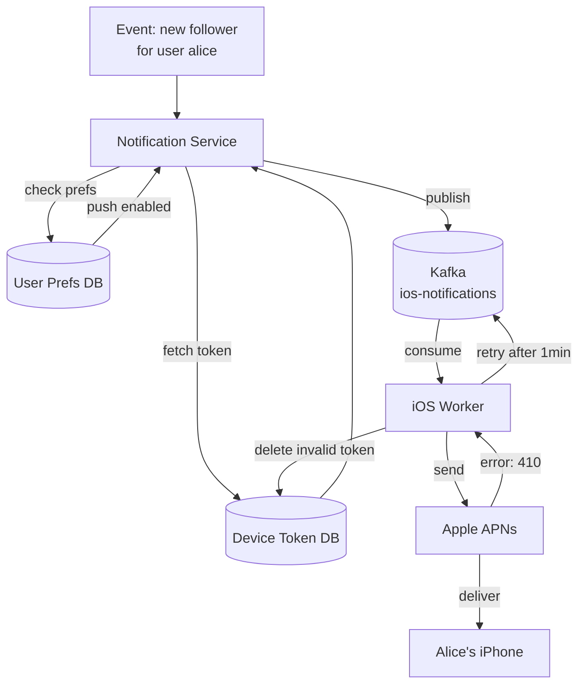

# Chapter 10 — Design a Notification System

> *"A notification reaches users where they are — mobile push, email, SMS — and must be delivered reliably even when the recipient's device is offline."*

---

## 🎯 Core Concept

A **Notification System** delivers messages to users across multiple channels: mobile push notifications (iOS/Android), email, and SMS. The challenge is building a system that's reliable, scalable, and respectful of user preferences — at billions of notifications per day.

**Real-world scale:**
- Facebook: 1 billion+ notifications/day
- Gmail: billions of email notifications
- WhatsApp: notification for every message

---

## 📋 Requirements

### Functional
- Push notifications: iOS (APNs), Android (FCM)
- Email notifications (via Sendgrid, Mailchimp)
- SMS notifications (via Twilio, Nexmo)
- User preference management (opt-out per channel)
- Notification templates (with variable substitution)
- Retry failed deliveries

### Non-Functional
- Soft real-time: notifications delivered within seconds (not milliseconds)
- High reliability: don't drop notifications
- At-least-once delivery (may deliver twice; handle dedup at client)
- 10 million push notifications/day + 1M SMS + 5M email

### Scale (Back-of-Envelope)
```
Push notifications:  10M/day = 115/sec
SMS:                  1M/day = 12/sec
Email:                5M/day = 58/sec
Total notifications:  16M/day = ~185/sec
```

---

## 🏗️ High-Level Architecture


---

## 🔑 Third-Party Delivery Providers

Notifications are always delivered through **third-party services** — never directly from your servers. Here's why:

```
Option A: Direct delivery (bad)
  Your server → Mobile device
  
  Problem: Device might be offline → you need to hold the message
           Platform delivery varies wildly (Android vs iOS)
           APNs and FCM have specific protocols your code must speak
           Scale: millions of persistent connections to maintain
           Cost: massive infrastructure

Option B: Third-party providers (correct)
  Your server → APNs (Apple's servers) → iPhone
  Your server → FCM (Google's servers) → Android
  Your server → Sendgrid → Email recipient
  Your server → Twilio → SMS recipient
  
  Third parties handle:
    Persistent connection to each device (they have 100s of millions)
    Retry logic for offline devices
    Platform-specific protocols
    Compliance (email laws, SMS laws)
```

### Provider Integration

**iOS Push (APNs):**
```python
import httpx
import jwt  # for APNs JWT authentication

async def send_ios_push(device_token: str, title: str, body: str):
    # APNs uses HTTP/2 with JWT auth
    headers = {
        "Authorization": f"bearer {generate_apns_jwt()}",
        "apns-topic": "com.mycompany.myapp",  # your app's bundle ID
    }
    payload = {
        "aps": {
            "alert": {"title": title, "body": body},
            "badge": 1,
            "sound": "default"
        }
    }
    response = await apns_client.post(
        f"https://api.push.apple.com/3/device/{device_token}",
        json=payload, headers=headers
    )
    if response.status_code == 410:
        # Device unregistered — remove token from DB
        await delete_device_token(device_token)
```

**Android Push (FCM):**
```python
async def send_android_push(registration_token: str, title: str, body: str):
    payload = {
        "registration_ids": [registration_token],
        "notification": {"title": title, "body": body},
        "data": {"custom_key": "custom_value"}
    }
    response = await httpx.post(
        "https://fcm.googleapis.com/fcm/send",
        json=payload,
        headers={"Authorization": f"key={FCM_SERVER_KEY}"}
    )
    # Handle errors: invalid token, rate limits, etc.
```

---

## 🏗️ System Architecture

### Services Overview

```
Event Source (e.g., new message, new follower, payment)
    ↓
Notification Service
  - Validates request
  - Fetches user preferences (opt-out check)
  - Fetches device tokens / email addresses
  - Publishes to appropriate Kafka topic
    ↓
Kafka Topics:
  topic: ios-notifications
  topic: android-notifications
  topic: email-notifications
  topic: sms-notifications
    ↓
Workers (one per channel):
  iOS Worker → APNs → iPhone
  Android Worker → FCM → Android
  Email Worker → Sendgrid → Inbox
  SMS Worker → Twilio → Phone
```

### Why Kafka in the Middle?

```
Without Kafka:
  Notification Service → APNs (direct)
  If APNs is slow → Notification Service blocks
  If APNs is down → notifications lost
  Burst of 10,000 notifications → all hit APNs simultaneously

With Kafka:
  Notification Service → Kafka (fast, always available)
  Workers consume at sustainable rate
  APNs slow? Workers back off; Kafka buffers
  APNs down? Messages sit in Kafka, delivered when it recovers
  Burst absorbed by Kafka → smooth delivery

Kafka provides:
  ✓ Buffer for traffic spikes
  ✓ Retry mechanism (re-read from offset)
  ✓ Durability (messages survive crashes)
  ✓ Decoupling (notification service doesn't know about APNs)
```

---

## 🔔 Device Token Management

```
Device tokens expire and change:
  - User reinstalls app → new token
  - iOS rotates tokens periodically
  - User unregisters from push

DB Schema:
CREATE TABLE user_device_tokens (
    user_id      BIGINT,
    platform     ENUM('ios', 'android'),
    token        VARCHAR(256),
    created_at   TIMESTAMP,
    last_seen_at TIMESTAMP,
    PRIMARY KEY (user_id, token)
);

On app launch: register current token with your server
On APNs 410 error: token is invalid, delete from DB
On FCM "NotRegistered" error: delete token from DB
```

---

## 🔄 Retry Mechanism

```
Not all notifications deliver successfully on first attempt:
  User's phone offline: APNs will retry for up to 28 days
  APNs temporarily down: your system must retry
  Rate limit hit: back off and retry

Retry strategy:
  Attempt 1: immediate
  Attempt 2: 1 minute later
  Attempt 3: 5 minutes later
  Attempt 4: 30 minutes later
  Attempt 5: 2 hours later
  Attempt 6: give up, log as failed

Implementation with Kafka:
  On failure: don't commit offset → Kafka will re-deliver
  Or: publish to "retry" topic with delay metadata
```

---

## 🛡️ User Preferences & Opt-out

```
DB Schema:
CREATE TABLE user_notification_prefs (
    user_id      BIGINT,
    channel      ENUM('push', 'email', 'sms'),
    type         VARCHAR(50),  -- 'marketing', 'security', 'social', 'all'
    enabled      BOOLEAN DEFAULT true,
    updated_at   TIMESTAMP
);

Before sending ANY notification:
  1. Check global opt-out: "Has user disabled all notifications?"
  2. Check channel opt-out: "Has user disabled push notifications?"
  3. Check type opt-out: "Has user disabled marketing emails?"
  4. Check frequency: "Have we sent too many notifications today?"

Frequency capping:
  Max 10 push notifications per user per day
  Max 3 emails per user per day
  Always allow security/transactional (password reset, etc.)
```

---

## 📊 Mermaid: End-to-End Notification Flow



---

## ⚖️ Design Decisions & Trade-offs

### Consistency of Delivery

```
At-most-once: send once, don't retry if fails
  ✅ No duplicate notifications
  ❌ May miss notifications (unreliable)

At-least-once: retry until success
  ✅ Notifications always delivered eventually
  ❌ User may receive same notification twice (app should dedup by notification ID)

Exactly-once: complex, expensive
  ❌ Overkill for notifications; use for financial events
  
Choose at-least-once: add notification_id to payload,
app deduplicates on client side
```

### Priority: Marketing vs. Transactional

```
Transactional (high priority):
  - Password reset
  - Payment confirmation
  - Security alert
  → Must deliver: skip frequency caps, no batching

Marketing (low priority):
  - New product announcement
  - Sale notification
  → Apply frequency caps, batch for efficiency, respect quiet hours
```

---

## 💡 Key Takeaways

| Concept | The Lesson |
|---------|-----------|
| **Third-party providers** | APNs/FCM/Sendgrid handle delivery — never talk to devices directly |
| **Kafka as buffer** | Decouple notification generation from delivery; absorb traffic spikes |
| **Device token lifecycle** | Tokens expire/rotate; always handle 410 (unregistered) responses |
| **At-least-once with dedup** | Retry deliveries; include notification_id for client-side deduplication |
| **User preferences** | Check opt-outs before every notification — respect user choices |
| **Transactional vs. marketing** | Different priorities, different frequency rules, different SLAs |

---

*← [Back to System Design Interview](../README.md)*
