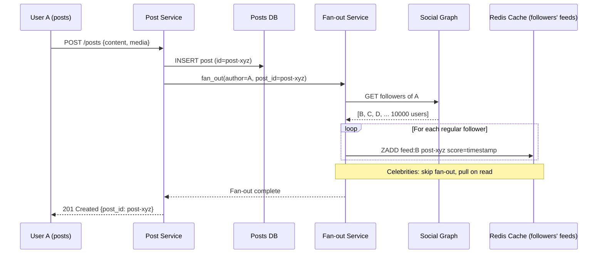

# Chapter 11 — Design a News Feed System

> *"Your Facebook feed loads in 200ms. Behind it: millions of friends' posts, ranking algorithms, and a fan-out system that pre-built your feed while you were away."*

---

## 🎯 Core Concept

A **News Feed System** (like Facebook's News Feed or Twitter's Home Timeline) aggregates posts from people you follow and presents them in a personalized, ranked order. The core challenge is the **fan-out problem**: when a user posts, how do you efficiently update the feeds of all their followers?

Two extreme approaches exist, and the real solution is a hybrid of both.

---

## 📋 Requirements

### Functional
- User publishes a post (text, photos, video)
- User sees a home feed: posts from people they follow, ranked by relevance
- Posts appear in near-real-time (within seconds)
- Feed can be paginated (infinite scroll)
- Supports 200-character text, images, videos

### Non-Functional
- 300M DAU (Facebook scale)
- Read-heavy: 10 feed loads per user per day vs. 1 post per week
- Feed loads in < 200ms
- Posts appear in followers' feeds within 5 seconds

### Scale (Back-of-Envelope)
```
Write (post creation):
  10M posts/day = 116/sec (relatively low)

Read (feed loads):
  300M users × 10 feed loads/day = 3B reads/day = 34,700/sec

Read/Write ratio = 34,700 / 116 = ~300:1 (massively read-heavy)
→ Design heavily favors read performance
```

---

## 🏗️ High-Level Architecture


---

## 🔑 The Fan-out Problem

When User A (with 10,000 followers) publishes a post, that post needs to appear in 10,000 people's feeds. This is called **fan-out**.

There are two fundamentally different approaches.

### Approach 1: Fan-out on Write (Push Model)

```
When User A posts:
  1. Save post to DB
  2. Look up all 10,000 followers of User A
  3. Write A's post ID to each follower's feed cache (Redis list)
  
  Feed read:
    User B opens feed → read from Redis list → instant (O(1))
```

**Detailed flow:**

```
User A posts → Feed Service
  ↓
Fetch followers of A (from Social Graph)
  = [User B, User C, ..., User 10000]
  ↓
For each follower:
  LPUSH feed:userB:posts {post_id, author_id, timestamp}
  LPUSH feed:userC:posts {post_id, author_id, timestamp}
  LPUSH feed:user10000:posts {post_id, author_id, timestamp}
  LTRIM feed:userX:posts 0 499  ← keep only last 500 posts
```

**Pros and Cons:**

```
✅ Feed reads are O(1) — pre-built, no computation at read time
✅ Works great for users with few followers
❌ Celebrity problem: Lady Gaga (100M followers) posts → 100M Redis writes!
   100M writes × 100 bytes = 10GB written in seconds — catastrophic
❌ Wasted writes: offline users have feeds built that nobody reads
```

### Approach 2: Fan-out on Read (Pull Model)

```
When User B opens feed:
  1. Look up who B follows: [A, C, D, E, F, ...]
  2. Query each followee's recent posts from DB
  3. Merge and rank results
  4. Return to user
```

**Pros and Cons:**

```
✅ No wasted computation (only compute when user opens feed)
✅ Celebrities are fine (their posts fetched on demand)
❌ Feed load is slow: 
   User follows 500 people → 500 DB queries → merge → rank
   With 300M users loading feeds simultaneously → DB crushed
❌ Complex: requires efficient scatter-gather and merge sort
```

### Approach 3: Hybrid (What Facebook/Twitter Actually Do)

```
Regular users (< 5,000 followers): use Fan-out on Write
  → Pre-build their followers' feeds in Redis
  → Fast reads

Celebrities (> 5,000 followers): use Fan-out on Read
  → Their posts are NOT pushed to followers' feed caches
  → When user loads feed: fetch celebrity's latest posts on-demand
  → Merge celebrity posts with pre-built regular-user feed

Feed construction at read time:
  1. Read pre-built feed from Redis (regular users' posts)
  2. For each celebrity you follow: fetch their last 20 posts from DB
  3. Merge and rank all posts
  4. Return sorted feed

Trade-off:
  Regular users: O(1) writes (push) → O(1) reads (cache)
  Celebrities: O(1) writes → O(N_celebrity_followers) reads (pull)
  
  But celebrity posts are heavily cached (millions of people reading same posts)
  → CDN for celebrity post content
  → High cache hit rate → fast
```

---

## 💾 Data Model

```sql
-- Posts
CREATE TABLE posts (
    id          BIGINT PRIMARY KEY,  -- Snowflake ID
    author_id   BIGINT NOT NULL,
    content     TEXT,               -- text content
    media_url   VARCHAR(512),       -- image/video URL
    created_at  TIMESTAMP NOT NULL,
    like_count  INT DEFAULT 0,
    comment_count INT DEFAULT 0
);

-- Social graph (follows)
CREATE TABLE follows (
    follower_id  BIGINT,
    followee_id  BIGINT,
    created_at   TIMESTAMP,
    PRIMARY KEY (follower_id, followee_id)
);
-- Index for "who follows X" lookups:
CREATE INDEX idx_followee ON follows(followee_id);
```

### Feed Cache (Redis)

```
Key pattern: "feed:{user_id}"
Value: Redis ZSET (sorted set) of post IDs, scored by timestamp

ZADD feed:12345 1700000100 post_id_1
ZADD feed:12345 1700000200 post_id_2
ZADD feed:12345 1700000300 post_id_3

ZREVRANGE feed:12345 0 19 WITHSCORES
  → Latest 20 post IDs for user 12345

Then fetch post details from Redis/DB by post IDs
```

---

## ⚡ Feed Ranking

Raw chronological feeds are replaced by **ranked feeds** that show the most relevant content:

```
Ranking factors (simplified):
  1. Recency: newer posts scored higher
  2. Affinity: posts from close friends scored higher
     (based on likes/comments/messages exchanged)
  3. Engagement: posts with many likes/comments scored higher
  4. Content type: video > photo > text (platform-specific)
  5. Diversity: don't show 10 posts from same person in a row

Ranking score = recency_weight × recency 
              + affinity_weight × affinity 
              + engagement_weight × engagement

ML model trained on what users click, like, comment on
```

---

## ⚖️ Design Decisions & Trade-offs

### Cache Size and Pagination

```
Keep last N posts per user in feed cache:
  N = 500 posts (typical)
  
  If user scrolls past 500 posts:
    Pull from DB (slower)
    Most users never scroll that far
  
  Cache per user:
    500 posts × 8 bytes/post_id × 300M users = 1.2TB
    Redis cluster: 3 nodes × 512GB = 1.5TB ← just fits
    With compression: much smaller
```

### Cold Start for New Users

```
New user follows 100 people:
  Feed cache is empty!
  
  Option A: Eager build — query all 100 followees' posts immediately
    Build cache in background; show loading state briefly
  
  Option B: Lazy build — build on first feed load
    Slow first load; subsequent loads from cache
    
  Real systems (Twitter): eager build in background on follow action
```

---

## 📊 Mermaid: Post Creation Fan-out



---

## 💡 Key Takeaways

| Concept | The Lesson |
|---------|-----------|
| **Fan-out on Write** | Pre-build feeds in cache — fast reads, expensive for celebrities |
| **Fan-out on Read** | Pull on demand — no wasted writes, slow reads at scale |
| **Hybrid model** | Push for regular users, pull for celebrities — real-world solution |
| **ZSET for feed cache** | Sorted by timestamp → efficient range queries for pagination |
| **ML ranking** | Chronological feeds replaced by engagement-ranked feeds |
| **300:1 read/write** | Design for reads: caches everywhere, DB is last resort |

---

*← [Back to System Design Interview](../README.md)*
