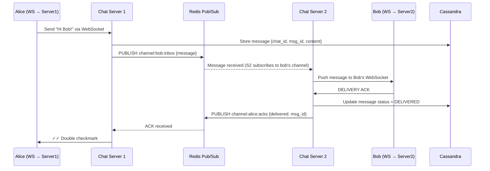

# Chapter 12 — Design a Chat System

> *"WhatsApp delivers 100 billion messages per day. A chat system must deliver messages in under a second, store them reliably, and show you who's online — all at once."*

---

## 🎯 Core Concept

A **Chat System** (like WhatsApp, Slack, or Facebook Messenger) must deliver messages between users in real-time, persist them reliably, and show presence (online/offline status). The unique challenge is the **persistent connection requirement**: unlike HTTP request-response, chat needs a bidirectional channel that stays open.

---

## 📋 Requirements

### Functional
- 1:1 messaging (direct messages)
- Group messaging (up to 500 members)
- Online/offline presence indicator
- Message delivery confirmation (sent → delivered → read)
- Push notifications for offline users
- Message history (searchable)

### Non-Functional
- 50M DAU
- Delivery latency < 100ms
- Message persistence (stored indefinitely)
- Availability > 99.99%
- End-to-end encryption (implementation detail, not design focus)

### Scale (Back-of-Envelope)
```
DAU: 50M
Messages/user/day: 40
Total messages/day: 50M × 40 = 2B messages/day
Messages/sec: 2B / 86,400 = 23,000/sec
Message size avg: 200 bytes
Storage/day: 23,000 × 200 × 86,400 = 400GB/day
10-year storage: 400GB × 365 × 10 = 1.46PB
```

---

## 🏗️ High-Level Architecture


---

## 🔑 Protocol: Why WebSocket?

### HTTP Polling (Naive Approach — Don't Do This)

```
Client asks server every 3 seconds: "Any new messages?"

For 50M users:
  50M × (1 request / 3 seconds) = 16.7M requests/sec
  99.9% of these return: "No new messages" (empty responses)
  
  ← This is 16.7M wasted requests per second!
  
Problems:
  ❌ Massive waste: most polls return nothing
  ❌ 3-second delivery delay (not real-time)
  ❌ High server load for empty responses
```

### Long Polling (Better — Still Suboptimal)

```
Client: "Any new messages? I'll wait for 30 seconds before giving up."
Server: holds connection open until a message arrives or timeout

Improvement: no empty responses (server waits for data)
Still problems:
  ❌ Server holds 50M connections open (high memory)
  ❌ HTTP headers sent on every reconnect (overhead)
  ❌ Unidirectional: server can't push without being asked
```

### WebSocket (The Right Answer)

```
Client establishes WebSocket connection: HTTP → upgrade → WebSocket

After upgrade:
  ← Single TCP connection stays open
  ← Bidirectional: client OR server can send anytime
  ← Low overhead: no HTTP headers per message

Message flow:
  Alice sends message:
    Alice's client → WebSocket → Chat Server A
    Chat Server A stores message in Cassandra
    Chat Server A → Redis Pub/Sub → Bob's channel
    Chat Server B (serving Bob) → WebSocket → Bob's client
    Bob sees message instantly
```

---

## 🔄 Message Flow: 1:1 Chat

```
Alice (connected to Chat Server 1) sends to Bob (connected to Chat Server 2):

Step 1: Alice sends via WebSocket
  Alice → WS → Chat Server 1

Step 2: Chat Server 1 processes
  - Generate unique message_id (Snowflake)
  - Store message in Cassandra (chat_id, message_id, content, sender_id)
  - Determine which server Bob is on

Step 3: Route to Bob's server via Redis Pub/Sub
  Chat Server 1 → PUBLISH channel:bob:messages → {message}
  Chat Server 2 → subscribed to channel:bob:messages → receives it

Step 4: Deliver to Bob
  Chat Server 2 → WS → Bob receives message

Step 5: Is Bob offline?
  Chat Server 2 can't find Bob's WebSocket connection
  → Publish to notification service
  → Send push notification (Chapter 10)
```

---

## 💾 Storage: Why Cassandra for Messages?

### Access Patterns

```
Read patterns:
  1. Get recent messages in a chat:  SELECT * WHERE chat_id = X ORDER BY ts DESC LIMIT 50
  2. Get older messages (pagination): SELECT * WHERE chat_id = X AND ts < last_seen
  3. Search: find messages containing "meeting" ← separate Elasticsearch index

Write patterns:
  23,000 messages/sec → write-heavy
  Messages are immutable (no updates)
  Messages ordered by time within a chat
```

### Cassandra Schema

```sql
CREATE TABLE messages (
    chat_id     UUID,
    message_id  BIGINT,    -- Snowflake ID (time-ordered)
    sender_id   BIGINT,
    content     TEXT,
    type        TINYINT,   -- 0=text, 1=image, 2=video, 3=audio
    created_at  TIMESTAMP,
    PRIMARY KEY ((chat_id), message_id)
) WITH CLUSTERING ORDER BY (message_id DESC);  -- newest first

-- Query recent messages in chat:
SELECT * FROM messages WHERE chat_id = ? LIMIT 50;

-- Query older messages (pagination):
SELECT * FROM messages WHERE chat_id = ? AND message_id < ? LIMIT 50;
```

**Why Cassandra (not MySQL)?**

```
Message writes: 23,000/sec (extremely write-heavy)
MySQL:     ~5,000 writes/sec (single node), sharding complex
Cassandra: ~100,000 writes/sec (single node), horizontal scaling trivial

Messages are immutable → Cassandra's append-only model is perfect
Time-ordered IDs (Snowflake) → natural partition + cluster key fit
```

---

## 🟢 Presence System: Online/Offline Status

### Heartbeat Approach

```
User's app sends heartbeat every 5 seconds:
  PUT /presence/heartbeat {user_id, status: "online"}

Server records:
  presence:alice = {status: "online", last_seen: now()}

If no heartbeat for 30 seconds:
  presence:alice = {status: "offline", last_seen: 2024-01-01T10:30:00}
```

### Scalable Presence with Pub/Sub

```
Problem: If Alice is connected to Server 1, and Bob is on Server 2,
         how does Bob see Alice's online status?

Solution:
  When Alice goes online:
    1. WebSocket connection established to Server 1
    2. Server 1: PUBLISH presence:updates → {user: alice, status: online}
  
  When Bob's friend list updates are needed:
    Server 2 subscribes to presence updates for Bob's friends
    When Alice's status changes → Server 2 receives it → pushes to Bob
  
  Fan-out of presence: when Alice connects, update all her friends' apps
  Alice has 1,000 friends → 1,000 presence updates
  (Acceptable — not the celebrity problem since all users do this)
```

---

## 📱 Message Delivery Status

```
Message lifecycle indicators (WhatsApp-style):
  ✓  (single checkmark) = message sent to server
  ✓✓ (double checkmark) = message delivered to recipient's device
  ✓✓ (blue double)     = message read by recipient

Implementation:
  Sender creates message → status = SENT (stored in DB)
  
  Recipient's device receives message → 
    device sends delivery_ack to Chat Server
    Chat Server updates status = DELIVERED
    Sender's client receives delivery notification via WebSocket
  
  Recipient opens chat →
    device sends read_receipt to Chat Server
    Chat Server updates status = READ
    Sender's client receives read notification via WebSocket
```

---

## ⚖️ Design Decisions & Trade-offs

### Connection Management at Scale

```
50M DAU with persistent WebSocket connections:
  If 10% online simultaneously: 5M connections
  Each connection: ~1-2MB memory
  Per server: 1M connections max (modern hardware)
  → Need: 5M / 1M = 5 chat servers minimum
  
  In practice: many more for redundancy and geography
```

### Service Discovery: Which Server Is Bob On?

```
When Chat Server 1 needs to deliver to Bob:
  "Which server is Bob's WebSocket connection on?"
  
  Zookeeper / Redis:
    when Bob connects to Server 2: SET presence:location:bob "server2" TTL 60s
    Server 1 queries: GET presence:location:bob → "server2"
    Server 1 → Redis Pub/Sub channel:server2 → message for Bob
    Server 2 → WebSocket → Bob
```

---

## 📊 Mermaid: Message Routing via Pub/Sub



---

## 💡 Key Takeaways

| Concept | The Lesson |
|---------|-----------|
| **WebSocket** | Bidirectional, persistent connection — the only right answer for real-time chat |
| **Cassandra for messages** | Partition by chat_id, cluster by message_id (Snowflake) → perfect fit for chat |
| **Redis Pub/Sub** | Route messages between chat servers without direct connections |
| **Snowflake IDs** | Time-ordered message IDs enable natural sorting and pagination |
| **Heartbeat presence** | 5s heartbeat, 30s timeout → simple, scalable online/offline detection |
| **Delivery receipts** | Three states: sent → delivered → read, tracked via acks back to sender |

---

*← [Back to System Design Interview](../README.md)*
