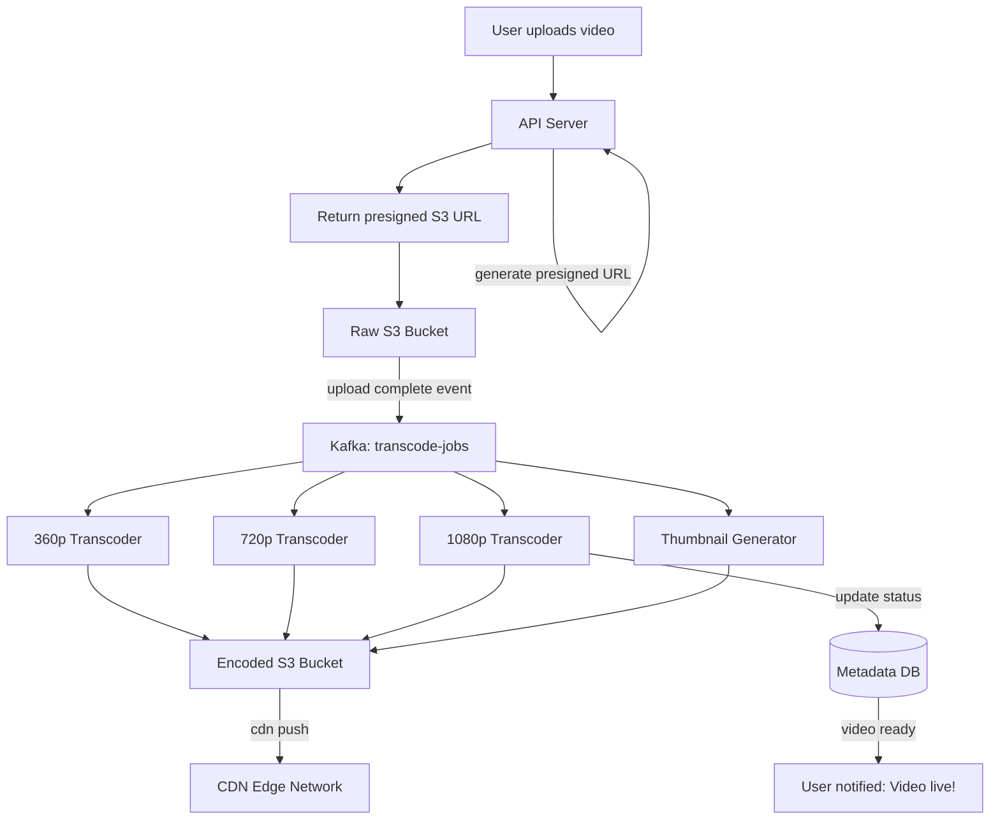

# Chapter 14 — Design YouTube

> *"YouTube handles 500 hours of video uploaded every minute. The hard part isn't storing it — it's transcoding, distributing, and streaming it to billions of users."*

---

## 🎯 Core Concept

**YouTube-scale video sharing** combines two fundamentally different challenges:

1. **Upload pipeline**: Receive raw video → transcode to multiple qualities → store reliably
2. **Streaming**: Serve video chunks to millions of concurrent viewers at < 200ms startup time

The key insight: **video distribution is a CDN problem**, not a database problem.

---

## 📋 Requirements

### Functional
- Upload video (up to 4K resolution, up to 60 minutes)
- Watch video in adaptive quality (360p / 720p / 1080p / 4K)
- Like, comment, subscribe
- Search videos
- View recommendations

### Non-Functional
- 5M videos uploaded/day
- 100M video views/day
- Global availability (CDN in 100+ countries)
- Video starts within 2 seconds
- 99.99% uptime

### Scale (Back-of-Envelope)
```
Uploads:
  5M videos/day = 58 videos/sec
  Avg upload size: 300MB (raw)
  Daily upload: 5M × 300MB = 1.5PB/day raw
  
After transcoding (5 quality levels × compression):
  Final storage: ~1.5PB × 0.2 (compression) = 300TB/day encoded

Views:
  100M views/day = 1,157 views/sec
  Avg video: 5 minutes × 720p = ~500MB
  Bandwidth: 1,157 × 500MB streaming = complex (CDN handles this)
```

---

## 🏗️ High-Level Architecture


---

## 🔑 The Video Upload Pipeline

### Raw Video Ingestion

```
User selects video file (upload.mp4, 1.2GB)

1. Client requests upload URL:
   POST /videos/upload → {upload_id, presigned_s3_url}

2. Client uploads DIRECTLY to S3 (bypasses your API servers):
   PUT https://s3.amazonaws.com/youtube-raw/upload_id/video.mp4
   
   Why S3 direct upload?
   → Your API servers can't handle 1.5PB/day of video data
   → S3 has unlimited bandwidth and geographic distribution
   → Multipart upload: resume interrupted uploads

3. S3 sends event notification: "upload_id upload complete"
   → SQS/Kafka message: {upload_id, s3_key, size}
   → Transcoding workers pick up the job
```

### Transcoding: The Critical Step

Raw uploaded video must be converted to multiple formats for different devices and connection speeds:

```
Input: upload.mp4 (1080p, H.264, 1.2GB)

Output (multiple parallel jobs):
  ┌─── 360p  (360×640)  H.264  → 50MB  → CDN
  ├─── 480p  (480×854)  H.264  → 100MB → CDN
  ├─── 720p  (720×1280) H.264  → 300MB → CDN
  ├─── 1080p (1080×1920)H.264  → 700MB → CDN
  └─── 2160p (4K)       H.265  → 1.5GB → CDN (for premium subscribers)

Plus:
  ├─── Audio track (AAC, 128kbps)
  ├─── Thumbnail generation (3 at 1:00, 2:00, 3:00)
  └─── Subtitles (speech-to-text)
```

**Why multiple quality levels?**

```
Adaptive Bitrate Streaming (HLS/DASH):
  Video player monitors network speed in real-time
  
  Fast connection (WiFi): serve 1080p chunks
  Slower connection: automatically switch to 720p
  Mobile data: switch to 480p
  Very slow: drop to 360p → video never buffers
  
  User gets best quality their connection supports
  → No buffering wheel of death
```

### Transcoding Architecture (DAG Pipeline)

```
Transcoding is complex — split into composable stages:

Raw Video
    │
    ├── Video Transcoder (parallel per quality)
    │   └── 360p job  → 360p.mp4
    │   └── 720p job  → 720p.mp4
    │   └── 1080p job → 1080p.mp4
    │
    ├── Audio Extractor → audio.aac
    │
    ├── Thumbnail Generator → thumb1.jpg, thumb2.jpg, thumb3.jpg
    │
    └── Subtitle Generator (ASR) → subtitles.vtt

Each stage:
  - Picks up from queue
  - Processes one chunk
  - Publishes result to next stage
  - Fully parallelizable

DAG = Directed Acyclic Graph
  All tasks can run in parallel where dependencies allow
  Similar to Apache Airflow or AWS Step Functions
```

---

## 📡 Video Streaming: CDN Architecture

```
Without CDN: all 100M daily viewers → your origin servers
  100M × 500MB = 50PB/day bandwidth needed → impossible

With CDN:
  Video chunks stored at 1,000+ CDN edge nodes worldwide
  User in Tokyo → nearest CDN edge in Tokyo → low latency
  User in Berlin → CDN edge in Frankfurt → fast
  CDN cache hit rate: ~95% (popular videos cached everywhere)
  Origin only serves: 5% (new or rare videos)

CDN serving flow:
  User clicks play:
    1. Player requests first chunk: GET /video/abc/720p/chunk_0.ts
    2. CDN edge: chunk cached? → serve directly (< 10ms)
    3. CDN edge: not cached? → fetch from origin S3, cache, serve
    
  For popular videos:
    Chunk cached at nearest CDN edge
    Playback starts in < 2 seconds from anywhere in world
```

---

## 🗄️ Metadata Database

```sql
-- Videos table
CREATE TABLE videos (
    id              VARCHAR(11) PRIMARY KEY,  -- YouTube-style ID: "dQw4w9WgXcQ"
    uploader_id     BIGINT,
    title           VARCHAR(256),
    description     TEXT,
    duration_sec    INT,
    view_count      BIGINT DEFAULT 0,
    like_count      BIGINT DEFAULT 0,
    status          ENUM('processing', 'published', 'deleted'),
    created_at      TIMESTAMP,
    
    -- Transcoded quality URLs
    url_360p        VARCHAR(512),
    url_720p        VARCHAR(512),
    url_1080p       VARCHAR(512)
);

-- Thumbnail storage in S3:
--   thumbnail://{video_id}/thumb_1.jpg
--   thumbnail://{video_id}/thumb_2.jpg
```

### Video ID Generation

```
YouTube uses 11-character base64 IDs:
  Characters: [A-Za-z0-9_-] = 64 options
  64^11 = 7.38 × 10^19 IDs possible
  At 5M videos/day × 100 years: 182.5B videos
  Collision probability: astronomically low
  
  vs. UUID: 36 chars (with dashes) — YouTube chose shorter for shareable URLs
```

---

## ⚡ Recommendation System (High-Level)

```
"What to watch next" recommendations:
  
  Collaborative filtering: 
    "Users who watched video A also watched video B"
    Build user-video matrix → matrix factorization → find similar videos
  
  Content-based:
    "This video has tags: music, pop → recommend other music/pop videos"
  
  Real-time session:
    "You just watched 3 cooking videos → recommend more cooking"
  
  YouTube's actual system:
    Two-stage:
    1. Candidate generation (fast): 100,000s → 200 candidates
    2. Ranking (ML model): 200 → top 20 to show
    
    Latency target: < 200ms to generate recommendations
```

---

## ⚖️ Design Decisions & Trade-offs

### Pre-signed URL vs. API Proxy for Upload

```
Option A: API Proxy (user → API server → S3)
  ❌ API server handles all video bytes (1.5PB/day bandwidth)
  ❌ Bottleneck and cost center

Option B: Pre-signed URL (user → S3 directly)
  ✅ API server only generates the URL (no video bytes)
  ✅ S3 scales to handle any bandwidth
  ✅ Client handles multipart, resume, retry

Decision: Always use pre-signed URLs for large file uploads
```

### Hot vs. Cold Videos

```
Hot (popular) videos: millions of views/day
  → CDN caches aggressively
  → Edge nodes worldwide
  → P99 latency < 50ms

Cold (rare) videos: <100 views/day
  → Not worth caching at edge
  → Served from regional S3 bucket
  → P99 latency 200-500ms (acceptable for rare content)

Storage tier:
  New videos: S3 Standard (fast access)
  Videos > 1 year old: S3 Glacier (10× cheaper, 4h retrieval)
  Very old rarely watched: S3 Deep Archive (40× cheaper, 48h retrieval)
```

---

## 📊 Mermaid: Video Upload and Transcode Pipeline



---

## 💡 Key Takeaways

| Concept | The Lesson |
|---------|-----------|
| **Pre-signed URL** | Never proxy video bytes through API servers — upload directly to S3 |
| **DAG transcoding** | Pipeline of parallel stages: video, audio, thumbnail, subtitles |
| **Adaptive bitrate** | Multiple quality levels + player chooses → no buffering |
| **CDN is the product** | 95% of video traffic served from CDN — origin barely touched |
| **Storage tiering** | New videos on fast storage, old/cold on cheap storage (Glacier) |
| **11-char base64 ID** | Short, shareable, collision-resistant — better than UUID for URLs |

---

*← [Back to System Design Interview](../README.md)*
