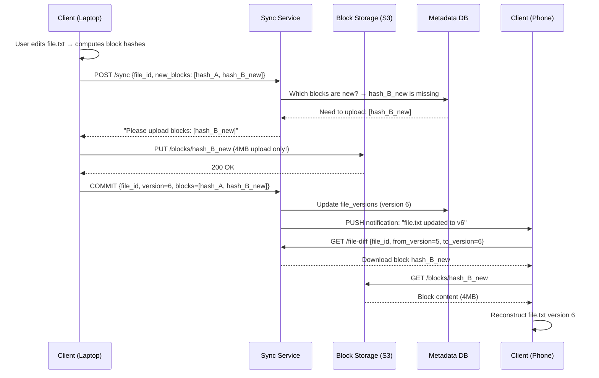

# Chapter 15 — Design Google Drive

> *"Google Drive stores 2 trillion files. The hard part is keeping your file in sync across your laptop, phone, and tablet — instantly and without conflicts."*

---

## 🎯 Core Concept

**Google Drive** (and similar services: Dropbox, OneDrive, iCloud Drive) provides file storage, sync, and sharing. Unlike YouTube (mostly reads), Drive has a complex **sync problem**: when a file changes on one device, all other devices must see the change quickly and correctly — even if two devices changed the same file simultaneously.

The two core challenges:
1. **Delta sync**: only transfer what changed, not the whole file
2. **Conflict resolution**: what happens when two devices edit the same file?

---

## 📋 Requirements

### Functional
- Upload, download, delete files and folders
- Sync files across multiple devices automatically
- Share files/folders with other users (view/edit permissions)
- View file revision history
- Support any file type, up to 15GB per file

### Non-Functional
- 1 billion users
- File changes appear on other devices within 30 seconds
- 10 million uploads/day
- 99.99% file durability (no data loss)
- Available across mobile, desktop, web

### Scale (Back-of-Envelope)
```
Users:             1 billion
Storage per user:  15GB free
Total storage:     15 exabytes (15 × 10^18 bytes)
Uploads/day:       10M files/day = 116 files/sec
Avg file size:     500KB (mix of documents, photos, etc.)
Upload bandwidth:  116 × 500KB = 58MB/sec write to storage
```

---

## 🏗️ High-Level Architecture


---

## 🔑 Delta Sync: The Efficiency Core

### Naive Approach (Don't Do This)

```
User edits a 100MB file, changes 1KB in the middle.
Upload the entire 100MB file again.

For 10M uploads/day × 100MB = 1PB/day bandwidth waste!
```

### Block-Level Delta Sync (The Right Approach)

```
Files are split into fixed-size blocks (e.g., 4MB each):

File: presentation.pptx (100MB)
  Block 0: bytes 0-3MB     hash=abc123
  Block 1: bytes 4-7MB     hash=def456  ← CHANGED
  Block 2: bytes 8-11MB    hash=ghi789
  ...
  Block 24: bytes 96-99MB  hash=xyz999

User edits slide 3 (which is in Block 1):
  New Block 1: bytes 4-7MB  hash=NEW456  ← different hash

Delta sync:
  Compare hashes: only Block 1 changed
  Upload ONLY Block 1 (4MB instead of 100MB)
  Server assembles: [old Block 0][new Block 1][old Block 2]...

Bandwidth savings: 4MB instead of 100MB = 96% reduction!
```

### Block Storage Schema

```
Each block is stored as a deduplicated content-addressed object:

File metadata:
  file_id: "uuid-abc"
  blocks: ["hash_0", "hash_1_new", "hash_2", ...]  ← array of block hashes

Block storage:
  "hash_abc123" → /s3/blocks/ab/c1/abc123.bin  (4MB)
  "hash_def456" → /s3/blocks/de/f4/def456.bin  (4MB)
  "hash_NEW456" → /s3/blocks/NE/W4/NEW456.bin  (4MB, new block)
  
  Deduplication: if multiple files share the same 4MB block content,
  they share the same hash → stored only ONCE on S3
```

---

## 🔄 Sync Protocol

### How Sync Works Across Devices

```
Device A (laptop) has file.txt at version 5
Device B (phone) is offline

Device A: user edits file.txt → creates version 6
  1. Upload changed blocks to S3
  2. Update metadata: version 6 with new block hashes
  3. Notify sync service: "file.txt updated to version 6"

Device B: comes back online
  4. Sync service: "file.txt on device B is version 5, server is version 6"
  5. Download block diff: which blocks in v6 are not in v5?
  6. Download only changed blocks
  7. Reconstruct file.txt version 6 on device B
```

### Notification: How Devices Know About Changes

```
Long polling (traditional):
  Device: "Any changes? I'll wait 30 seconds."
  Server: holds connection, sends response when change occurs
  
  Simple but: 1 billion devices × 1 connection each = 1B connections!
  → Too many connections for servers to hold

WebSocket (modern):
  Device establishes persistent WS connection
  Server pushes change notification instantly
  Device receives: {file_id, new_version, changed_blocks}
  
  For mobile: push notifications (APNs/FCM) when app is background
```

---

## 💾 Data Model

```sql
-- Files/folders
CREATE TABLE files (
    id          VARCHAR(36) PRIMARY KEY,  -- UUID
    owner_id    BIGINT NOT NULL,
    parent_id   VARCHAR(36),              -- folder it's in (NULL = root)
    name        VARCHAR(255) NOT NULL,
    type        ENUM('file', 'folder'),
    size_bytes  BIGINT,
    mime_type   VARCHAR(100),
    created_at  TIMESTAMP,
    updated_at  TIMESTAMP
);

-- File versions (revision history)
CREATE TABLE file_versions (
    version_id  BIGINT PRIMARY KEY AUTO_INCREMENT,
    file_id     VARCHAR(36) NOT NULL,
    version_num INT NOT NULL,
    block_ids   JSON,          -- ordered array of block hash IDs
    created_by  BIGINT,
    created_at  TIMESTAMP,
    INDEX idx_file_version (file_id, version_num)
);

-- Block storage registry
CREATE TABLE blocks (
    hash        VARCHAR(64) PRIMARY KEY,  -- SHA-256 of content
    s3_key      VARCHAR(256) NOT NULL,    -- location in S3
    size_bytes  INT NOT NULL,
    ref_count   INT DEFAULT 1             -- deduplication reference counting
);

-- Sharing permissions
CREATE TABLE permissions (
    file_id     VARCHAR(36),
    user_id     BIGINT,
    permission  ENUM('view', 'comment', 'edit'),
    created_at  TIMESTAMP,
    PRIMARY KEY (file_id, user_id)
);
```

---

## ⚡ Conflict Resolution

### The Problem

```
Scenario:
  file.txt is "Hello World" (version 1) on all devices

  Device A (offline): edits to "Hello Alice"
  Device B (offline): edits to "Hello Bob"
  
  Both devices go online simultaneously.
  Which version wins?
```

### Strategy 1: Last Write Wins (LWW)

```
Compare timestamps:
  Device A edit timestamp: 10:30:05
  Device B edit timestamp: 10:30:07
  
  Device B wins (newer)
  Device A's changes are LOST

✅ Simple, predictable
❌ Data loss: Alice's changes disappear
```

### Strategy 2: Keep Both Versions (Google Drive's Approach)

```
Both versions are preserved:
  file.txt           ← original (or most recent)
  file (conflict).txt ← conflicting version

User sees both files, manually merges them.

✅ No data loss
✅ User decides what to keep
❌ Requires manual resolution
❌ Confusing UI for non-technical users
```

### Strategy 3: Operational Transformation / CRDT (Google Docs Approach)

```
For collaborative text editing:
  Track each individual edit operation, not just final state
  
  Device A: INSERT "Alice" at position 6
  Device B: INSERT "Bob" at position 6
  
  Server receives both → transforms operations:
    Device A insert: position 6 → "Hello Alice"
    Device B insert: needs adjustment → position 11 → "Hello Alice Bob"
  
  Result: "Hello Alice Bob" (merged automatically!)

This is how Google Docs real-time collaboration works.
Complex to implement but seamless for users.
```

---

## ⚖️ Design Decisions & Trade-offs

### Client-Side vs. Server-Side Block Splitting

```
Option A: Client splits file into blocks
  ✅ Client only uploads changed blocks (delta sync)
  ✅ Reduced bandwidth
  ❌ Client needs to track block state
  ❌ Different clients may use different block sizes (compatibility)

Option B: Server splits uploaded file into blocks  
  ✅ Simpler client
  ❌ Client uploads entire file → server splits → poor for large files
  
Decision: Client-side block splitting (Dropbox model)
          Client tracks block state in local database
```

### Deduplication Scope

```
User-level deduplication:
  Same file stored twice by same user → stored once
  Saves: user space quota

Cross-user deduplication:
  Same photo stored by 1M users → stored once globally
  
  Privacy concern: can users infer if someone else has their file?
    (hash similarity → implies content similarity)
  
  Decision: Dropbox uses cross-user dedup but encrypts client-side
            Google Drive: file-level dedup within user, not cross-user
```

---

## 📊 Mermaid: File Upload Sync Flow



---

## 💡 Key Takeaways

| Concept | The Lesson |
|---------|-----------|
| **Block-level delta sync** | Split files into 4MB blocks; only upload changed blocks — 96% bandwidth savings |
| **Content addressing** | Block hash = block ID; identical content stored once (deduplication) |
| **Version history** | Store block hash arrays per version; reconstruct any version |
| **Conflict resolution** | LWW for simplicity, keep-both for safety, CRDT for real-time collaboration |
| **Notification mechanism** | WebSocket for desktop/web, push notifications for mobile background |
| **S3 for block storage** | 15 exabytes of files needs object storage — never put files in a relational DB |

---

*← [Back to System Design Interview](../README.md)*
