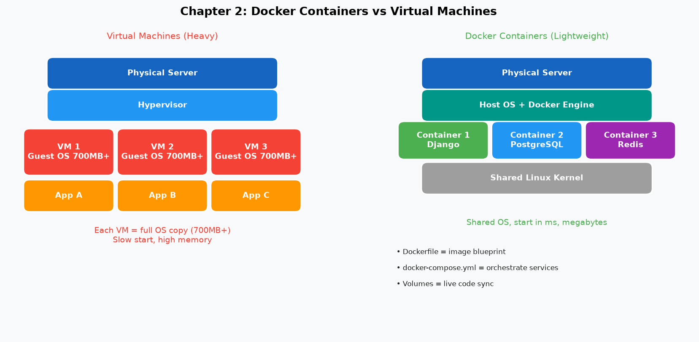
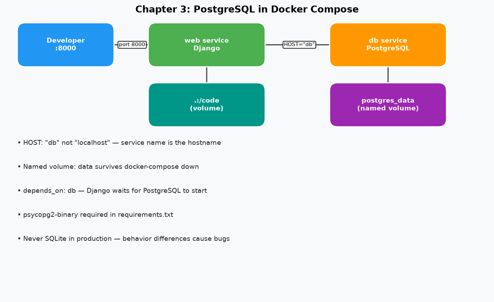
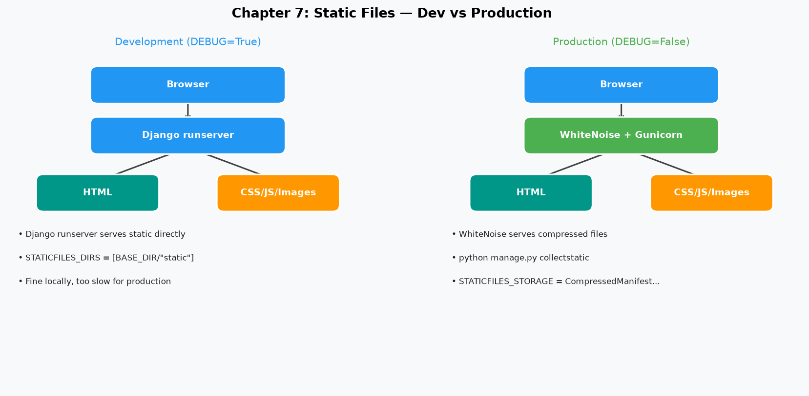
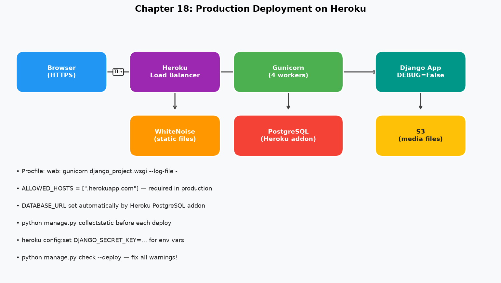

# Django for Professionals

> **Author:** William S. Vincent
> **Year:** 2022 · WelcomeToCode
> **Category:** Web Development / Django / Python

---

## 📖 About This Book

*Django for Professionals* bridges the gap between beginner "toy apps" and production-grade web applications. The book builds a complete **online Bookstore** with Docker, PostgreSQL, custom User model, environment variables, email, permissions, security, and deployment.

> *"There is a massive gulf between building simple toy apps and what it takes to build a production-ready web application."*

---

## 📚 Chapters

| # | Chapter | Core Concepts | Key Pattern |
|---|---------|--------------|-------------|
| [00](chapters/00-introduction.md) | Introduction | Dev vs prod Django | 12-Factor App |
| [01](chapters/01-initial-setup.md) | Initial Set Up | Python 3, venv, Git | Virtual environment |
| [02](chapters/02-docker.md) | Docker Hello, World! | Containers, Dockerfile | Layer caching |
| [03](chapters/03-postgresql.md) | PostgreSQL | Production DB, volumes | Service name = hostname |
| [04](chapters/04-bookstore-project.md) | Bookstore Project | Custom User model | `AUTH_USER_MODEL` |
| [05](chapters/05-pages-app.md) | Pages App | Templates, testing | 5-test pattern |
| [06](chapters/06-user-registration.md) | User Registration | Login, logout, signup | `reverse_lazy` |
| [07](chapters/07-static-assets.md) | Static Assets | STATIC_URL, Bootstrap | WhiteNoise |
| [08](chapters/08-advanced-user-registration.md) | Advanced Registration | django-allauth, email auth | `ACCOUNT_AUTHENTICATION_METHOD` |
| [09](chapters/09-environment-variables.md) | Environment Variables | `.env`, environs | 12-Factor config |
| [10](chapters/10-email.md) | Email | Backends, password reset | Console backend |
| [11](chapters/11-books-app.md) | Books App | UUID PKs, ListView | `<uuid:pk>` URL |
| [12](chapters/12-reviews-app.md) | Reviews App | ForeignKey, inline admin | `related_name` |
| [13](chapters/13-file-image-uploads.md) | File/Image Uploads | ImageField, S3 | `enctype="multipart/form-data"` |
| [14](chapters/14-permissions.md) | Permissions | LoginRequiredMixin, groups | Mixin order |
| [15](chapters/15-search.md) | Search | icontains, Q objects | Q objects |
| [16](chapters/16-performance.md) | Performance | debug-toolbar, N+1 | select_related |
| [17](chapters/17-security.md) | Security | HTTPS, CSRF, XSS | Deployment checklist |
| [18](chapters/18-deployment.md) | Deployment | Gunicorn, WhiteNoise, Heroku | Production config |

---

## ⚡ Core Concepts at a Glance

### Professional Django Stack

```
Development:                 Production:
────────────────────────────────────────────
SQLite          →            PostgreSQL
runserver       →            Gunicorn (workers)
Local static    →            WhiteNoise / S3
Built-in User   →            CustomUser(AbstractUser)
DEBUG=True      →            DEBUG=False + env vars
No email        →            SendGrid / Mailgun
No HTTPS        →            HTTPS + HSTS + Secure cookies
```

### The Custom User Model Rule

```
ALWAYS: Create CustomUser BEFORE first migrate
        → AUTH_USER_MODEL = "accounts.CustomUser"
        → Never import User directly → use get_user_model()
```

### The 5-Test Pattern

```python
def test_url_exists(self):        # 200 status
def test_url_name(self):          # reverse() works
def test_template_used(self):     # Correct template
def test_contains_text(self):     # Expected content
def test_resolves_view(self):     # Correct view class
```

---

## 🖼️ Architecture Diagrams

| Diagram | Description |
|---------|------------|
|  | Docker container architecture |
|  | Docker Compose services |
|  | Static files dev vs production |
|  | Full production stack |

---

## 🎯 Key Takeaways

→ [View all key takeaways](key-takeaways.md)

**5 most critical:**
1. **Custom User model first** — Before ANY migration. No exceptions.
2. **Always PostgreSQL** — Same DB in dev and prod.
3. **Secrets in environment** — Never commit `.env` to Git.
4. **Test both auth states** — Logged-in (200) AND logged-out (302).
5. **Gunicorn + WhiteNoise** — The two production requirements.

---

## 💬 Memorable Quotes

> *"The most important thing when starting a new Django project: always use a custom user model."*

> *"Never store secrets in source code. They will end up exposed."*

> *"Testing can feel overwhelming at first, but it quickly becomes boring — same structure, every time."*

---

## 🔗 Related Books

- [Two Scoops of Django 3.x](../two-scoops-of-django/README.md) — Best practices reference
- [Clean Architecture](../../Pragmatic/clean-architecture/README.md) — Architectural principles

---

*← [Back to Python](../README.md)*
