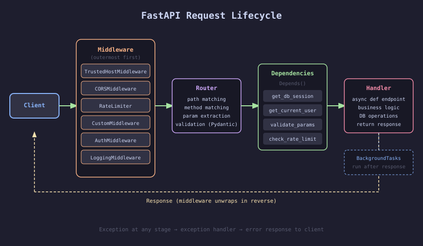
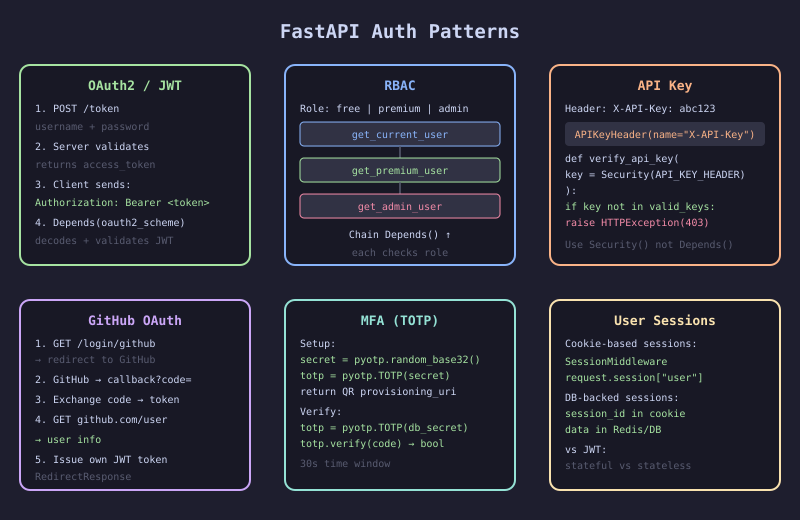

# FastAPI Cookbook

> **Author:** Giunio De Luca · **Publisher:** Packt · **Year:** 2024
> **GitHub:** [PacktPublishing/FastAPI-Cookbook](https://github.com/PacktPublishing/FastAPI-Cookbook)
> **Subtitle:** Develop high-performance APIs and web applications with Python

---

## 📖 About This Book

A hands-on cookbook covering FastAPI from routing basics through to WebSockets, AI integrations, middleware, and production deployment. Every chapter is built around a real project — bookstore, task manager, SaaS app, streaming platform, chat app, trip planner, and more.

**Who it's for:** Python developers who want practical FastAPI patterns with real project code, not just toy examples.

---

## 🗺️ Book Structure — 12 Chapters

| Ch | Project | Key Topics |
|----|---------|-----------|
| [01](./chapters/01-getting-started-with-fastapi.md) | Bookstore | Routing, path/query params, Pydantic, APIRouter, exception handlers |
| [02](./chapters/02-data-storage-and-retrieval.md) | Users & Songs | SQLAlchemy, MongoDB, async vs sync, file uploads |
| [03](./chapters/03-building-a-task-manager-api.md) | Task Manager | Full CRUD, OAuth2, API versioning, custom OpenAPI, testing |
| [04](./chapters/04-authentication-and-authorization.md) | SaaS App | JWT, RBAC, GitHub OAuth, MFA, API keys, user sessions |
| [05](./chapters/05-testing-and-profiling.md) | ProtoApp | pytest, fixtures, Locust load testing, middleware logging |
| [06](./chapters/06-async-sqlalchemy-and-migrations.md) | Ticketing System | AsyncSession, async SQLAlchemy, Alembic, relationships |
| [07](./chapters/07-advanced-data-storage.md) | Streaming Platform | MongoDB, Elasticsearch, Redis caching, text search |
| [08](./chapters/08-dependency-injection-and-middleware.md) | Trip Platform | DI patterns, background tasks, rate limiting, i18n, profiling |
| [09](./chapters/09-websockets.md) | Chat Platform | WebSockets, secured WS, chatrooms, disconnect handling |
| [10](./chapters/10-ai-and-advanced-integrations.md) | AI Apps | Cohere chatbot, RAG/LangChain, GraphQL, gRPC gateway |
| [11](./chapters/11-custom-middleware.md) | Middleware Project | ASGI middleware, CORS, webhooks, request/response middleware |
| [12](./chapters/12-deployment-and-migration.md) | Live App | Packaging FastAPI as a library, migration patterns, deployment |

---

## 🖼️ Architecture Diagrams

---

## ⭐ Top Takeaways

1. **`Depends()` is the backbone** — inject DB sessions, auth, config, query params — everything composable
2. **`lifespan` replaces `startup`/`shutdown`** — the modern way to manage app-level resources
3. **`AsyncSession` for async SQLAlchemy** — don't mix sync ORM calls in `async def` endpoints
4. **Alembic for migrations** — never `create_all()` in production
5. **`BackgroundTasks`** for fire-and-forget work that shouldn't block the response
6. **`slowapi` + `Depends`** = rate limiting without middleware boilerplate
7. **WebSockets** need explicit error handling for `WebSocketDisconnect`
8. **Middleware order matters** — added last = outermost layer
9. **`fastapi-cache` + Redis** for response caching with one decorator
10. **Package your app as a library** (`fca-server` pattern) — compose multiple FastAPI apps cleanly
