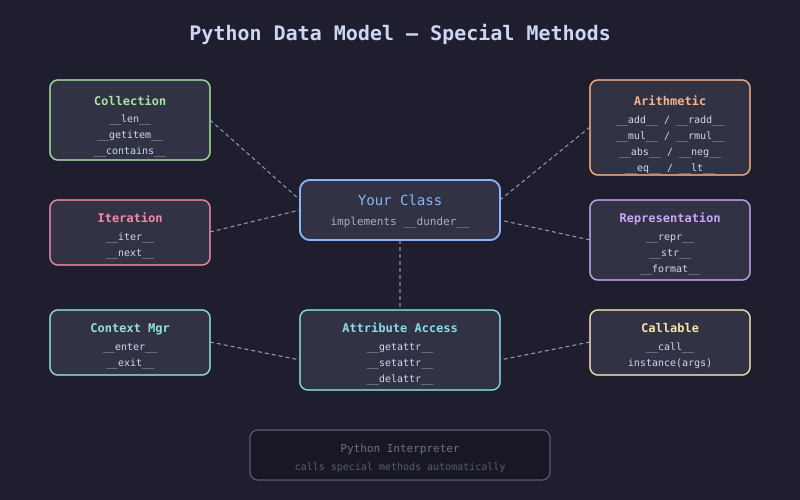
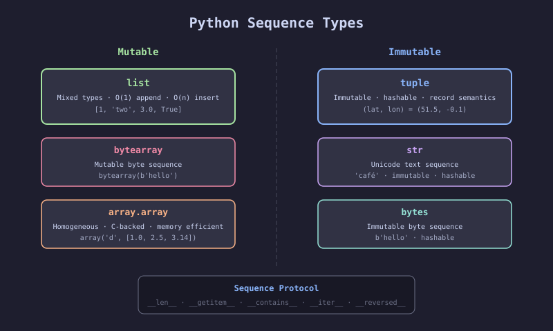
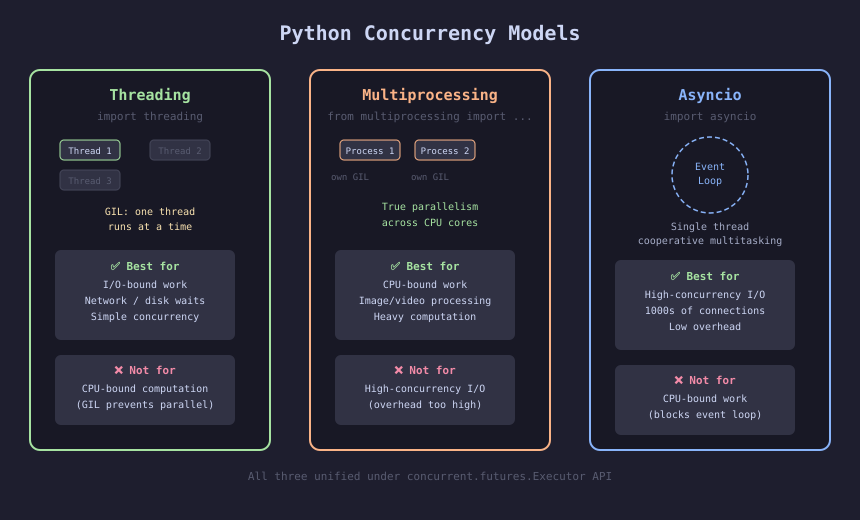
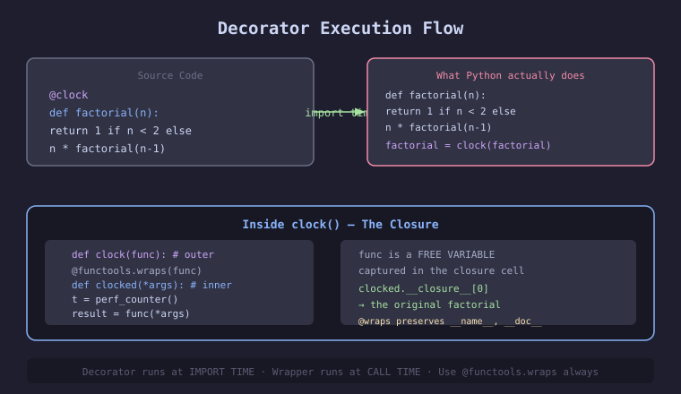

# Fluent Python — 2nd Edition

> **Author:** Luciano Ramalho · **Publisher:** O'Reilly · **Year:** 2022
> **Subtitle:** Clear, Concise, and Effective Programming

---

## 📖 About This Book

*Fluent Python* is the definitive guide to writing idiomatic Python. It goes deep into the features that make Python unique — the data model, sequences, iterables, generators, decorators, concurrency, and metaprogramming. Second edition updated for Python 3.10+ with type hints throughout.

**Who it's for:** Developers who know Python basics and want to write code that is more Pythonic, more efficient, and more expressive.

---

## 🗺️ Book Structure

The book is divided into 5 parts across 24 chapters:

| Part | Chapters | Theme |
|------|----------|-------|
| I — Data Structures | 1–6 | Sequences, dicts, bytes, Unicode |
| II — Functions as Objects | 7–10 | First-class functions, type hints, decorators |
| III — Classes and Protocols | 11–15 | OOP, sequences, interfaces, inheritance |
| IV — Control Flow | 16–21 | Operators, generators, async, concurrency |
| V — Metaprogramming | 22–24 | Properties, descriptors, metaclasses |

---

## 🖼️ Key Concepts Illustrated

### Python Data Model

The data model unifies how Python objects work. Implement `__dunder__` methods and your objects integrate naturally with built-ins, operators, and the entire language.

---

### Sequence Types Overview

Python's sequence types share a common protocol (`__len__` + `__getitem__`). The split between mutable and immutable determines hashability and safety.

---

### Concurrency Models

Three concurrency models with different trade-offs. The GIL is the key dividing line: it's released during I/O (threads work), but not during CPU computation (use processes).

---

### Decorator Execution Flow

`@decorator` is syntactic sugar for `func = decorator(func)`. Decorators run at import time. The inner wrapper function closes over the original function.

---

## 📚 Chapter Summaries

### Part I — Data Structures

| Chapter | Title | Key Concepts |
|---------|-------|-------------|
| [01](./chapters/01-the-python-data-model.md) | The Python Data Model | Special methods, `__repr__`, `__len__`, `__getitem__` |
| [02](./chapters/02-an-array-of-sequences.md) | An Array of Sequences | List comprehensions, generators, `namedtuple`, slicing, `array.array` |
| [03](./chapters/03-dictionaries-and-sets.md) | Dictionaries and Sets | Hash tables, `defaultdict`, `Counter`, set operations, dict comprehensions |
| [04](./chapters/04-unicode-text-versus-bytes.md) | Unicode Text Versus Bytes | Unicode sandwich, encode/decode, `codecs`, BOM, `unicodedata` |
| [05](./chapters/05-data-class-builders.md) | Data Class Builders | `namedtuple`, `@dataclass`, `__post_init__`, `field()`, `frozen=True` |
| [06](./chapters/06-object-references-mutability.md) | Object References, Mutability, Recycling | References vs copies, shallow/deep copy, `is` vs `==`, `del`, `__del__`, `weakref` |

### Part II — Functions as Objects

| Chapter | Title | Key Concepts |
|---------|-------|-------------|
| [07](./chapters/07-functions-as-first-class-objects.md) | Functions as First-Class Objects | Higher-order functions, callables, `operator`, `functools.partial` |
| [08](./chapters/08-type-hints-in-functions.md) | Type Hints in Functions | Gradual typing, `TypeVar`, `Protocol`, `Callable`, `Optional`, `Union` |
| [09](./chapters/09-decorators-and-closures.md) | Decorators and Closures | Closure cells, `nonlocal`, `@functools.wraps`, `@cache`, `@singledispatch` |
| [10](./chapters/10-design-patterns-with-first-class-functions.md) | Design Patterns with First-Class Functions | Strategy/Command as functions, registration decorator, `inspect` |

### Part III — Classes and Protocols

| Chapter | Title | Key Concepts |
|---------|-------|-------------|
| [11](./chapters/11-a-pythonic-object.md) | A Pythonic Object | `__repr__`, `__hash__`, `@classmethod`, `@property`, `__slots__`, `__format__` |
| [12](./chapters/12-special-methods-for-sequences.md) | Special Methods for Sequences | Slice objects, `__getattr__`, `__setattr__`, duck typing, `operator.index` |
| [13](./chapters/13-interfaces-protocols-and-abcs.md) | Interfaces, Protocols, and ABCs | Duck typing, `ABC`, `@register`, `Protocol`, `@runtime_checkable` |
| [14](./chapters/14-inheritance-for-better-or-worse.md) | Inheritance: For Better or Worse | MRO, `super()`, mixins, `UserDict`, composition over inheritance |
| [15](./chapters/15-more-about-type-hints.md) | More About Type Hints | `@overload`, `TypedDict`, variance (invariant/covariant/contravariant) |

### Part IV — Control Flow

| Chapter | Title | Key Concepts |
|---------|-------|-------------|
| [16](./chapters/16-operator-overloading.md) | Operator Overloading | `NotImplemented`, reflected ops (`__radd__`), `__matmul__`, rich comparisons |
| [17](./chapters/17-iterators-generators-coroutines.md) | Iterators, Generators, Classic Coroutines | Iterator protocol, `yield`, `yield from`, `itertools` |
| [18](./chapters/18-with-match-and-else-blocks.md) | `with`, `match`, and `else` Blocks | Context managers, `@contextmanager`, `match/case`, `for/else`, `try/else` |
| [19](./chapters/19-concurrency-models-in-python.md) | Concurrency Models in Python | GIL, threading, multiprocessing, asyncio, spinner examples |
| [20](./chapters/20-concurrent-executors.md) | Concurrent Executors | `ThreadPoolExecutor`, `ProcessPoolExecutor`, `Future`, `as_completed` |
| [21](./chapters/21-asynchronous-programming.md) | Asynchronous Programming | `async/await`, `asyncio.gather`, `Semaphore`, async generators |

### Part V — Metaprogramming

| Chapter | Title | Key Concepts |
|---------|-------|-------------|
| [22](./chapters/22-dynamic-attributes-and-properties.md) | Dynamic Attributes and Properties | `__getattr__`, `__new__`, `@property`, property factory, `@cached_property` |
| [23](./chapters/23-attribute-descriptors.md) | Attribute Descriptors | Data vs non-data descriptors, `__set_name__`, descriptor protocol, functions as descriptors |
| [24](./chapters/24-class-metaprogramming.md) | Class Metaprogramming | `type()`, `__init_subclass__`, class decorators, metaclasses, import vs runtime |

---

## 🔑 [Quick Reference — Key Takeaways](./key-takeaways.md)

One-line insights per chapter for rapid review before interviews or code reviews.

---

## ⭐ Top 10 Most Important Takeaways

1. **The data model is everything** — implement `__dunder__` methods; Python does the rest
2. **Variables are labels, not boxes** — assignment never copies; use `.copy()` explicitly
3. **Generators are lazy sequences** — O(1) memory; learn `itertools`
4. **`@functools.wraps` is mandatory** in every decorator
5. **Return `NotImplemented` in operators** — not `raise TypeError`
6. **Define `__hash__` whenever you define `__eq__`**
7. **Prefer `UserDict`/`UserList`** over subclassing `dict`/`list`
8. **Use `asyncio` for I/O-bound concurrency; `ProcessPoolExecutor` for CPU**
9. **`__init_subclass__` replaces most metaclass use cases** in modern Python
10. **Type hints + tests — neither replaces the other**
