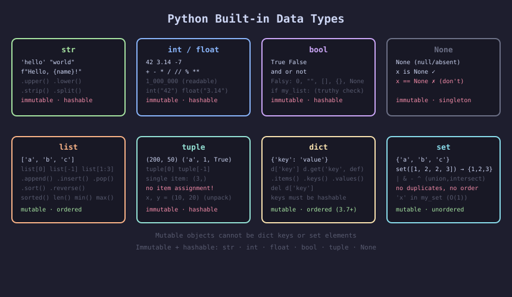
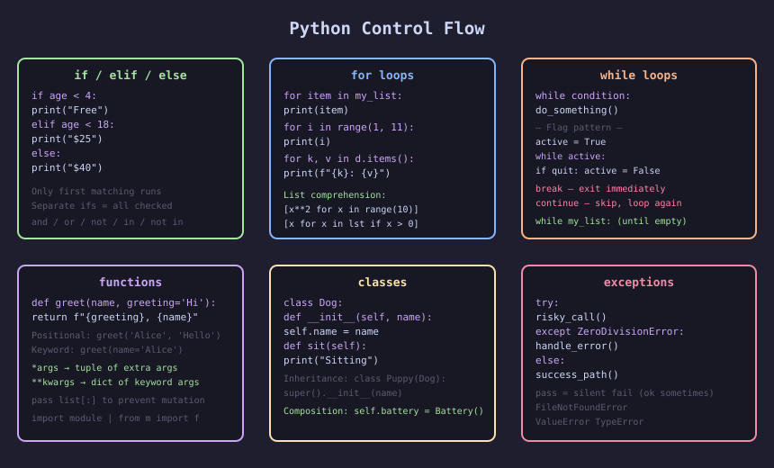
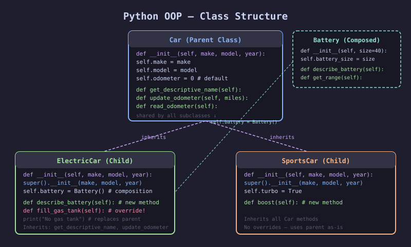

# Python Crash Course — 3rd Edition

> **Author:** Eric Matthes · **Publisher:** No Starch Press · **Year:** 2023
> **ISBN:** 978-1-7185-0270-3
> **Subtitle:** A Hands-On, Project-Based Introduction to Programming

---

## 📖 About This Book

The most popular Python beginner book, now in its third edition. Updated for Python 3.11+, using VS Code, `pathlib` for files, and `pytest` for testing. Part I teaches the language fundamentals; Part II applies them to three complete projects: a game (Pygame), data visualization (Matplotlib/Plotly), and a web app (Django).

**Who it's for:** Complete beginners with no prior programming experience, or developers from other languages learning Python.

---

## 🗺️ Book Structure

| Part | Chapters | Theme |
|------|----------|-------|
| I — Basics | 1–11 | Python fundamentals |
| II — Projects | 12–14 | Alien Invasion game (Pygame) |
| II — Projects | 15–17 | Data visualization (Matplotlib, Plotly, APIs) |
| II — Projects | 18–20 | Learning Log web app (Django) |

---

## 🖼️ Key Concepts Illustrated

---

## 📚 Chapter Summaries

### Part I — Basics

| Ch | Title | Key Topics |
|----|-------|-----------|
| [01](./chapters/01-getting-started.md) | Getting Started | Installing Python, VS Code, first program, terminal |
| [02](./chapters/02-variables-and-data-types.md) | Variables and Simple Data Types | Strings, f-strings, numbers, constants, Zen of Python |
| [03](./chapters/03-introducing-lists.md) | Introducing Lists | Indexing, append, insert, remove, pop, sort, len |
| [04](./chapters/04-working-with-lists.md) | Working with Lists | `for` loops, `range()`, list comprehensions, slices, tuples, PEP 8 |
| [05](./chapters/05-if-statements.md) | if Statements | Conditionals, `and`/`or`/`not`, `in`/`not in`, if-elif-else |
| [06](./chapters/06-dictionaries.md) | Dictionaries | Key-value pairs, `.items()/.keys()/.values()`, nesting |
| [07](./chapters/07-user-input-and-while-loops.md) | User Input and while Loops | `input()`, `int()`, `break`/`continue`, flags |
| [08](./chapters/08-functions.md) | Functions | Parameters, `*args`, `**kwargs`, modules, imports |
| [09](./chapters/09-classes.md) | Classes | `__init__`, attributes, methods, inheritance, `super()` |
| [10](./chapters/10-files-and-exceptions.md) | Files and Exceptions | `pathlib`, `read_text()`, `write_text()`, `try/except`, JSON |
| [11](./chapters/11-testing-your-code.md) | Testing Your Code | pytest, `assert`, fixtures, testing functions and classes |

### Part II — Projects

| Ch | Title | Project | Key Topics |
|----|-------|---------|-----------|
| [12](./chapters/12-a-ship-that-fires-bullets.md) | A Ship That Fires Bullets | Alien Invasion | Pygame window, sprites, keyboard events, bullets |
| [13](./chapters/13-aliens.md) | Aliens! | Alien Invasion | Alien fleet, collision detection, game loop |
| [14](./chapters/14-scoring.md) | Scoring | Alien Invasion | Score, high score, lives, levels, Play button |
| [15](./chapters/15-generating-data.md) | Generating Data | Data Viz | Matplotlib, random walks, dice rolls, bar charts |
| [16](./chapters/16-downloading-data.md) | Downloading Data | Data Viz | CSV parsing, JSON, world maps, Plotly |
| [17](./chapters/17-working-with-apis.md) | Working with APIs | Data Viz | GitHub API, `requests`, Plotly interactive charts |
| [18](./chapters/18-getting-started-with-django.md) | Getting Started with Django | Learning Log | Django setup, models, views, templates, URLs |
| [19](./chapters/19-user-accounts.md) | User Accounts | Learning Log | Auth, login/logout, user-owned data, forms |
| [20](./chapters/20-styling-and-deploying.md) | Styling and Deploying | Learning Log | Bootstrap, Platform.sh deployment, static files |

---

## 🔑 [Key Takeaways](./key-takeaways.md)

---

## ⭐ Top 10 Takeaways

1. **Variables are labels, not boxes** — assignment binds a name to an object
2. **Lists are mutable; tuples are immutable** — use tuples for fixed collections
3. **f-strings** are the modern way to embed variables in strings: `f"Hello, {name}!"`
4. **List comprehensions** replace simple loops: `[x**2 for x in range(10)]`
5. **Functions should do one thing well** — use `*args`/`**kwargs` for flexibility
6. **`__init__`** initializes every instance; `self` is the instance reference
7. **`pathlib.Path`** is the modern way to work with files — cross-platform, readable
8. **`try/except`** catches exceptions gracefully; `except Exception as e` captures details
9. **pytest** makes testing simple — just name functions `test_*` and use `assert`
10. **Django's MTV pattern**: Models define data, Templates render HTML, Views connect them
