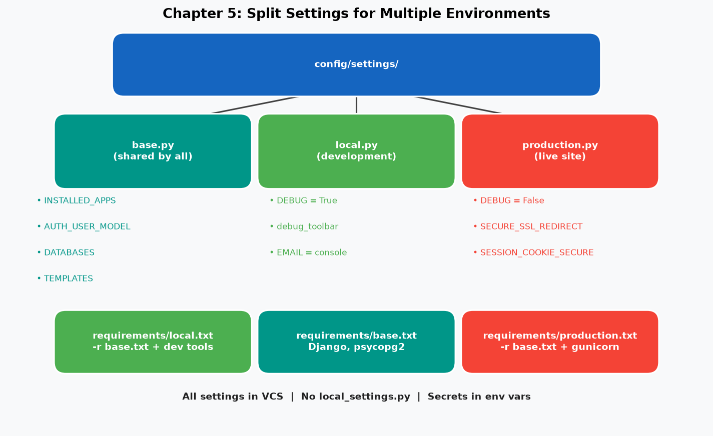
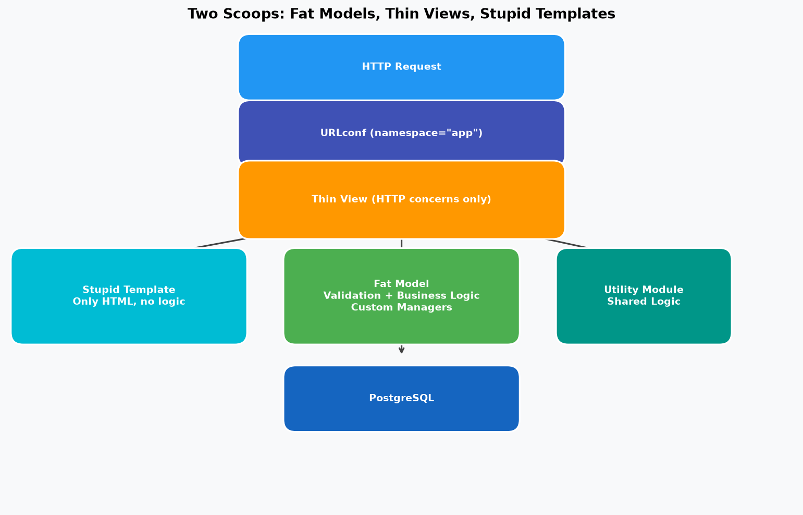
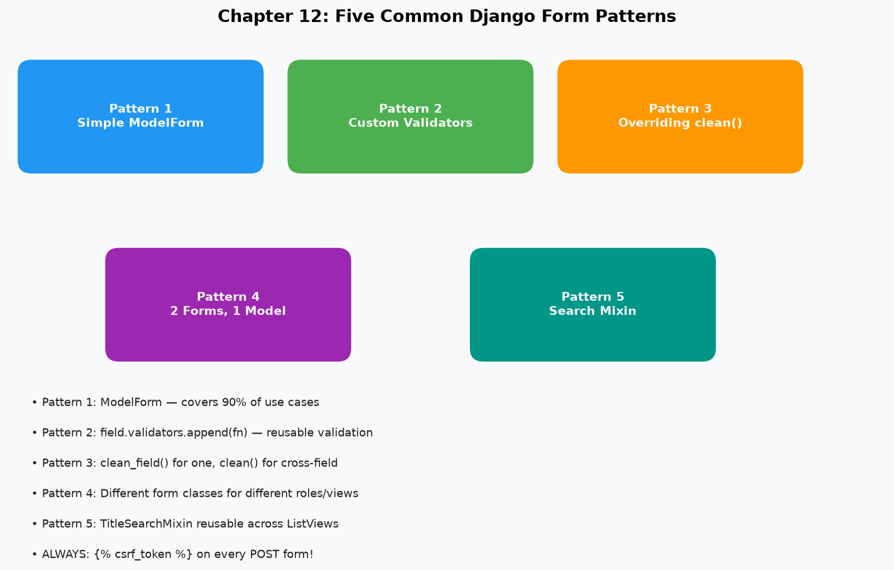
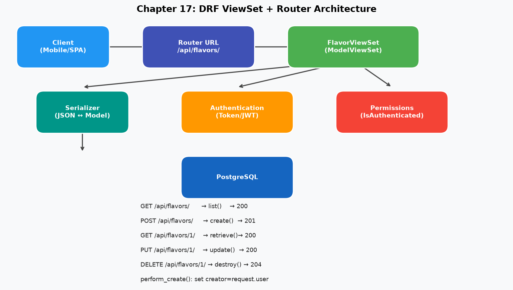

# Two Scoops of Django 3.x

> **Authors:** Daniel Feldroy & Audrey Feldroy
> **Year:** 2021 · Two Scoops Press
> **Category:** Web Development / Django / Best Practices

---

## 📖 About This Book

*Two Scoops of Django 3.x* is the definitive **best practices guide** for Django development. Unlike tutorial books, it doesn't build one project from start to finish. Each chapter is an **independent reference** on a specific topic — from project layout to security, from model design to REST APIs.

> *"Keep It Simple, Stupid. Fat models, thin views, stupid templates."*

Named after ice cream scoops (the authors love ice cream!), the book's philosophy is: use the right amount of Django — not too little, not too much.

---

## 📚 Chapters

| # | Chapter | Core Concepts | Key Pattern |
|---|---------|--------------|-------------|
| [01](chapters/01-coding-style.md) | Coding Style | PEP 8, imports, naming | Relative imports |
| [02](chapters/02-optimal-environment.md) | Optimal Environment | Same DB everywhere, pip, virtualenv | PostgreSQL always |
| [03](chapters/03-project-layout.md) | Project Layout | 3-level structure, Cookiecutter | config/settings/ |
| [04](chapters/04-app-design.md) | App Design | Golden rule, naming, app modules | One app = one task |
| [05](chapters/05-settings.md) | Settings & Requirements | Split settings, env vars, Pathlib | base/local/production |
| [06](chapters/06-model-best-practices.md) | Model Best Practices | Abstract base, choices, fat models | TimeStampedModel |
| [07](chapters/07-queries.md) | Queries & Database | ORM, Q objects, N+1, aggregation | select_related |
| [08](chapters/08-function-class-based-views.md) | FBVs and CBVs | Clean URLconfs, namespaces, thin views | URL namespaces |
| [09](chapters/09-fbv-best-practices.md) | FBV Best Practices | HttpRequest passing, decorators | @functools.wraps |
| [10](chapters/10-cbv-best-practices.md) | CBV Best Practices | GCBVs, mixins, form_valid() | LoginRequiredMixin |
| [12](chapters/12-common-form-patterns.md) | Common Form Patterns | 5 patterns, validators, clean() | ModelForm patterns |
| [17](chapters/17-rest-api.md) | Building REST APIs | DRF, serializers, viewsets, router | ModelViewSet |
| [24](chapters/24-testing.md) | Testing | Unit tests, RequestFactory, mock | Test failure paths |
| [28](chapters/28-security.md) | Security | XSS, CSRF, SQL injection, HTTPS | Production checklist |

---

## ⚡ Core Concepts at a Glance

### The Architecture Rule

```
Fat Models      → Business logic, validation, custom managers
Utility Modules → Shared complex logic
Thin Views      → Only: parse request, call model/form, render
Stupid Templates → Only HTML — no business logic
```

### Settings Structure

```
config/settings/
├── base.py         ← INSTALLED_APPS, databases, etc. (all environments)
├── local.py        ← DEBUG=True, debug_toolbar (development)
├── staging.py      ← Staging server config
└── production.py   ← HTTPS, strict security (production)
```

### Model Inheritance Decision

```
Shared fields with no DB table needed?  → Abstract Base Class ✓
Same data, different behavior?          → Proxy Model
True class hierarchy with separate DBs? → Multi-table (usually avoid)
```

### The Q Objects Pattern

```python
Flavor.objects.filter(
    Q(title__icontains=query) | Q(author__icontains=query)
)
```

---

## 🖼️ Architecture Diagrams

| Diagram | Description |
|---------|------------|
|  | Multiple settings files structure |
|  | Fat models / thin views / stupid templates |
|  | Five form patterns |
|  | DRF ViewSet + Router workflow |

---

## 🎯 Key Takeaways

→ [View all key takeaways](key-takeaways.md)

**5 most critical lessons:**

1. **Same DB everywhere** — SQLite dev + PostgreSQL prod = invisible bugs
2. **Fat models, thin views** — business logic in models, HTTP concerns in views
3. **Split settings** — `base.py` + `local.py` + `production.py`, all in version control
4. **URL namespaces** — `` not ``
5. **Test failure paths** — most bugs hide in error handling, not success paths

---

## 💬 Memorable Quotes

> *"Keep It Simple, Stupid."*

> *"Each app should be tightly focused on its task. If you can't describe what it does in a single sentence, it may need to be split up."*

> *"Don't hardcode your paths. Ever."*

> *"When you first look at a Django project, you should understand what it does from the structure, not from reading the code."*

> *"Fat models, utility modules, thin views, stupid templates."*

---

## 🔗 Related Books

- [Django for Professionals](../django-for-professionals/README.md) — Hands-on professional project
- [Clean Architecture](../../Pragmatic/clean-architecture/README.md) — Architectural principles
- [Domain-Driven Design](../../Pragmatic/domain-driven-design/README.md) — Domain modeling

---

*← [Back to Python](../README.md)*
